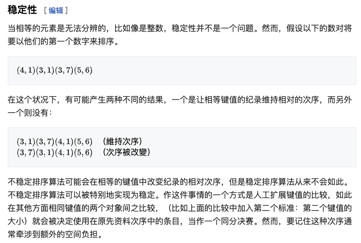
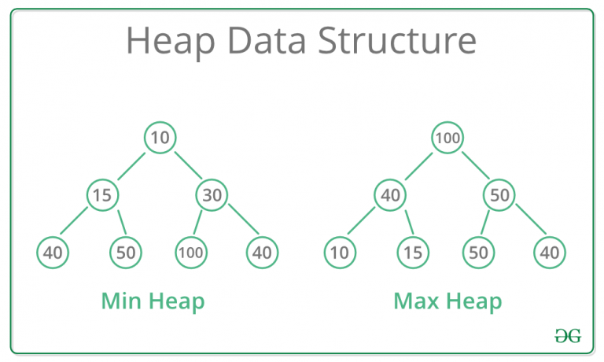

# 排序（Sort）

> 待补充：计数排序，基数排序以及桶排序

排序是计算机程序中非常重要的操作，主要是将一个数据元素的任意序列，重新排列成一个按关键字有序的序列。

[:point_right: Code Here](../src/sort/)

## 排序的稳定性

当可能存在重复键的键值对(Key-Value)时，稳定性非常重要，我们希望根据键(Key)对这些对象进行排序。「对于通过键值排序的数组重要」

Wiki定义比较清晰：


相同键值的元素在排序前后的顺序。

> 内部排序和外部排序：相对而言就比较好理解，内部排序指待排序记录存放在计算机随机存储器中进行排序的过程。外部排序指的是待排序记录的数量很大，以致内存不能一次容纳全部记录，在排序过程中，尚需对外存进行访问的排序过程。

内部排序有很多方法，从全面性考量，很难说A算法完全优于B算法，每种方法都有其优势与劣势，适合在不同的环境下使用，因此排序算法的选择需要结合其使用环境。

## 插入排序

### 直接插入排序（Straight Insertion Sort）

直接插入排序是简单直观的排序方法，将一个记录插入到已排好的有序表中，从而得到一个新的、记录数增1的有序表。

通过构建有序序列，对未排序数据，在已排序数据中从前向后扫描，找到相应位置并插入。采用in-place排序（只需要用到O(1)的额外空间的排序）。在从后向前扫描的过程中，需要反复把已排序的元素向后移动。


默认第一个元素已排序，从第二位开始遍历，外层循环遍历需要插入的元素，遍历至最后一个元素停止，内层循环用于确定插入元素在已排序数组中的位置，同时将大于该元素的数组后移；最后将元素插入。

#### 具体实现

```java
 void sort(int arr[]){
//        for(int i = 1; i < arr.length; ++i){
//            int temp = arr[i];
//            int j = i - 1;
//
//            while( j >= 0 && arr[j] > temp) {
//                arr[j + 1] = arr[j];
//                j--;
//            }
//            arr[j + 1] = temp;
//        }
        for(int i = 1; i < arr.length; ++i){
            int temp = arr[i];
            int j;
            for(j = i - 1; j >= 0 && arr[j] > temp; --j)
                arr[j + 1] = arr[j];
            arr[++j] = temp;
        }
    }
```

#### 算法效率

边界情况：最好的情况是序列已经升序排列（如果算法目标是把n个元素升序），只需比较n-1次即可。最坏情况为元素降序，需要进行`1 / 2 * n *  (n - 1)`次比较。平均来说，插入排序算法复杂度为 O(n^2)。

插入排序不适合数据量较大的排序应用，**如果需要排序的数据量很小，插入排序还是个很不错的选择。**

### 折半插入排序（Binary Insertion Sort）

对插入排序的改进，需要从**比较次数**和**移动次数**两处着手。

折半插入从减少比较次数着手，而移动次数不变。折半插入的比较可以将时间复杂度从 O(n^2)降为O(log n)，依旧是一个稳定的排序算法。

~~~java
    void binarySearch(int arr[]) {
        for (int i = 1; i < arr.length; ++i) {
            int temp = arr[i];
            int low = 0;
            int high = i - 1;
          	//折半插入核心
            while (low <= high) {
                int m = low + high / 2;
                if (arr[m] > temp)
                    high = m - 1;
                else
                    low = m + 1;
            }
          	//将数据后移然后插入
            for (int j = i - 1; j >= low; --j) {
                arr[j + 1] = arr[j];
            }
            arr[low] = temp;
        }
    }
~~~

#### 效率

时间复杂度：折半插入仅仅减少了关键字比较的次数，但是移动的次数并没有改变，为O(n^2)。


### 2-路插入排序（Two-way Insertion Sort）

因为折半插入排序不改变移动次数，因此2-路插入排序在折半插入排序的基础上进行改进，用于较少排序过程中的移动次数，但是需要**额外n个的辅助空间**。

2-路插入排序需要创建一个和存储记录数量大小相同的数组b，将原数组的第一个记录添加到合适的位置，假设为b[0]，从原数组的第二个元素开始进行比较，比较过程一共有三种情况：插入元素比最小的元素小，插入元素比最大元素大，插入元素在两者之间，最后一种情况则需要移动元素。

#### 实现

```java
  public void twoWayInsertionSort(int arr[], int brr[]){
        int length = arr.length;
        int first =0, last = 0;//point to the greater one and tiny one.
        brr[0] = arr[0];
        for(int i = 1; i < length; ++i){
            //greater than the biggest one
            if(arr[i] >= brr[last]){
                brr[++last] = arr[i];
            }
            else if(arr[i] <= brr[first]){
                first = (first - 1 + length) % length;
                brr[first] = arr[i];
            }
            else{
                int j = last;
                while(brr[j] > arr[i]){
                    brr[(j + 1) % length] = brr[j];//move back element
                    j = (j - 1 + length) % length;//update point
                }
                brr[(j + 1) % length] = arr[i];
                last++;
            }
            System.out.println("First is " + first + "Last is " + last);
        }
        //copy back to the array
        for(int i = 0; i < length; ++i){
            arr[i] = brr[(first + i) % length];
        }
    }
```

#### 效率

在2-路插入排序中，移动次数约为n^2 / 8，仅仅减少了排序的移动次数，但不能绝对避免移动，时间复杂度依旧为O(n ^ 2)。

### * 表插入排序 *

需要从根本上避免移动，则需要对存储结构进行改变，将结构改为**静态链表**作为待排记录序列的存储结构。

对于一个有序的循环链表，插入新元素，只需修改后继指针的指向，在这个过程中，我们不需要移动或交换元素。

顺着指针指向对元素进行调整，能够做到物理有序。

1. 创建新的静态链表结构体，封装值和指针。同时设置一个头节点，值存储不小于原序列最大值的值。
2. 对链表进行初始化
3. 将后续节点一次插入循环链表中，调整节点指针指向，使其有序。

```java
package Sort;

public class TableInsertionSort {
    public static Node init() {
        int[] a = {49, 38, 65, 97, 76, 13, 27, 49};
        Node head = new Node();
        Node p = head;
        for (int i = 0; i < a.length; i++) {
            Node node = new Node();
            node.setKey(a[i]);
            p.setNode(node);
            p = node;
        }
        return head;
    }
    public static void sort(Node list) {
        Node pre, now, p, q, head;
        head = list;
        pre = list.getNode();
        now = pre.getNode();
        while (now != null) {
            q = head;
            p = q.getNode();
            while (p != now && p.getKey() <= now.getKey()) {
                q = p;
                p = p.getNode();
            }
            if (p == now) {
                pre = pre.getNode();
                now = pre.getNode();
                continue;
            }
            pre.setNode(now.getNode());
            q.setNode(now);
            now.setNode(p);
            now = pre.getNode();
        }
    }
    public static void printList(Node head) {
        Node p = head.getNode();
        while (p != null) {
            System.out.print(p.getKey() + " ");
            p = p.getNode();
        }
    }

    public static void main(String agrs[]) {
        Node list = init();
        sort(list);
        printList(list);
    }

    //set Node class
     static class Node {
        private int key;
        private Node node;
        public Node() {
        }

        public Node(int key, Node node) {
            this.key = key;
            this.node = node;
        }

        public int getKey() {
            return key;
        }

        public void setKey(int key) {
            this.key = key;
        }

        public Node getNode() {
            return node;
        }

        public void setNode(Node node) {
            this.node = node;
        }
    }
}
```

####  效率：

元素推动次数为0，算法比较次数与直接插入排序算法比较次数同级，平均时间复杂度为O(n ^ 2)。每个元素增加一个指向下一个节点的指针，辅助空间O(n)，且算法**稳定**。

### 希尔排序（Shell Sort）

希尔排序也称“**缩小增量排序**”（Diminishing Increment Sort），是简单的插入排序经过改进后一个更高效的版本。

基本思想：把记录按下标的一定增量分组【将记录序列进行分割】，然后对每组进行插入排序，随着增量的减少，每组包含的关键字越多，当增量变为1时，对全体文件进行一次直接插入排序。

希尔排序通过分组并进行插入排序的方式对数组进行排序，从宏观上看数组逐渐有序，因为数组基本有序，所以在进行直接插入排序的过程中很少出现排序效率最低的情况，多数情况只需要对数据进行微调，从而降低了时间复杂度。

基于插入排序的两点性质：

1. 插入排序对几乎排好的数据操作效率很高，可以达到线性排序效率。
2. 但插入排序一般来说是低效的，因为每次只能移动一位数据。

一般我们会选择增量gap为length / 2，缩小增量继续以gap/2的形式进行。希尔排序的增量序列选择涉及数学上的难题，不做讨论。

~~~java
  //交换
    public void sort(int arr[]) {
        for (int gap = arr.length / 2; gap > 0; gap /= 2) {
            for (int i = gap; i < arr.length; i++) {
                //每次都与相隔gap位的值进行比较
                int j = i;
                while (j - gap >= 0 && arr[j] < arr[j - gap]) {
                    //swap the element
                    swap(arr, j, j - gap);
                    j -= gap;
                }
            }
        }
    }
    //移动
    public void sortMove(int arr[]) {
        for (int gap = arr.length / 2; gap > 0; gap /= 2) {
            for (int i = gap; i < arr.length; i++) {
                //每次都与相隔gap位的值进行比较
                int j = i;
                int temp = arr[i];
                while (j - gap >= 0 && arr[j] < arr[j - gap]) {
                    arr[j] = arr[j - gap];
                    j -= gap;
                }
                arr[j] =temp;
            }
        }
    }
~~~

#### 效率

希尔排序的效率收gap值的影响，选择不同的gap值能够得到不同的时间效率，一般建议gap取n/2，这样可以比多数O(n ^ 2)的算法更好，但仍可以减少平均时间和最差时间的空间。

## 快速排序

### 冒泡排序

通过“交换”的方式进行排序的方法，冒泡排序的逻辑很简单，重复遍历排序数列，一次比较两个元素，如果顺序不对就进行交换，知道不再需要进行交换。同样一次遍历只能排序一个数。

冒泡排序需要对n个元素进行O(n^2)次比较，可以进行原地排序。冒泡排序很简单，但效率很低，尤其是对于大量元素的数列。冒泡排序与插入排序拥有相同的运行时间，两种方法的交换次数有很大区别。最坏情况下，冒泡排序需要O(n ^ 2)次交换，而插入排序只需要O( n )次交换。冒泡排序会破坏原本已经多数排好序的数组，导致效率低下，不推荐使用。

```java
    public void bubbleSort(int arr[]) {
        int length = arr.length;
        for(int i = 0; i < length - 1; ++i){
            for(int j = 0; j < length - i - 1; ++j){
                //Move the bigger one to the end.
                if(arr[j] > arr[j + 1])
                    swap(arr, j, j + 1);
            }
        }
    }
```

### 快速排序

快速排序是对冒泡排序的一种改进。又称为分区交换排序（partition-exchange sort）最早由东尼霍尔提出。在平均情况下，排序n个项目要O(nlogn)次比较，最坏情况则需要O(n ^ 2)次。一般来说，快速排序是排序的最佳选择，得益于其出众的平均性能，同时能够就地排序，在虚拟环境中能够很好的工作。

快速排序是分治法（Divide and conquer）的典型应用之一，首先对数组进行划分【分解】，通过partition函数进行划分，最后将各操作合并。

> 关于分治算法的策略，分(divide)主要把大问题分解为模式类似的小问题，方便进行递归，而治（conquer）则将分阶段的各答案合并在一起，故称分治。

Partition函数的实现：

Partition函数是QuickSort很重要的组成。首先从给定数组中选择一个pivot值【中枢值】，关于中枢值的选择比较随意，可以为首元素、尾元素、中间元素以及随机元素，一般默认为首或尾元素。Partition函数的主要功能是在数组中选择一个中枢值，把该值放在排序后属于它的位置，所有比它小的数值放在该值的左侧，所有比它大的值放在它的右侧。


Partition函数的实现

```java
    int partition(int arr[], int low, int high){
        int pivot = arr[low];
        while(low < high){
            //find the element smaller than pivot
            while(low < high && arr[high] >= pivot)
                high--;
            arr[low] = arr[high];
            while(low < high && arr[low] <= pivot)
                low++;
            arr[high] = arr[low];
        }
        arr[low] = pivot;
        return low;
    }
```

QuickSort实现

```java
    void quickSort(int arr[], int low, int high){
        if(low < high){
            int pivotLoc = partition(arr, low, high);
            quickSort(arr, low, pivotLoc - 1);
            quickSort(arr, pivotLoc + 1, high);
        }
    }
```

### QuickSort性能分析（Analysis of QuickSort）

快速排序的性能可以通过如下公式进行表示： **T(n) = T(k) + T(n-k-1) + $\theta$(n)**

前两个属于用于两个递归调用，最后一个术语为分区过程。k表示小于pivot的元素个数，快速排序的时间花费主要取决于输入数组以及分区策略。【最坏情况、最优情况、平均情况】

**最坏情况（Worst Case）**

当每次分区都选择了最大或者最小的值作为pivot值。

 **T(n) = T(n-1) + $\theta$ (n)**

上述快排运行时间为$\theta$(n<sup>2</sup>)。

**最佳情况（Best Case）**

每次分区都选择中间元素作为pivot值。

 **T(n) = 2T(n / 2) + $\theta$ (n)**

**平均情况（Average Case）**

根据复杂的运行时间分析【后续补充】，得到该算法的平均运行效率公式为：

 **T(n) = T(n / 9) + T(9n / 10) + $\theta$ (n)**

上述快排的运行时间为$\theta$(nLogn)。

根据以上分析，QuickSort算法在最坏情况下的运行效率不及多数的排序算法，比如归并排序(Merge Sort)、堆排序(Heap Sort)。但在实际使用中，QuickSort排序算法表现很快，主要因为算法内部的循环排序可以很高效的适用于现实生活中多数的数组结构。因为pivot值可以随机更换，故最坏的情况很少在现实生活中发生，快排基本被认为相同数量级中所有排序算法中平均性能最优秀的。但与归并排序相比，归并排序更适用于数据量大且存储在外部的数据存储模式。

快速排序是一个不稳定的算法，在排序后相同值的元素相对位置会发生改变。

## 选择排序

选择排序的基本思想是：每一趟n - i + 1个记录中选取关键字最小的记录作为有序序列中的第i个记录。

### 简单的选择排序（Simple Selection Sort）

基本操作：通过n-i次关键字间的比较，从n-i+1个记录中选择关键字最小的记录，并和第i个记录交换。

```java
    void selectionSort(int arr[]){
        int length = arr.length;
        for(int i = 0; i < length - 1; ++i){
            int min = i;
            for(int j = i + 1; j < length; ++j){
                if(arr[j] < arr[min])
                    min = j;
            }
            if(min != i)
                swap(arr, min, i);
        }
    }
```

### 树排序（TreeSort）

树排序是基于二叉搜索树（BST）的一种数据结构。首先创造一颗二叉搜索树，然后对创建的二叉搜索树进行中序遍历以获取相关元素。实现较为复杂。

```java
package Sort;
//use bianrySerachTree.
public class TreeSort {
    class Node
    {
        int key;
        Node left, right;

        public Node(int item)
        {
            key = item;
            left = right = null;
        }
    }
    // Root of BST
    Node root;
    // Constructor
    TreeSort()
    {
        root = null;
    }
    // This method mainly calls insertRec()
    void insert(int key)
    {
        root = insertRec(root, key);
    }
    /* A recursive function to insert a new key in BST */
    Node insertRec(Node root, int key)
    {
        /* If the tree is empty, return a new node */
        if (root == null)
        {
            root = new Node(key);
            return root;
        }

        /* Otherwise, recur down the tree */
        if (key < root.key)
            root.left = insertRec(root.left, key);
        else if (key > root.key)
            root.right = insertRec(root.right, key);

        /* return the root */
        return root;
    }
    // A function to do inorder traversal of BST
    void inorderRec(Node root)
    {
        if (root != null)
        {
            inorderRec(root.left);
            System.out.print(root.key + " ");
            inorderRec(root.right);
        }
    }
    void treeins(int arr[])
    {
        for(int i = 0; i < arr.length; i++)
        {
            insert(arr[i]);
        }
    }
    // Driver Code
    public static void main(String[] args)
    {
        TreeSort tree = new TreeSort();
        int arr[] = {5, 4, 7, 2, 11};
        tree.treeins(arr);
        tree.inorderRec(tree.root);
    }
}
```

平均时间复杂度为O(n log n)，最差时间复杂度为O(n ^ 2)。添加一个元素到二叉搜索树中需要O( logn)的时间，因此添加n个元素到二叉搜索树中需要O(n log n)。需要O( n )个辅助空间。


### 堆排序(HeapSort)

堆排序只需要一个记录大小的辅助空间，每个待排序的记录仅占有一个存储空间。

#### 什么是堆？



（二叉）堆数据结构是一种数组对象，可以被视为一颗特殊的完全二叉树。

树中每个节点与数组中存放该节点值的那个元素对应。树每一层都是填满的，最后一层除外。

二叉堆有两种：最大堆和最小堆【大根堆和小根堆】。

大根堆：“给定堆中的任意节点P和C，若P是C的根节点，那么P的值大于等于C的值。” `A[Parent(i)] >= A[i]`，i 表示除了根节点以外的每个节点。

小根堆：“给定堆中的任意节点P和C，若P是C的根节点，那么P的值小于等于的值。” `A[Parent(i)] <= A[i]`，i 表示除了根节点以外的每个节点。

大根堆最大元素在根部，小根堆最小元素在根部。

在堆排序中，我们使用大根堆，小根堆主要在构造**优先排列**时使用。

#### 堆排序

堆排序是使用堆这种数据结构而设计的一种排序算法，是一种**选择排序**，同时也是一种**不稳定的排序**。

**堆排序解决的两个问题：**

如何由一个无序序列建成一个堆？

在去除堆顶元素后，如何调整剩余元素至新堆？

**堆排序主要流程：**

1. 将无需序列构造成一个大根堆，将序列的最大值放到堆顶。【建堆】
2. 将堆顶元素与末尾元素进行交换，末尾元素即为最大值。【依次排序】
3. 将剩余的n-1个元素重新排列成堆，堆顶再次得到n-1个元素的最大值。
4. 循环1-3步，直到排成有序数列。

```java
package Sort;

import java.util.Arrays;

public class HeapSort {
    public static void main(String[] args) {
        int[] arr = {11, 9, 8, 7, 6, 5, 4, 3, 2, 1};
        heap_sort(arr);
        System.out.println(Arrays.toString(arr));
    }
    public static void heap_sort(int[] arr) {
        //Build heap
        for (int i = arr.length / 2 - 1; i >= 0; i--) {
            max_heapify(arr, i, arr.length);
        }
        //Sort Process, extract an element one by one.
        for (int j = arr.length - 1; j > 0; j--) {
            //Move current root to end.
            swap(arr, 0, j);
            //Rebuild the heap.
            max_heapify(arr, 0, j);
        }
    }
    //adjust the heap, the core function of HeapSort;
    //To heapify a subtree from start to end.
    public static void max_heapify(int[] arr, int start, int end) {
        //keep the current swap element.
        int temp = arr[start];
        //compare the child, from left to right
        for (int i = start * 2 + 1; i < end; i = i * 2 + 1) {
            //select the larger one between right child and left child
            if (i + 1 < end && arr[i] < arr[i + 1]) {
                i++;
            }
            //swap the root node with larger one.
            if (arr[i] > temp) {
                arr[start] = arr[i];
                start = i;
            } else {
                break;
            }
        }
        arr[start] = temp;
    }
    //swap the element
    public static void swap(int[] arr, int a, int b) {
        int temp = arr[a];
        arr[a] = arr[b];
        arr[b] = temp;
    }
}
```

#### 效率

排序是一种选择排序，主要过程为创建初始堆，交换堆顶元素和末尾元素，重建堆等步骤组成。构建初始堆复杂度为O(n)。需要n - 1次交换，重建过程参考完全二叉树的性质，近似于nlogn，因此堆排序时间复杂度默认O(nlogn)。

> Time complexity of heapify is O(Logn). Time complexity of createAndBuildHeap() is O(n) and overall time complexity of Heap Sort is O(nLogn).

对于记录数较少的文件，并不适合使用堆排序，一般在n较大的情况下比较有效。其运行时间主要耗费在建初始堆以及反复调整新堆。

堆排序的使用相对较少，相对与快速排序，其优势在于最坏情况下时间复杂度也为O(nlogn)，因为快速排序和合并排序两者在实际生活使用中更有效率。

## 归并排序（MergeSort）

很多算法在结构上是递归的，为了解决给定问题，需要一次或多次调用自身来解决相关子问题，通常使用**分治策略（Divide-and-Conquer）**，即将问题分解为n个规模较小而结构与原问题类似的子问题；递归解决这些问题，然后合并其结果，即得到问题的解。

”归并“含义是将两个或两个以上的有序表组合成一个新的有序表。

分治模式在每一层的递归上一般有三个步骤：

分解（Divide）：将原问题分解为一系列的子问题。

解决（Conquer）：递归解决各子问题，若子问题足够小，则直接求解。

合并（combine）：将子问题的结果合并为原问题的解。

归并排序（MergeSort）算法是分治策略的一个完美实现。

分解：将n个元素分成各含n/2个元素的子序列。

解决：用合并排序法对两个子序列递归地排序。

合并：合并两个已排序的子序列以得到排序结果。

关键在于合并步骤中两个已经排列的子序列。

实现：

```java
package Sort;
public class MergeSort {
    void merge(int arr[], int l, int m, int r){
        //count the length of two arrays
        int n1 = m - l + 1;
        int n2 = r - m;
        int arr1[] = new int[n1];
        int arr2[] = new int[n2];
        //copy the data to the two array
        for(int i = 0; i < n1; i++)
            arr1[i] = arr[l + i];
        for(int i = 0; i < n2; i++)
            arr2[i] = arr[m + 1 + i];
        //merge begin
        int i = 0, j = 0;
        int k = l;
        while(i < n1 && j < n2){
            if(arr1[i] < arr2[j])
                arr[k++] = arr1[i++];
            else
                arr[k++] = arr2[j++];
        }
        while(i < n1)
            arr[k++] = arr1[i++];

        while(j < n2)
            arr[k++] = arr2[j++];
    }
    //divide the array
    void sort (int arr[], int l, int r){
        if(l < r){
            int m = (l + r) / 2;
            sort(arr, l, m);
            sort(arr,m + 1, r);

            merge(arr, l, m, r);
        }
    }
    static void printArray(int arr[])
    {
        int n = arr.length;
        for (int i = 0; i < n; ++i)
            System.out.print(arr[i] + " ");
        System.out.println();
    }
    // Driver method
    public static void main(String args[])
    {
        int arr[] = { 12, 11, 13, 5, 6, 7 };

        System.out.println("Given Array");
        printArray(arr);

        MergeSort ob = new MergeSort();
        ob.sort(arr, 0, arr.length - 1);

        System.out.println("\nSorted array");
        printArray(arr);
    }
}
```

归并排序是一种稳定、高效的排序，一般利用了完全二叉树特性的排序一般不会太差。

与快速排序和堆排序相比，归并排序最大的特点为：他是一种稳定的排序算法。但递归形式的算法在实用性上很差。

每次合并操作的平均时间复杂度为O(n)，而完全二叉树的深度为|log2n|。总的平均时间复杂度为O(nlogn)，归并排序的最好，最坏，平均时间复杂度均为O(nlogn)。

## 排序总结


未完......


---

[Stabgility in sorting algorithms](https://www.geeksforgeeks.org/stability-in-sorting-algorithms/)

[GeeksforGeeks HeapSort](https://www.geeksforgeeks.org/heap-sort/?ref=lbp)

[图解排序算法之堆排序](https://www.cnblogs.com/chengxiao/p/6129630.html)

[堆排序维基百科](https://zh.wikipedia.org/wiki/%E5%A0%86%E6%8E%92%E5%BA%8F#C%E8%AF%AD%E8%A8%80)

[Merge Sort](https://www.geeksforgeeks.org/merge-sort/?ref=lbp)

[归并排序](https://www.cnblogs.com/chengxiao/p/6194356.html)

[GG:QuickSort](https://www.geeksforgeeks.org/quick-sort/)

[被忽视的partition算法](https://selfboot.cn/2016/09/01/lost_partition/)

[Dutch national flag problem](https://en.wikipedia.org/wiki/Dutch_national_flag_problem)

[快速排序](https://wiki.jikexueyuan.com/project/easy-learn-algorithm/fast-sort.html)