# 分布式文件系统HDFS

## 1. HDFS概述：

HDFS（Hadoop Distributed File Syetem），Hadoop框架的核心组件之一。**HDFS是为以流式数据访问模式存储超大文件而设计的文件系统。**主要解决数据分布式存储问题。

HDFS是个高度容错性的系统，适合部署在廉价的机器上，能提供高吞吐量的数据访问，非常适合大规模数据集上的应用。

### 1.1 设计目标

设计目标即设计初衷，理解其为何诞生对我们掌握并使用它具有很大帮助。

**流式数据访问**：“一次写入，多次读取”，HDFS建立在这个思想之上，简化了数据一致性问题。HDFS设计中考虑了数据批处理，而不是用户交互处理。HDFS为了达到高数据吞吐量从而牺牲了数据访问的延时。

**硬件故障**：由于Hadoop适合部署在廉价硬件集群上，而非昂贵且高可靠的硬件上，不可避免会产生硬件错误，HDFS面对硬件故障时，其快速检错与自动恢复时是HDFS架构最核心的目标。

### 1.2 HDFS设计优劣

优点：高容错性、适合大量数据批处理、模型简单、成本低...

缺点：流式数据读取拥有很高的数据吞吐率，但导致了很高的延时，不适合低延时数据访问；不适合大量小文件存储，过多小文件会严重影响系统性能；不支持多用户并发写入及修改文件。

<!------more -------->

##  2. HDFS架构

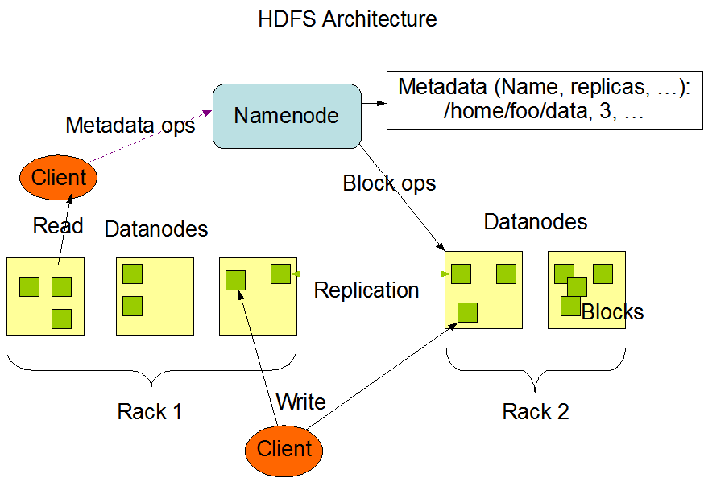

### 2.1 数据存储与组织

HDFS采用块作为存储单位，默认为128MB，是HDFS读写数据数据的最小单位。注意：**HDFS中小于一个块大小的文件不会占据整个块的空间。**

**为什么分布式文件系统中采用抽象块来存储数据？**

1. 抽象的扩大了单个文件所能存储的最大值。假设要存储一个20G的文件，可以采用分布式文件系统存储在10个2G的磁盘上，而使用文件系统，即使你有10个2G的磁盘，你能存储的**最大单个文件大小**为2G。
2. 简化存储子系统。存储子系统控制的是块，**简化了存储管理**。「可以很容易的计算出一个磁盘分为了多少块」，同时也消除了对元数据（MetaData）的顾虑，「块仅仅作为一部分存储数据，而文件的元数据，不需要与块一同存储，<u>其他系统就可以正交地管理元数据</u>」

3. 应对损坏的块或机器的故障，每个块会在其他分散机器复制副本，**提高容错性和实用性**。块很适合做这样的复制操作。

**为什么HDFS中一个块这么大？**

影响文件系统存储文件的事件有两个因素，一是寻址时间，二是数据传输时间。

寻址时间主要取决于数据块的数量，而数据块越大，相对而言寻址事件就越小。

数据传输时间取决于数据大小及磁盘读写速率。

**T(存储时间) = T(寻址时间)  + T(传输时间)**

如果数据传输时间远远大于数据的寻址时间，那么公式可以简化为**T(存储时间) ≈ T(传输时间)**，而HDFS要的就是这个效果。


### 2.2 Namenode 和 Datanode

**Namenode**管理文件系统的命名空间（namespace）以及客户端对文件的访问「比如打开、关闭、重命名等」。将信息通过fsimag（命名空间镜像）和edits（编辑日志）的形式永久保存在**本地磁盘**中，Namenode会记录每个文件的每个块所在的数据节点，但不会永久保存，因为信息会在系统启动时由数据节点重建。

> Namespace：支持传统层次型文件组织结构，用户可以创建、删除、移动文件等，但HDFS不支持用户磁盘配额和访问权限控制。
>
> Fsimage文件：用于维护文件系统树以及文件树中所有的文 件和文件夹的元数据信息
>
> Edits文件记录所有针对目录、文件的创建、删除、重命 名等的操作日志。

Namenode工作机制：

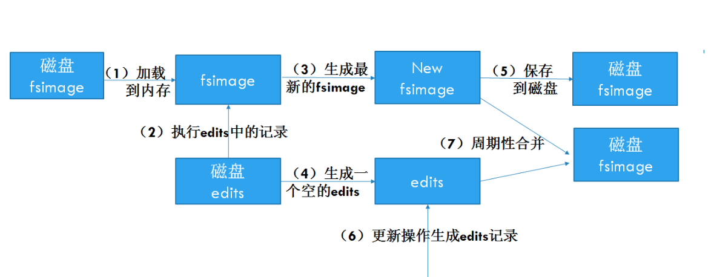

**Datanode**负责它所在的节点上的存储，处理客户端的读写请求，在Namenode的统一调度下进行数据块的创建和、删除和复制。

如果没有Namenode，那么文件系统将无法使用，因为我们无法知道如何通过数据节点上的块来重建文件，故Namenode是HDFS集群中的单点故障(Single point of failure)所在。对于名称节点的保护机制时非常重要的。Hadoop提供了两种方法。

1. 复制那些组成文件系统元数据持久状态的文件。Hadoop可以通过配置使Namenode在多个文件系统上写入其持久化状态。「一般在配置选择：在本地磁盘写入同时，写入一个远程NFS挂载」 `Network File System (NFS) is a distributed file system protocol that allows you to share remote directories over a network`

2. 运行Secondary Namenode，主要作用是为了防止Edits日志过大导致的问题，主要通过定期合并Edits和fsimage来减少Edits的数据大小。一般在其他单独的计算机上运行，因为需要占用大量CPU和内存。Secondary Namenode还可以作为Namenode 的冷备份，它会保存合并后的fsimage的副本，在名称节点失效后使用。但因为Secondary Namenode相较Namenode是滞后的，损失难以避免。

   Secondarynode执行过程：

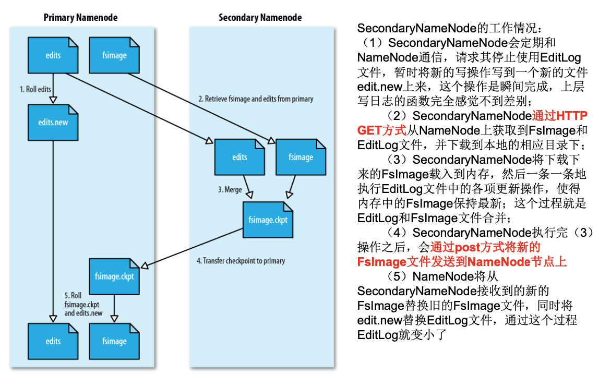


### 2.3 HDFS 高可用架构（ HDFS High Avaiability）

[HDFS High Availability Using the Quorum Journal Manager](https://hadoop.apache.org/docs/current/hadoop-project-dist/hadoop-hdfs/HDFSHighAvailabilityWithQJM.html)

[HDFS High Availability With NFS](https://hadoop.apache.org/docs/current/hadoop-project-dist/hadoop-hdfs/HDFSHighAvailabilityWithNFS.html)

[后续补充]

### 2.4 HDFS Federation

[HDFS Federation](https://hadoop.apache.org/docs/current/hadoop-project-dist/hadoop-hdfs/Federation.html)

[后续补充]

## 3. HDFS存储

### 3.1 数据冗余（Data redundancy）存储

为了保证系统的容错性和可用性，HDFS采用多副本方式对数据进行冗余存储，即一个数据块的内容会放到不同的数据节点上。

> 当多个客户访问统一文件时，可以从不同副本中读取数据，加快了数据传输速度。
>
> HDFS节点之间通过网络传输数据，多副本可以很**容易判断数据是否出错。**
>
> 保证了数据的可靠，避免了单点故障。

### 3.2 数据存储策略

> 简单介绍一下HDFS数据读写的相关类。
>
> FileSystem时一个通用文件系统的抽象基类，可被分布式文件系统继承。
>
> DistributedFileSystem是FileSystem在HDFS文件系统中的实现，是Hadoop为FileSystem这个抽象类提供的具体实现之一。
>
> FileSystem的open( )方法返回一个输入流FSDataInputStream对象，create（）方法返回一个输出流FSDataOutputStream对象。「即HDFS文件系统中的具体输入输出流」
>
> Hadoop文件API的起点是FileSysem类，可以通过调用FileSystem.get(Configuration conf)来得到所需的FileSystem实例。
>
> Configuration类的默认实例化方法是以HDFS系统的资源配置为基础。
>
> 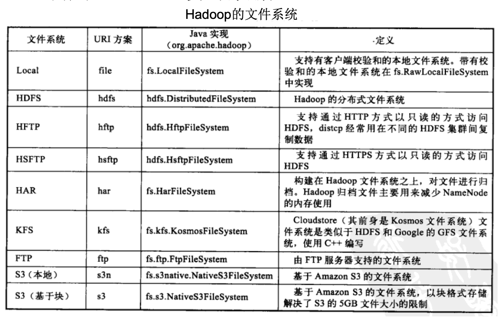

#### 3.2.1 数据存放

HDFS默认每个数据节点都是在不同的机架上，会带来一个问题：**写入数据时不能充分利用同一机架内部机器之间的带宽**。但更容易实现系统内部的负载均衡和错误处理。

HDFS默认冗余复制因子为3，每一个文件块被同时保存到三个地方，两个副本放在同一机架不同机器上，第三个副本放在不同机架的机器上面。可以保证机架发生异常时的数据恢复，也可以提高读写性能。

`hdfs-site.xml`配置文件`dfs.replication`用于修改冗余复制因子

```xml
<configuration>
  <property>
    <name>dfs.replication</name>
    <value>1</value>
  </property>
   <property>
    <name>dfs.namenode.name.dir</name>
    <value>/usr/local/Cellar/hadoop/hdfs/tmp/dfs/name</value>
  </property>
   <property>
    <name>dfs.datanode.name.dir</name>
    <value>/usr/local/Cellar/hadoop/hdfs/tmp/dfs/data</value>
  </property>
</configuration>
```


#### 3.2.2 数据读取

HDFS提供了一个API可以确定一个数据节点所属的机架ID，客户端也可以调用API获取自己所属的机架ID。

利用Java API读数据过程：

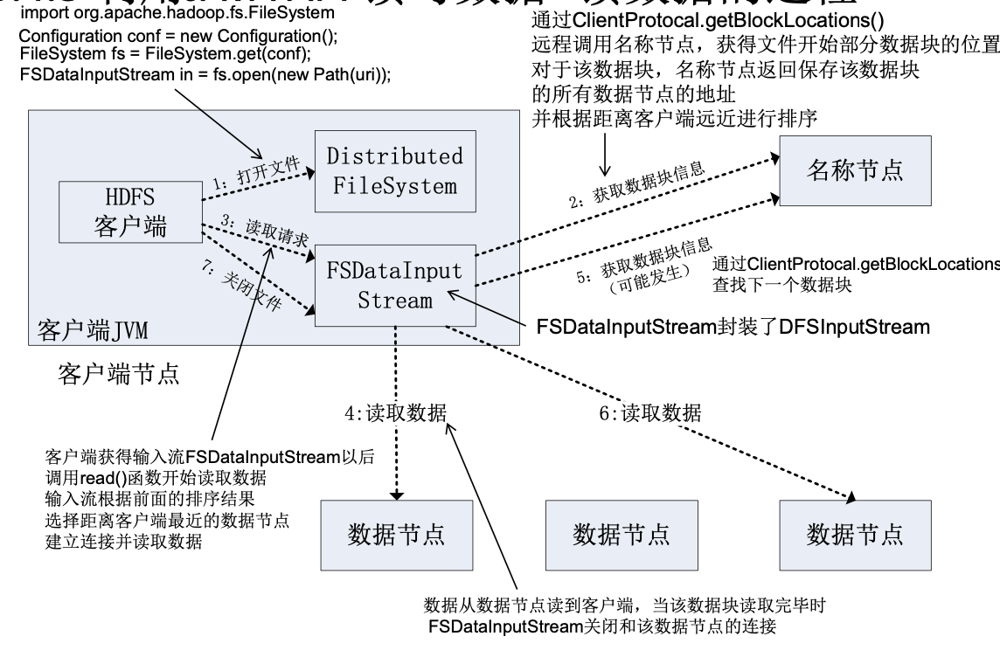


#### 3.2.3 数据写入与复制

HDFS采用流水线复制的策略。

当客户端要向HDFS写入文件时，这个文件首先根据块大小划分成若干块并写入本地，每个块都向HDFS集群中的Namenode发起写请求，Namenode返回一个最佳数据节点返回客户端，客户端把数据写入第一个数据节点，同时把列表传给第一个数据节点，第一个数据节点将数据写入本地，同时向第二个数据节点发送数据和列表，以此类推。

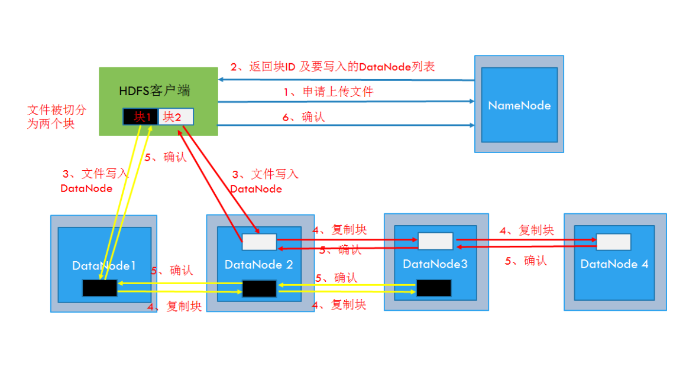

使用Java API写数据：

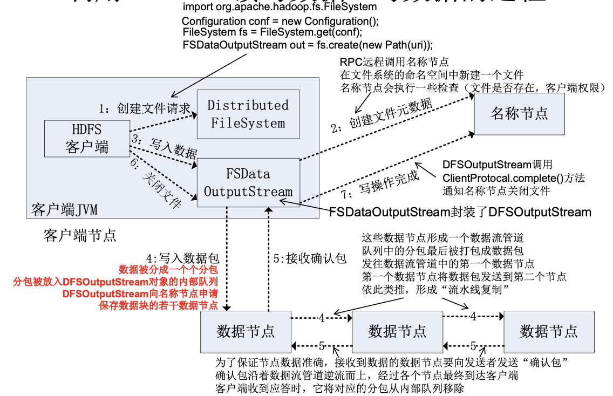


### 3.3 数据错误与恢复

#### 3.3.1 Namenode出错

Namenode保存了所有元数据信息，若文件损坏，整个系统宕机。HDFS的两种补救措施在2.2.2 Namenode 和 Datanode 中已提到。

#### 3.3.2 Datanode出错

每个Datanode会定期向Namenode发送“心跳”，向Namenode报告“我还活着”。一旦Namenode没有接收到定期的心跳信息，默认该Datanode宕机，不会对其进行任何读写等操作。同时Namenode会定期检查Datanode数据块副本数量，若小于冗余因子，则启动数据的冗余复制。

#### 3.3.3 数据错误

数据错误主要集中在网络传输和磁盘错误。客户端采用md5和sha1对数据块进行校验，确保读取到正确的数据。

> 文件被创建时，客户端会对每一个文件进行信息摘录，把信息写入同一个路径的隐藏文件中。当客户端读取文件时，先读取该信息文件，利用信息文件对每个信息读取的数据块进行校验，校验出错，客户端请求到另一个数据节点读取文件块，并向Namenode报告错误。


## 4. HDFS 实践

HDFS交互的方式有很多种，但相对而言使用命令行是最简单的，如果在一台机器上运行HDFS，需要将Hadoop配置为为分布模式。

在使用HDFS的过程中，注意集群的`/`目录与`.`目录的区别。

#### 4.1 Shell 命令

HDFS Shell具体使用命令如下：

```shell
Usage: hadoop fs [generic options]
	[-appendToFile <localsrc> ... <dst>]
	[-cat [-ignoreCrc] <src> ...]
	[-checksum <src> ...]
	[-chgrp [-R] GROUP PATH...]
	[-chmod [-R] <MODE[,MODE]... | OCTALMODE> PATH...]
	[-chown [-R] [OWNER][:[GROUP]] PATH...]
	[-copyFromLocal [-f] [-p] [-l] [-d] [-t <thread count>] <localsrc> ... <dst>]
	[-copyToLocal [-f] [-p] [-ignoreCrc] [-crc] <src> ... <localdst>]
	[-count [-q] [-h] [-v] [-t [<storage type>]] [-u] [-x] [-e] <path> ...]
	[-cp [-f] [-p | -p[topax]] [-d] <src> ... <dst>]
	[-createSnapshot <snapshotDir> [<snapshotName>]]
	[-deleteSnapshot <snapshotDir> <snapshotName>]
	[-df [-h] [<path> ...]]
	[-du [-s] [-h] [-v] [-x] <path> ...]
	[-expunge [-immediate]]
	[-find <path> ... <expression> ...]
	[-get [-f] [-p] [-ignoreCrc] [-crc] <src> ... <localdst>]
	[-getfacl [-R] <path>]
	[-getfattr [-R] {-n name | -d} [-e en] <path>]
	[-getmerge [-nl] [-skip-empty-file] <src> <localdst>]
	[-head <file>]
	[-help [cmd ...]]
	[-ls [-C] [-d] [-h] [-q] [-R] [-t] [-S] [-r] [-u] [-e] [<path> ...]]
	[-mkdir [-p] <path> ...]
	[-moveFromLocal <localsrc> ... <dst>]
	[-moveToLocal <src> <localdst>]
	[-mv <src> ... <dst>]
	[-put [-f] [-p] [-l] [-d] <localsrc> ... <dst>]
	[-renameSnapshot <snapshotDir> <oldName> <newName>]
	[-rm [-f] [-r|-R] [-skipTrash] [-safely] <src> ...]
	[-rmdir [--ignore-fail-on-non-empty] <dir> ...]
	[-setfacl [-R] [{-b|-k} {-m|-x <acl_spec>} <path>]|[--set <acl_spec> <path>]]
	[-setfattr {-n name [-v value] | -x name} <path>]
	[-setrep [-R] [-w] <rep> <path> ...]
	[-stat [format] <path> ...]
	[-tail [-f] [-s <sleep interval>] <file>]
	[-test -[defswrz] <path>]
	[-text [-ignoreCrc] <src> ...]
	[-touch [-a] [-m] [-t TIMESTAMP ] [-c] <path> ...]
	[-touchz <path> ...]
	[-truncate [-w] <length> <path> ...]
	[-usage [cmd ...]]
```

多数操作与Linux类似，不做赘述。具体实践可参考下面文章：[HDFS实践](https://juejin.im/entry/58a57f12128fe1006cafc8d9)  [注：该文章有几个错误]

需要注意几点：

1. HDFS主张“一次写入，多次读取”，一般来说，写入的内容最好不要后期修改内容，要不删除，要不重新上传。极端情况下可以使用`appendToFile`这一命令对文件进行追加，但一般建议先把文件下到本地再进行追加操作。

2. 熟悉Shell命令的朋友在命令比价复杂情况下可以使用Shell的条件判断等语句来执行。


#### 4.2 如何在Mac使用Eclipse进行HDFS编写：

参考这边文章吧，这边懒得写了。[Mac Eclipse HDFS配置](https://blog.csdn.net/G290095142/article/details/78231337)

以下步骤为Hadoop单机伪分布环境下Eclipse HDFS 配置。

##### 4.2.1 下载Hadoop Eclipse插件

[官网地址](https://people.apache.org/~srimanth/hadoop-eclipse/)，需要Eclipse版本3.6以上。

将插件放到Eclipse Plugins下，然后重启Eclipse，在Preferences下按如下配置，Hadoop安装目录根据自己情况配置。

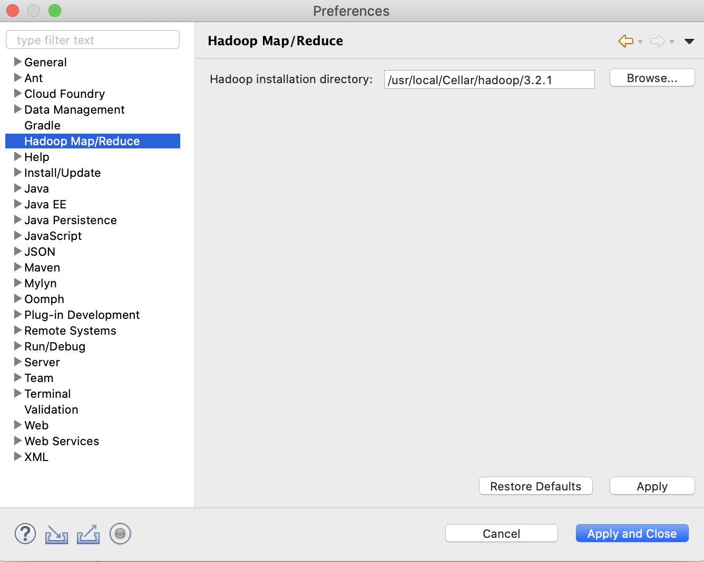

##### 4.2.2 创建Hadoop HDFS程序

New一个Map/Reduce Project

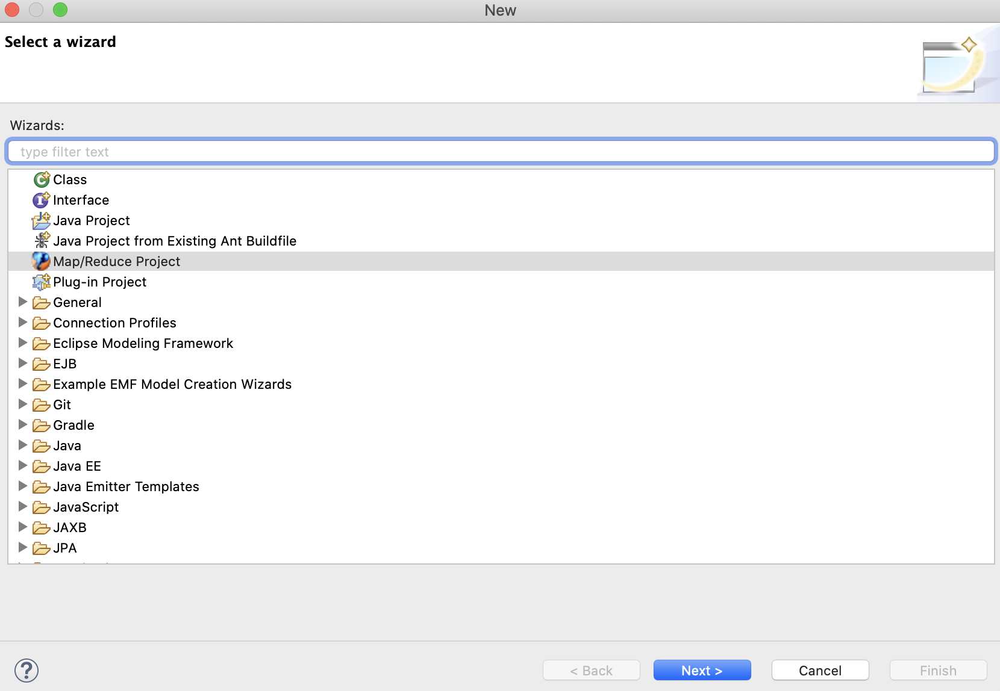

项目创建完毕后，重点是配置Hadoop Location。

在`Windows -> show view -> Other -> MapReduce Location`下配置：

其中

**Map/Reduce Master**下：

Host：就是jobtracker 所在的集群机器，这里写localhost

Port：就是jobtracker 的port，这里写的是9001

**这两个参数就是mapred-site.xml里面mapred.job.tracker里面的ip和port** 

**DFS Master **下：

Host：就是namenode所在的集群机器，这里写localhost

Port：就是namenode的port，这里写9000

**这两个参数就是core-site.xml里面fs.default.name里面的ip和port**，根据自己情况修改。

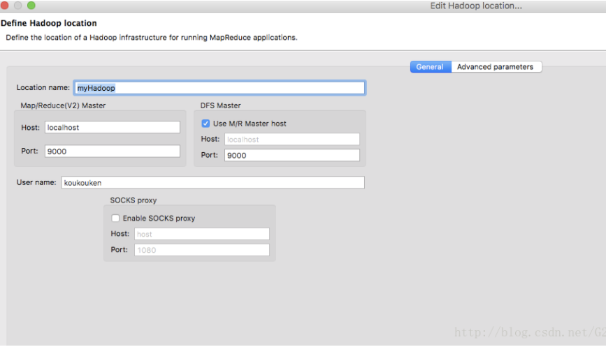

修改完成，就可以去搞了，项目运行时选择`Run On Hadoop`运行即可。

举个例子吧：

编程实现一个类“MyFSDataInputStream”，该类继承“org.apache.hadoop.fs.FSDataInputStream”，要求如下：实现按行读取HDFS中指定文件的方法“readLine()”，如果读到文件末尾，则返回空，否则返回文件一行的文本。

准备：

使用JavaApi在superming目录下写入test文件，文件内容为“Hello World”，代码截图如下：

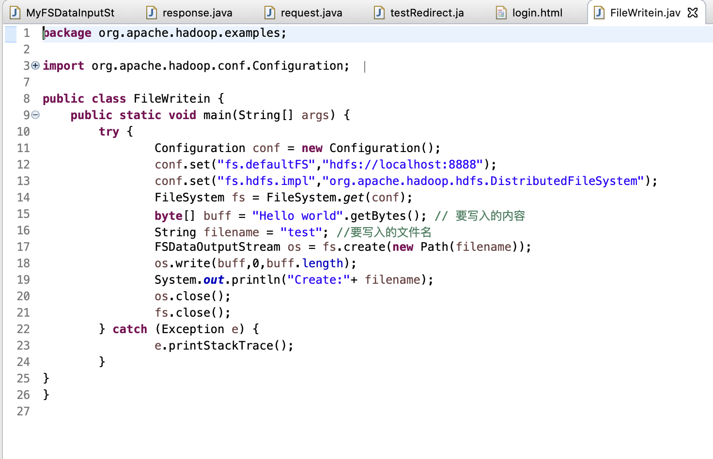

在Hadoop下运行代码将文件写入。

执行：

使用JavaApi读取刚创建的test文件，代码截图如下：

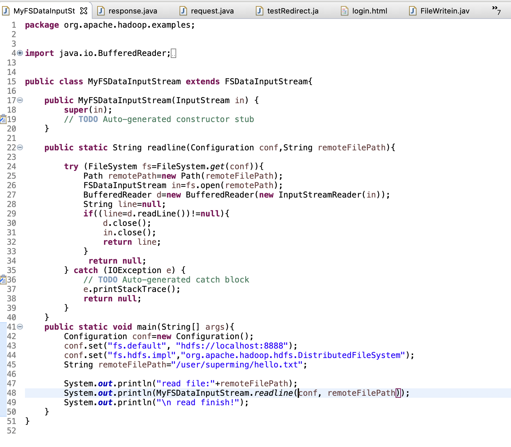

在Hadoop下执行如下：

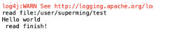


## 参考

[Hadoop分布式文件系统：架构和设计](https://hadoop.apache.org/docs/r1.0.4/cn/hdfs_design.html) 

[HDFS command 官方文档](https://hadoop.apache.org/docs/current/hadoop-project-dist/hadoop-common/FileSystemShell.html)

[Hadoop Api](http://hadoop.apache.org/docs/stable/api/)