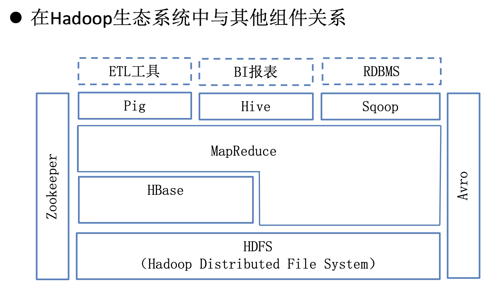
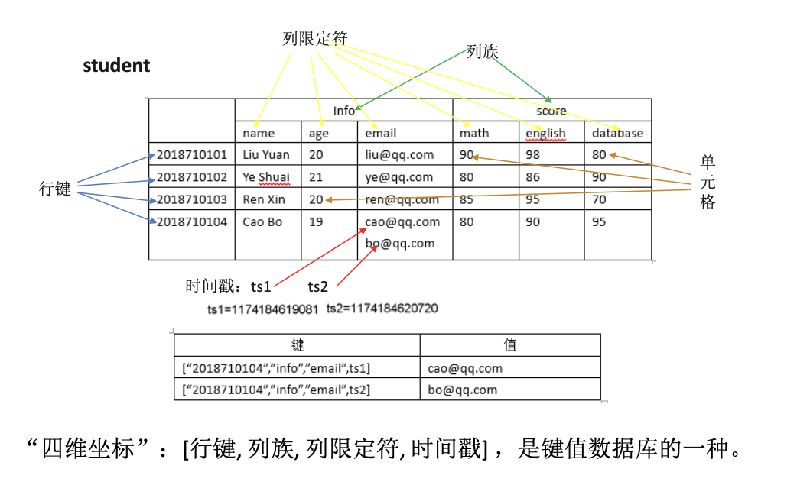
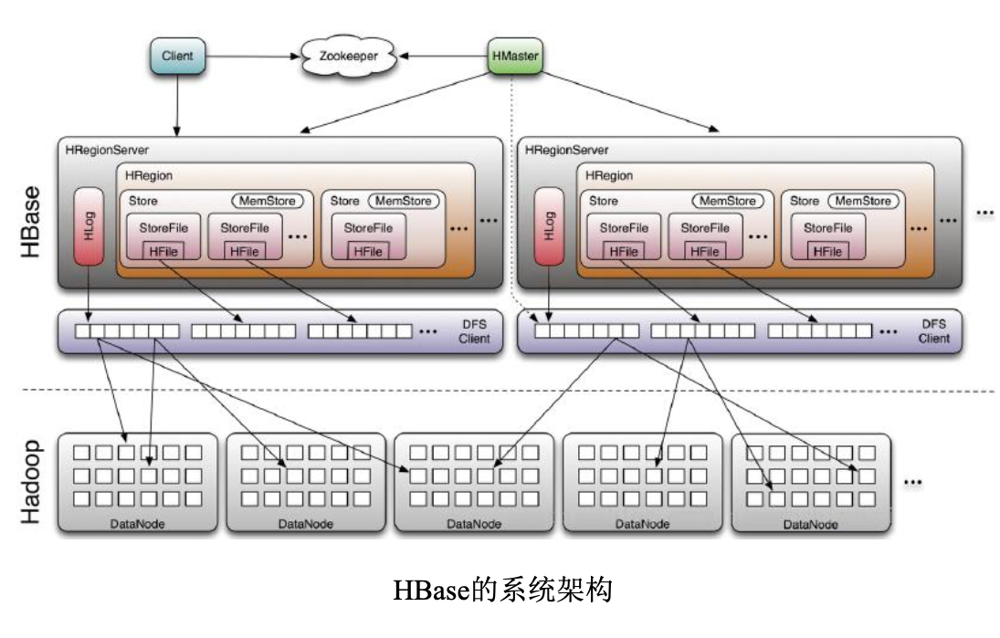
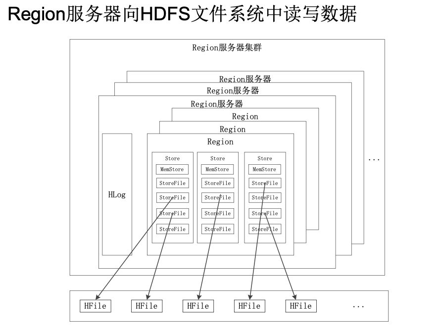
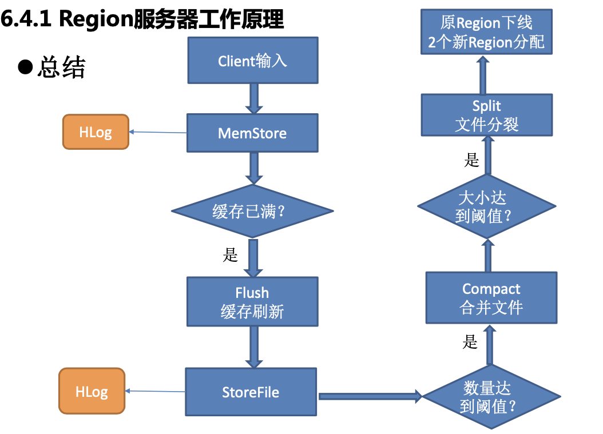
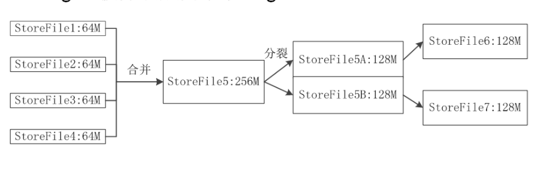
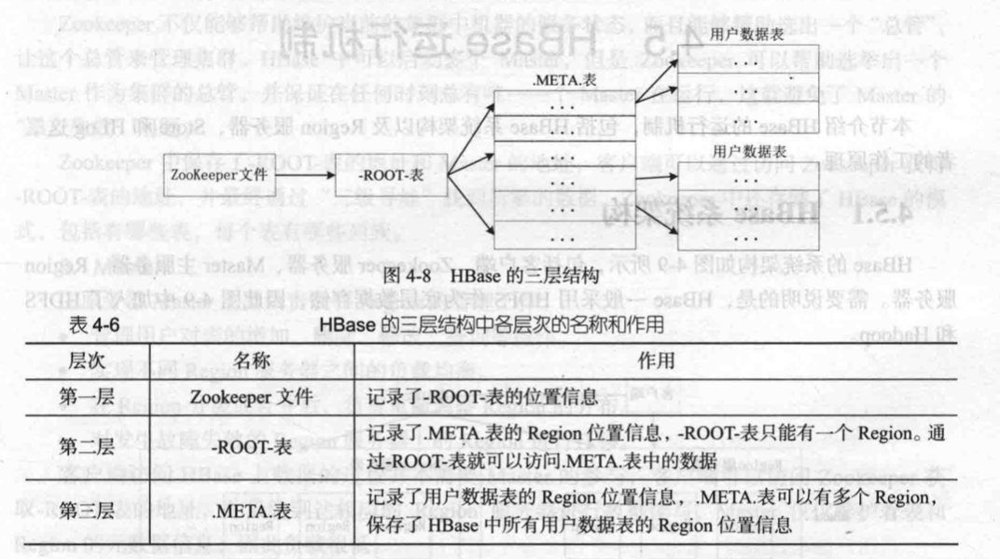
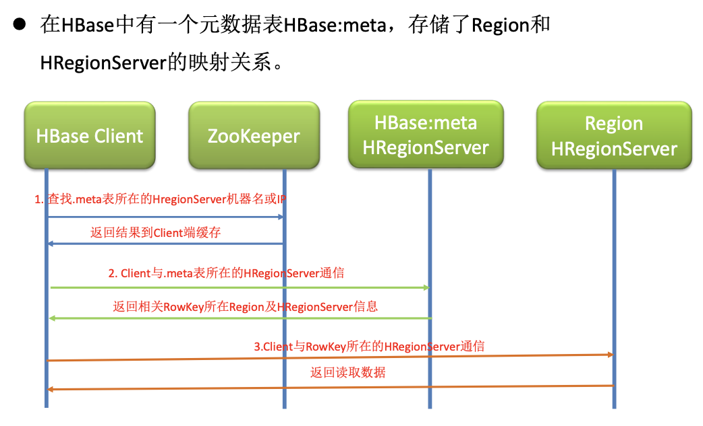
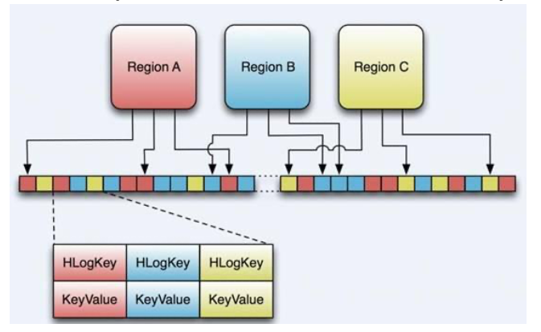

# HBase

## 环境准备

> MacOS 10.15.3	/	Hadoop 3.2.1	/	Hbase  1.3.5

使用shell命令安装Hbase

```
brew install Hbase
```

默认安装的hbase1.3.5，安装目录如下：`/usr/local/Cellar/hbase/1.3.5`。

配置：Hbase有两个运行模式，分别为单机模式和分布式模式。分布式又分为伪分布式和完全分布式，下面配置伪分布式模式。其余配置请参考[HBase文档](https://hbase.apache.org/book.html)。

`在确保Hbase停止的情况下进行如下配置。`

- 修改hbase-env.sh

```sh
export HBASE_MANAGES_ZK=true
export HBASE_HOME=/usr/local/Cellar/hbase/1.3.5/libexec
```

第一个配置使用Hbase自带的Zookeeper，而非单独加载外部的。

- 修改hbase-site.xml

```xml
<property>
    <name>hbase.rootdir</name>
    <value>hdfs://localhost:9000/hbase</value>
</property>
<property>
    <name>hbase.cluster.distributed</name>
    <value>true</value>
</property>
```

修改`hbase.rootdir`地址可参见Hadoop配置文件`core-site.xml`下的`fs.default.name`值。

为了使用方便，我们可以在shell配置文件下使用以下命令。

`export PATH=$PATH:/usr/local/Cellar/hbase/1.3.5/bin`

运行Hbase：

类似HDFS，先运行hadoop伪分布，再运行Hbase。

```shell
start-dfs.sh
start-hbase.sh
```

使用`jps`查看`HMaster`、`HQuorumPeer`和HRegionServer进程是否运行。


## HBase

### 概述

HBase是一种构建在HDFS之上的分布式、面向列的存储系统，是一个高可靠、高性能、面向列、可伸缩的分布式数据库，用于存储非结构化和半结构化的松散数据，在需要实时读写、随机访问超大数据集时具有极大优势。

### 生态关系

HBase在Hadoop生态中与其他部分的关系。

> HBase利用Hadoop MapReduce来处理HBase中的海量数据，实现**高性能计算**。
>
> Zookeeper作为协同服务，实现**稳定服务和失败恢复**。
>
> 使用HDFS作为高可靠底层数据存储，**利用廉价集群提供海量数据存储能力**。
>
> Sqoop为HBase提供高效、**便捷的RDBMS（Relational Database Management System）数据导入功能**。
>
> Pig和Hive为HBase提供**高层语言支持**。



### 为什么需要HBase

Hadoop主要解决大规模数据的离线批量处理，无法满足大规模数据实时处理应用的需求。HDFS面向批量访问模式，而非随机访问模式	——> HBase支持数据的随机访问模式，提供在线实时数据分析处理。

传统的关系型数据库无法应对在数据规模剧增时导致的系统扩展性和性能问题	——> 	Hbase支持分布式存储，易于横向拓展，性能高，且支持动态调整。

HBase与传统数据库之间优劣分析

| 对比     | HBase                                                        | 传统关系数据库                                               |
| -------- | ------------------------------------------------------------ | ------------------------------------------------------------ |
| 数据类型 | 把数据存储为未经解释的字符串，用户可以把不同格式的数据存入其中 | 关系模型具有丰富的数据类型和存储方式                         |
| 数据操作 | 采用单表的主键查询，操作功能简单                             | 操作丰富，表简通过主外键关联，操作较复杂                     |
| 存储模式 | 列存储，不同列族文件分离存储，可以降低I/O开销，支持大量并发用户查询 | 基于行存储，被连续存在磁盘页中，需要顺序扫描每个元组，筛选出需要属性，会浪费磁盘空间和内存带宽 |
| 数据索引 | 只有行键作为索引                                             | 针对不同列构建复杂的索引，提高数据访问性能                   |
| 数据维护 | 执行更新操作时，并不会删除数据旧的版本，而是生成新的版本     | 更新操作使用新的值去覆盖旧的值                               |
| 可伸缩性 | 可以轻易通过在集群中增加或减少硬件数量实现伸缩               | 很难实现**横向扩展**                                         |

局限：Hbase不支持事务，无法实现跨行原子性。

### 数据模型概述

HBase是一个稀疏、多维度、排序的映射表，索引是行键、列族、列限定符和时间戳。每个值是未经解释的字符串，没有数据类型。**每一行都有一个可排序的行键和任意多的列。**

**数据模型相关概念**



Hbase可以对允许保留的版本数量进行设置。

|          | 概念                                                         |
| -------- | ------------------------------------------------------------ |
| 表       | 采用表组织数据，表由行和列族组成，列族划分若干个列限定符     |
| 行       | 每个HBase由若干行组成，每个行由行键（row key）标示           |
| 列族     | 一个HBase表被分组为许多“列族”(Column Family)的集合，它是基本的访问控制单元 |
| 列限定符 | 列族里的数据通过列限定符定位                                 |
| 单元格   | 在HBase表中，通过行键、列族和列限定符确定一个“单元格”（cell），单元格中存书的数据没有数据类型，视为字节数据byte[] |
| 时间戳   | 每个单元格都保存着同一份数据的多个版本，采用时间戳进行索引   |
| 稀疏表   | 很多单元没有值                                               |

> HBase按单元格插数据，或按照单元格删除数据

## HBase原理与系统架构

### HBase各组件



HBase系统架构如上图，包含客户端、Zookeeper服务器、Master服务器、Region服务器。

**客户端**

包含HBase接口，在缓存中维护已经访问过的Region位置信息以加快后续数据访问。使用RPC机制与Master和Region服务器进行通信。**对于管理类操作，客户端与Master进行RPC；对于数据读写，客户端与Region服务器进行RPC。**

**Zookeeper**

维护集群中机器的服务状态：每一个Region服务器都需要到Zookeeper中进行注册，**Zookeeper实时监控每个Region服务器的状态并通知给Master**，Master就可以通过Zookeeper感知到各个region服务器的工作状态。

选出“总管”：HBase可以启动多个Master，Zookeeper可以选出一个Master作为集群总管，并保证在任何时刻总有唯一一个Master在运行，避免Master**单点失效**。

保存了HBase：mata的位置。

**HMaster**

对用户表的增删改查操作

在Region分裂或合并后，负责重新调整Region的分布

Master会实时监测集群中的Region服务器，把特定的Region分配到可用Region服务器中，**确保整个集群内部不同Region服务器之间负载均衡**

对故障失效的Region服务器上的Region进行迁移

> 客户端一般访问HBase上的数据不需要Master参与，客户端可以通过访问Zookeeper获取ROOT表地址，并最终到达相应Region服务器。
>
> 对于未被分配的Region：Master给这个Region服务器发送一个请求，把该Region分配给它，Region服务器接受请求并加载数据后变提供服务。

**HRegion服务器**
Region是HBase最核心的模块。负责维护分配给自己的Region丙响应读写请求。

HBase自身不具备**数据复制和维护数据副本的功能**，而HDFS可以为HBase提供支持。「也可以使用其他任何支持Hadoop接口文件系统作为底层存储）

管理一系列HRegion对象，每个HRegion对象对应table中的一个Region，Region中每个Store对应一个列族。

管理一个HLog对象，存储数据日志，当HRegion发生故障时，利用HLog进行故障恢复。

一台机器上只运行一个RegionServer。


### Region服务器工作原理



上图描述了Region服务器向HDFS文件系统读写数据的基本原理。

Region服务器内部管理了一系列Region对象和一个HLog文件，每个Region对象由多个Store组成，每个Store对应表中一个列族。同时每个Store包含一个MemStore和多个StoreFile。

> HLog：磁盘上的记录文件，记录所有更新操作。
>
> MemStore时内存中的缓存，保存最近更新的数据。
>
> StoreFile：磁盘中的文件，文件是B树结构，方便快速读取。
>
> HFile：是StoreFile的底层实现方式，HFile数据快通常采用压缩方式存储，压缩之后大大减少网络I/O和磁盘I/O。

**用户读写数据的过程**

用户读写数据时，会被翻配到对应的Region服务器去执行操作。用户数据首先写入**MemStore**与**HLog**中，当操作写入HLog后，commit( )调用将其返回客户端。

当用户读取数据时，Region服务器先访问**MemStore**缓存，如果数据不在缓存中，然后到**StoreFile**中读取。

**缓存的刷新**

MemStore缓存容量有限，系统周期性调用Region.flushcache( )把MemStore缓存里面的内容写到磁盘的StoreFile文件中，清空缓存，并在HLog文件中写入一个标记，表示缓存中内容已经被写入StoreFile文件中。每次缓存刷新操作都会在磁盘上生成新的StoreFile。

**StoreFile的合并**

每次MemStore缓存的刷新操作都会在磁盘上生成一个新的StoreFile，在用户访问Store中某个值时非常耗费时间，因此系统会调用Store.compact( )把多个StoreFile文件合并成一个大文件。次操作耗费资源，会在StoreFile文件数量到一个阈值时出发该操作。「阈值参数：hbase.hstore.compaction.min 默认3，hbase.hstore.compaction.max 默认10」

**StoreFile分割**

单个StoreFile大小超过阈值后「hbase.hregion.max.filesize」，触发Split操作，当前Region Split成两个Region。原Region下线，2个新生成的Region被HMaster分配到对应的HRegionServer上。

以下两张图解释的很详细





> 注意：合并操作是由文件数量触发的，分裂操作由单个文件大小触发。


### 表和Region

> Region服务器是HBase最核心的模块。

开始只有一个Region， 后来不断分裂。

Region拆分操作非常快，拆分后Region读取的仍是原存储文件，直到“分裂”过程把存储文件异步写到独立的文件之后，才会读取新文件

需要根据行键的值对表中的行进行分区，每个行区间构成一个分区，称为“Region”

每个Region最佳大小取决于单台服务器的有效处理能力，建议1GB-2GB

同一Region不会被分拆到多个Region服务器，每个Region服务器存储10-1000个Region「每个Region服务器负责管理一个Region集合」

> 每个Region都有一个RegionID来标识其唯一性，一个Region标识符“表名 + 开始主键 + RegionID”‘
>
> 元数据表(.META表)：这个映射表包含关于Region的元数据，为了加快访问速度，数据存放在Region位置
>
> -ROOT-表：当HBase中Region非常庞大的时候，一个服务器保存不了.MATA.表的条目，就需要存储到不同服务器上，此时.MATA.分裂成多个Region，于是构建了一个新的映射表即：“-ROOT-表”



#### Region定位

客户端查找zookeeper的meta-region-server节点查询HBase：meta表在哪台HRegionServer上

客户端连接含有HBase:meta表的HRegionServer该表存储了所有Region的行键范围信息,可以查询出需要存取的行键属于那个Region，以及这个Region属于那个HRegionServer

此后，客户端就可以直接连接拥有存取行键Region的HRegionServer，并对其操作

客户端吧meta信息缓存起来，下次进行相同操作就不用加载HBase:meta操作了




### HLog工作原理

**HLog实际是为了保证系统容错性而存在的。**

HLog文件格式：



> Key： HLogKey对象，记录了写入数据的归属信息，包括table、sequence number、timestamp等
>
> Value：HBase的KeyValue对象，对应HFile中的KeyValue

HBase为每个Region配置了一个HLog文件，是一种**预写式日志(Write Ahead Log)**，换句话说，用户更新数据必须首先写入日志才能写MemStore缓存，直到MemStore缓存内容对应内容被写入磁盘之后，该缓存内容才会被刷新写入磁盘。

Region服务器启动时检查HLog文件，发现更新，则先写入MemStore再刷写到StoreFile。

HLog定期回滚，删除被写入文件中的更新。

#### 数据恢复

1. Zookeeper实时监测Region服务器状态，当某个Region服务器发生故障，Zookeeper通知Master。

2. Master处理故障Region服务器上遗留的HLog文件。根据每条日志记录所属的**Region对象**对HLog数据进行拆分，分别放到对应Region对象目录下，然后再将失效的Region重新分配到可用的Region服务器中,同时把该Region对象相关的HLog日志记录也发送给相应的Region服务器。
3. Region服务领取到分配给自己的Region对象以及相关的HLog日志后，把日志记录中的数据写入到MemStore缓存中，刷新到磁盘的StroeFile文件中，完成数据恢复。

> 需要强调的是：HBase中，每个Region服务器只需要维护一个HLog文件，所有**Region对象**共用一个HLog。多个Region对象的更新操作导致的日志修改，只需要对HLog进行文件追加即可。缺点在于，当一个Region服务器故障时，需要将HLog按照所属的Region对象进行拆分并分发。

## 小结

主要介绍HBase数据库相关内容。HBase数据库是BigTable的开源实现，和BigTable一样，支持大规模海量数据，分布式并发数据处理效率很高，易于扩展且支持动态伸缩。

HBase实际是一个稀疏、多维、持久化存储的映射表，采用行键、列键和时间戳进行索引，每个值都是未经解释的字符串。

HBase采用分区存储，一个大的表会被拆分为多个Region，这些Region会被分发到不同的服务器上实现分布式存储。

HBase的系统架构包括客户端、Zookeeper服务器、Master、Region服务器。客户端包含访问HBase的接口；Zookeeper服务器负责稳定、可靠的协同服务；Master主要负责表和Region的管理工作；Region服务器负责维护分配给自己的Region，并响应用户的读写请求。

对于HBase实现与编程受限于文章长度并未涉及。