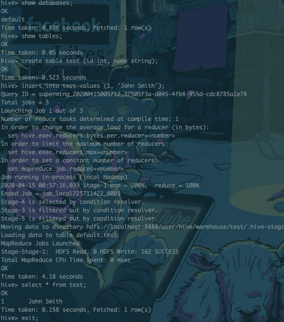
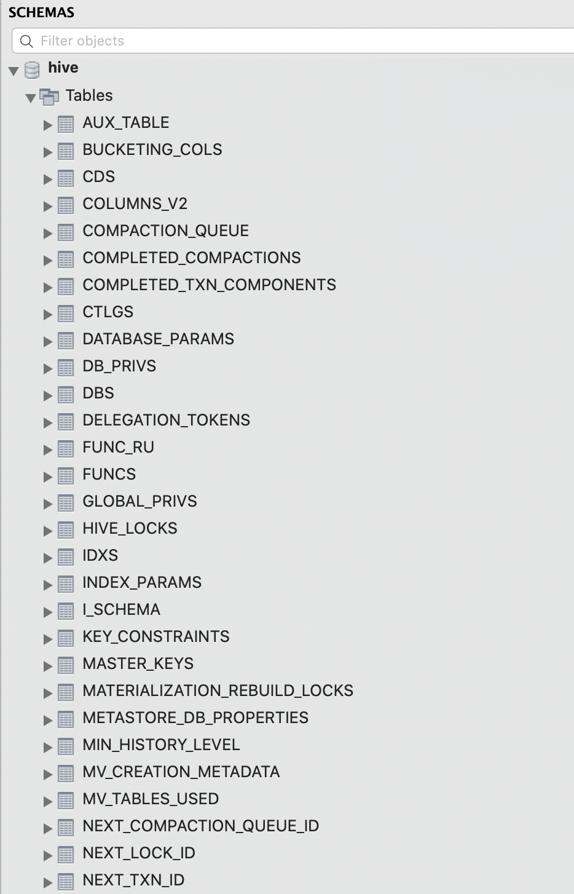
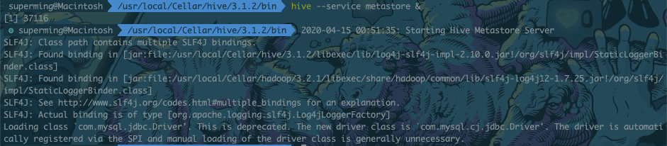

## Hive MacOS 配置

环境：

Hadoop3.2.1

Hive 3.1.2

## Hive 3.1.2 安装

使用brew安装Hive

```shell
brew update
brew install hive
```

Hive的默认安装目录为：`/usr/local/Cellar/hive/3.1.2`

添加环境变量至shell配置文件, 我使用`zshrc`，故执行`vim .zshrc`

```shell
export HIVE_HOME=/usr/local/Cellar/hive/3.1.2
export PATH=$PATH:$HIVE_HOME/bin
```

保存退出后使配置生效`source .zshrc`。

###  创建Hive的HDFS目录

```hadoop shell
//Create warehouse folder under hive and provide permission
hdfs dfs -mkdir -p /user/hive/warehouse
hdfs dfs -chmod g+w /user/hive/warehouse

//Create tmp folder in root and provide permission
hdfs dfs -mkdir -p /tmp
hdfs dfs -chmod g+w /tmp

hdfs dfs -mkdir -p /tmp/hive
hdfs dfs -chmod 777 /tmp/hive
```


### 环境变量配置

```shell
cd /usr/local/Cellar/hive/3.1.2/libexec/conf
mv hive-default.xml.template hive-default.xml
vim hive-site.xml
```


进入`/usr/local/Cellar/hive/3.1.2/libexec/conf`目录创建`hive-site.xml`，在其中添加如下配置信息：

```xml
<?xml version="1.0" encoding="UTF-8" standalone="no"?>
<?xml-stylesheet type="text/xsl" href="configuration.xsl"?>
<configuration>
  <property>
    <name>javax.jdo.option.ConnectionURL</name>
    <value>jdbc:mysql://localhost:3306/hive?createDatabaseIfNotExist=true</value>
    <description>JDBC connect string for a JDBC metastore</description>
  </property>
  <property>
    <name>javax.jdo.option.ConnectionDriverName</name>
    <value>com.mysql.jdbc.Driver</value>
    <description>Driver class name for a JDBC metastore</description>
  </property>
  <property>
    <name>javax.jdo.option.ConnectionUserName</name>
    <value>hive</value>
    <description>username to use against metastore database</description>
  </property>
  <property>
    <name>javax.jdo.option.ConnectionPassword</name>
    <value>hive</value>
    <description>password to use against metastore database</description>
  </property>
</configuration>
```

其中UserName为数据库名称，Password为数据库密码，其中Password与下面mysql创建的hive账户密码一致。


## MySQL配置

> 本文默认安装MySQL。

### jdbc包下载

下载地址：[地址](https://downloads.mysql.com/archives/c-j/)，选择Platform Independent，下载。

下载完成后，将mysql的jdbc包移入hive的lib目录下`/usr/local/Cellar/hive/3.1.2/libexec/lib`。

### 创建sql表

```mysql
mysql -u root -p
mysql> create database hive;
mysql> USE hive;
mysql> CREATE USER 'hive'@'localhost' IDENTIFIED BY 'hive';
mysql> grant SELECT,INSERT,UPDATE,DELETE,ALTER,CREATE ON hive.* TO 'hive'@'localhost';
// grant all on hive.* to 'hive'@'localhost';
mysql> FLUSH PRIVILEGES;
```


## 启动Hive 并测试

先执行以下命令，使用 schematool工具初始化Hive版本的Metastore架构。

```shell
schematool -initSchema -dbType mysql
```

最后会出现`Initialization script completed schemaTool completed`

启动Hive

```shell
hive
```

hive启动完成后会出现如下命令提示符

```hive
hive>
```

可以简单执行以下命令尝试：

```hive
hive> show databases;
hive> show tables;
hive> create table test (id int, name string);
hive> insert into test values (1, 'John Smith');
hive> select * from test;
hive> drop table test;
hive> exit;
```



Hive安装成功后在MySql会有如下表格：




## Hive常见Bug汇总

### guava版本不一致问题

在使用hive命令后，出现如下报错：

```shell
LF4J: Class path contains multiple SLF4J bindings.
SLF4J: Found binding in [jar:file:/usr/local/Cellar/hive/3.1.2/libexec/lib/log4j-slf4j-impl-2.10.0.jar!/org/slf4j/impl/StaticLoggerBinder.class]
SLF4J: Found binding in [jar:file:/usr/local/Cellar/hadoop/3.2.1/libexec/share/hadoop/common/lib/slf4j-log4j12-1.7.25.jar!/org/slf4j/impl/StaticLoggerBinder.class]
SLF4J: See http://www.slf4j.org/codes.html#multiple_bindings for an explanation.
SLF4J: Actual binding is of type [org.apache.logging.slf4j.Log4jLoggerFactory]
Exception in thread "main" java.lang.NoSuchMethodError: com.google.common.base.Preconditions.checkArgument(ZLjava/lang/String;Ljava/lang/Object;)V
    at org.apache.hadoop.conf.Configuration.set(Configuration.java:1357)
    at org.apache.hadoop.conf.Configuration.set(Configuration.java:1338)
    at org.apache.hadoop.mapred.JobConf.setJar(JobConf.java:536)
    at org.apache.hadoop.mapred.JobConf.setJarByClass(JobConf.java:554)
    at org.apache.hadoop.mapred.JobConf.<init>(JobConf.java:448)
    at org.apache.hadoop.hive.conf.HiveConf.initialize(HiveConf.java:5141)
    at org.apache.hadoop.hive.conf.HiveConf.<init>(HiveConf.java:5099)
    at org.apache.hadoop.hive.common.LogUtils.initHiveLog4jCommon(LogUtils.java:97)
    at org.apache.hadoop.hive.common.LogUtils.initHiveLog4j(LogUtils.java:81)
    at org.apache.hadoop.hive.cli.CliDriver.run(CliDriver.java:699)
    at org.apache.hadoop.hive.cli.CliDriver.main(CliDriver.java:683)
    at sun.reflect.NativeMethodAccessorImpl.invoke0(Native Method)
    at sun.reflect.NativeMethodAccessorImpl.invoke(NativeMethodAccessorImpl.java:62)
    at sun.reflect.DelegatingMethodAccessorImpl.invoke(DelegatingMethodAccessorImpl.java:43)
    at java.lang.reflect.Method.invoke(Method.java:498)
    at org.apache.hadoop.util.RunJar.run(RunJar.java:323)
    at org.apache.hadoop.util.RunJar.main(RunJar.java:236)
```

修复：

查阅资料后，是因为`com.google.common.base.Preconditions.checkArgument`依赖包在hive内部以及hadoop内部版本不一致导致的。

使用如下命令解决：

```shell
# 查看版本
$ ls /usr/local/Cellar/hadoop/3.2.1/libexec/share/hadoop/common/lib/guava*
/usr/local/Cellar/hadoop/3.2.1/libexec/share/hadoop/common/lib/guava-27.0-jre.jar
$ ls /usr/local/Cellar/hive/3.1.2/libexec/lib/guava* 
/usr/local/Cellar/hive/3.1.2/libexec/lib/guava-19.0-jre.jar
# hadoop 版本比 hive 高，替换之
$ mv /usr/local/Cellar/hive/3.1.2/libexec/lib/guava-19.0.jar /tmp # 保留下副本
$ cp /usr/local/Cellar/hadoop/3.2.1/libexec/share/hadoop/common/lib/guava-27.0-jre.jar /usr/local/Cellar/hive/3.1.2/libexec/lib/ # 替换
```

### Metastore Server未正常启动

报错如下：

```shell
Exception in thread "main" java.lang.RuntimeException: java.lang.RuntimeException: Unable to instantiate org.apache.hadoop.hive.ql.metadata.SessionHiveMetaStoreClient
        at org.apache.hadoop.hive.ql.session.SessionState.start(SessionState.java:444)
        at org.apache.hadoop.hive.cli.CliDriver.run(CliDriver.java:672)
        at org.apache.hadoop.hive.cli.CliDriver.main(CliDriver.java:616)
        at sun.reflect.NativeMethodAccessorImpl.invoke0(Native Method)
        at sun.reflect.NativeMethodAccessorImpl.invoke(NativeMethodAccessorImpl.java:39)
        at sun.reflect.DelegatingMethodAccessorImpl.invoke(DelegatingMethodAccessorImpl.java:25)
        at java.lang.reflect.Method.invoke(Method.java:597)
        at org.apache.hadoop.util.RunJar.run(RunJar.java:221)
        at org.apache.hadoop.util.RunJar.main(RunJar.java:136)
Caused by: java.lang.RuntimeException: Unable to instantiate org.apache.hadoop.hive.ql.metadata.SessionHiveMetaStoreClient
```

解决：启动Hive的MetaStoreServer服务进程即可

```
# hive --service metastore &
[1] 52460
Starting Hive Metastore Server
SLF4J: Class path contains multiple SLF4J bindings.
SLF4J: Found binding in [jar:file:/root/hadoop/hadoop-2.6.0/share/hadoop/common/lib/slf4j-log4j12-1.7.5.jar!/org/slf4j/impl/StaticLoggerBinder.class]
SLF4J: Found binding in [jar:file:/root/hadoop/apache-hive-0.14.0-bin/lib/hive-jdbc-0.14.0-standalone.jar!/org/slf4j/impl/StaticLoggerBinder.class]
SLF4J: See http://www.slf4j.org/codes.html#multiple_bindings for an explanation.
SLF4J: Actual binding is of type [org.slf4j.impl.Log4jLoggerFactory]
```



Hive启动报错

参见：[参考](https://stackoverflow.com/questions/52783323/hive-throws-wstxparsingexception-illegal-character-entity-expansion-character)

```shell
Exception in thread "main" java.lang.RuntimeException: com.ctc.wstx.exc.WstxParsingException: Illegal character entity: expansion character (code 0x8
...
```

解决：

在hive-site.xml中删除下面描述

```xml
<description>
     Ensures commands with OVERWRITE (such as INSERT OVERWRITE) acquire Exclusive locks for 
     transactional tables. This ensures that inserts (w/o overwrite) running concurrently
     are not hidden by the INSERT OVERWRITE.
</description>
```


---

参考：

[常见问题汇总](https://blog.csdn.net/freedomboy319/article/details/44828337)

[hive configuration](https://www.datageekinme.com/setup/setting-up-my-mac-hive/)

https://luckymrwang.github.io/2018/03/14/Install-hive-on-Mac-with-Homebrew/

[hive set up on mac](https://dbmstutorials.com/hive/hive-setup-on-mac.html)

[set up hive](https://www.datageekinme.com/setup/setting-up-my-mac-hive/)