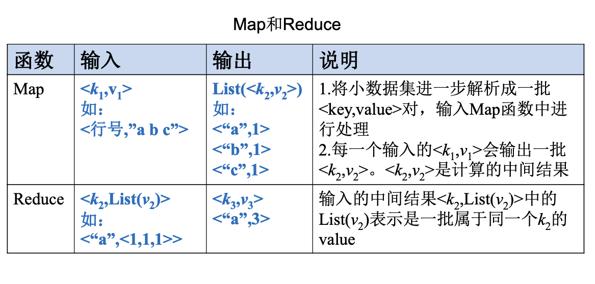
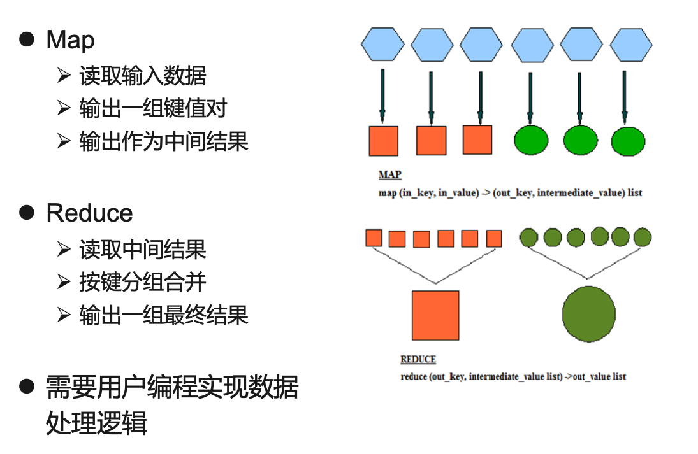
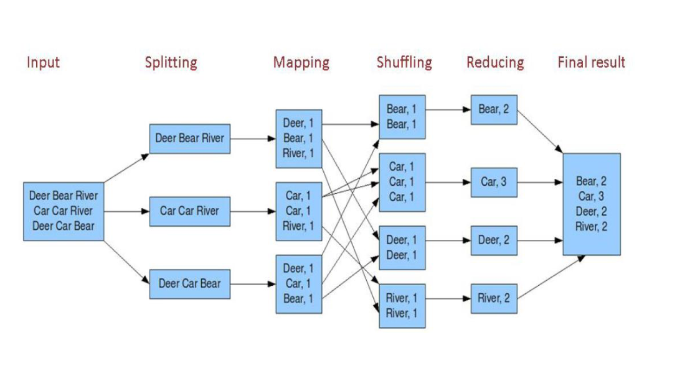
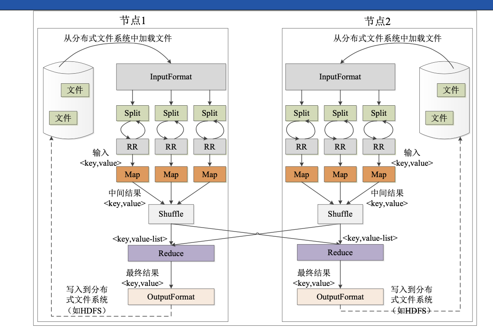
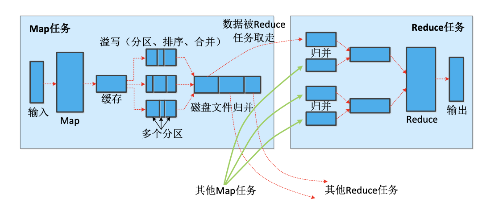

# Mapreduce

## 概述

> 分布式并行编程可以大幅提高程序性能，实现高效的批量数据处理。分布式程序运行在大规模计算机集群上，集群中包含大量廉价服务器，能够并行执行大规模数据处理任务，从而获得海量的计算能力。MapReduce就是一种并行编程模型，用于大规模数据集的并行运行，将复杂的，运行于大规模集群上的并行计算高度抽象到两个函数**Map**和**Reduce**，两个函数及其核心思想源自函数式编程语言。

谷歌最先提出了分布式并行编程模型MapRecude，Hadoop MapReduce是其开源实现。前者运行在DFS上，后者运行在HDFS上。

在MapReduce中，一个存储在分布式文件系统中的大规模数据集会被切分为许多独立的小数据块，这些小数据块可以被多个Map任务并行处理。<u>MapReduce框架会为每个Map任务输入一个**数据子集**，Map任务生成的结果会继续作为Reduce任务的输入，最终由Reduce任务输出最后结果，并写入分布式文件系统。</u>「适合用MapReduce来处理的数据集需要满足一个前提条件：待处理的数据集可以分解成许多小的数据集，而且每个小数据集都可以完全并行进行处理。」

MapReduce的一个设计理念为**“计算向数据靠拢”**而非“数据向计算靠拢”。主要是因为移动数据需要大量的网络传输开销，尤其在大规模数据环境下，移动计算比移动数据更加经济。所以在集群中，MapReduce框架会将每个Map程序就近在HDFS数据所在的节点运行，即将计算节点和存储节点一起运行，减少移动数据开销。

综上，MapReduce是一个**基于集群的高性能并行计算平台**，MapReduce是一个**并行计算软件框架**，MapReduce是一个**并行程序设计模型与方法**。

## 模型介绍

MapReduce核心是Map函数和Reduce函数，开发者只需要关注Map和Reduce函数的实现即可，不需要处理其他复杂的问题，比如分布式存储、工作调度、负载均衡等。

MapReduce使用列表和键值对<key, value>作为主要的数据模式。

### Map函数

Map函数的输入来自分布式文件系统的文件快，这些文件块的格式是任意的，可以是文档，也可以是二进制格式的。文件块是一系列元素的集合，这些元素也是任意类型的。Map函数将输入元素转化为键值对，**键和值的类型也是任意的**，其中键不同于一般的标志属性，键没有唯一性，不能作为输出身份标识。即使是同一输入元素也可以通过Map任务生成具有相同键的多个<key, value>。

### Reduce函数

Reduce函数的任务就是将输入的一系列具有相同键的键值对以某种方式组合起来，输出处理后的键值对，输出结果会合并成一个文件。用户可指定Reduce任务个数，通知实现系统，然后主控进程通常选择一个Hash函数，Map任务输出的每个键都会经过Hash函数计算，并更具哈希结果将该键值对输入相应的Reduce任务处理。

### 工作流程

MapReduce的核心思想可以用“分而治之”描述，如上流程图可知，即将一个大的数据集拆分成多个小数据块在多台机器上并行处理。Map任务一般在数据节点上运行，以减少多余开销。只有在Map任务结束后，中间结果会被分发到多个Reduce中。

需要注意的是：不同的Map任务之间不会进行通讯，不同的Reduce任务之间也不会发生任何信息交换；用户不能显式地从一台机器向另一台机器发送消息，所有数据交换都通过MapReduce自身去实现的。

在执行过程中，Map任务输入文件，Reduce任务的处理结果保存在分布式文件系统中，而Map任务处理得到的中间结果则保存在本地磁盘中，只有Map任务处理结束后，Reduce过程才开始；所以Map任务需要考虑到数据的局部性。

### 任务执行

MapReduce执行阶段如下：

1. MapReduce使用**InputFormat**模块作为Map的预处理；然后将输入文件切分为逻辑上的多个**InputSplit**，*InputSplit是MapReduce对文件进行处理和运算的输入单位。*「实际上InputSplit并没有对文件进行切割，而是记录了需要处理数据的位置和长度」
2. 通过**RecordReader**（RR）根据InputSplit里面的信息处理具体数据，加载数据并转换为适合的Map任务读取的键值对，输入给Map任务。
3. Map根据用户自定义的映射规则，输出一些列键值对作为中间结果。
4. 为了让Reduce可以并行处理Map的结果，需要对Map的输出进行一定的分区(Portition)、排序(Sort)、合并(Combine)、归并(Merge)等操作，得到中间结果，然后交给对应的Reduce处理，该过程为**Shuffle**。从无序的键值对到有序的键值对。
5. Reduce以一系列中间结果作为输入，执行用户定义的逻辑，输出结果给OutputFormat模块。
6. **OutputFormat**模块验证输出目录是否已经存在以及输出结果类型是否符合配置文件中的配置类型，如果都满足，就输出Reduce结果到分布式文件系统。

### Shuffle过程

Shuffle是MapReduce的核心环节。Shuffle过程即对Map输出结果进行分区、排序、合并等处理交给Reduce过程，故分为Map端操作和Reduce端操作，Shuffle过程如下图。

Map的输出结果首先被写入缓存，缓存满后进行溢写操作，即把缓存中的数据写入磁盘文件，清空缓存。当启动溢写操作时，首先把缓存中的数据写入分区，然后对每个分区的数据进行排序、合并，之后再写入磁盘文件。每次溢写操作生成一个新的磁盘文件，随着Map任务执行，磁盘中就会有多个溢写文件，任务结束后，这些文件被归并（Merge）为一个大的磁盘文件。然后通知Reduce任务领取属于自己处理的数据。Reduce任务领取数据后，将其归并写入磁盘后交给Reduce处理。

#### Map端的Shuffle过程

1. 输入数据和执行Map任务

Map任务的输入数据保存在分布式文件系统的文件块中，文件格式任意。Map任务接收<key , value>作为输入后，按一定的映射规则转换成一批<key , value>进行输出。

2. 写入缓存

每个Map任务都会分配一个缓存，Map输出结果先写入缓存中，在缓存满后才写入磁盘。可以大大降低开销。

3. 溢写（分区、排序和合并）

提供给MapReduce的缓存容量时有限的，一旦占满缓存就执行溢写（Spill）操作，把缓存中的内容一次性写入磁盘并清空缓存。在溢写到磁盘前，缓存中的数据先被分区（Partition），以键值对形式存储；对于每个分区的键值对，后台线程根据其Key对其进行内存排序（Sort），排序是MapReduce默认操作，排序结束后执行合并（Combine）操作，合并操作根据用户定义的执行。

4. 文件归并

在Map任务全部结束之前，系统会对所有溢写文件中的数据进行归并（Merge），生成一个大的溢写文件。这个大的溢写文件中所有键值对也是经过分区和排序的。

综上，Map端的Shuffle过程全部完成，最终生成一个大文件存放在本地磁盘上。其中JobTracker会一直检测Map任务执行，当检测到一个Map任务完成后，立即通知相关Reduce任务来领取数据。

#### Reduce端的Shuffle过程

Reduce端的Shuffle过程相对简单，从Map端读取Map结果，然后进行归并，最后输送给Reduce进行处理。

1. 领取数据

Map端的Shuffle过程结束后，Reduce任务把这些数据领取回来，

2. 归并数据

归并过程与Map端类似

3. 把数据给Reduce任务

磁盘经过多轮归并后得到若干大文件，不再继续归并，直接输入给Reduce任务，减少磁盘读写开销。

