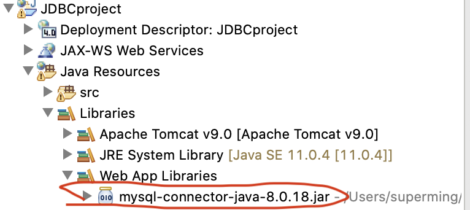

# JDBC基本概念

## 简介

JDBC（Java Database Connectivity）是一组用来按照统一方式访问数据库的API。向程序员提供了独立于数据库的**统一接口**，开发人员只需要学习JDBC结构，并通过JDBC加载具体驱动，就可以对数据库进行连接及操作。「组成JDBC的两个包：java.sql和javax.sql」

JDBC一共有四种驱动类型，参见[维基百科](https://en.wikipedia.org/wiki/JDBC_driver)。

JDBC API：


## 基本编程操作

连接数据库分为以下7步：

> 第一步：加载正确的数据库驱动程序
>
> 第二步：定义所要连接数据库的地址
>
> 第三步：建立与数据库的连接
>
> 第四步：声明SQL语句并创建语句对象
>
> 第五步：执行SQL语句
>
> 第六步：对执行结果进行处理
>
> 第七步：关闭打开的资源

1. 创建数据库脚本

```sql
-- ----------------------------
-- Table structure for user
-- ----------------------------
DROP TABLE IF EXISTS `user`;
CREATE TABLE `user`  (
  `id` int(11) NOT NULL AUTO_INCREMENT,
  `username` varchar(20) CHARACTER SET utf8 COLLATE utf8_general_ci NOT NULL,
  `password` varchar(20) CHARACTER SET utf8 COLLATE utf8_general_ci NOT NULL,
  `ident` char(1) CHARACTER SET utf8 COLLATE utf8_general_ci NOT NULL COMMENT '0普通用户\r\n1管理员',
  `telephone` varchar(20) CHARACTER SET utf8 COLLATE utf8_general_ci NOT NULL,
  `address` varchar(50) CHARACTER SET utf8 COLLATE utf8_general_ci NOT NULL,
  PRIMARY KEY (`id`) USING BTREE,
  UNIQUE INDEX `unique-username`(`username`) USING BTREE
) ENGINE = InnoDB AUTO_INCREMENT = 17 CHARACTER SET = utf8 COLLATE = utf8_general_ci ROW_FORMAT = Dynamic;

-- ----------------------------
-- Records of user
-- ----------------------------
INSERT INTO `user` VALUES (1, 'admin', '123', '1', '0', '0');
INSERT INTO `user` VALUES (2, 'user1', '123', '0', '041184835202', '大连东软信息学院A3座117室');
INSERT INTO `user` VALUES (3, 'user2', '123', '0', '041184835207', '大连理工大学计算机系');
INSERT INTO `user` VALUES (4, 'user3', '123', '0', '041184832264', '新新园100号2门103');

SET FOREIGN_KEY_CHECKS = 1;
```

数据表结构如下：


2. 新建Java工程并在web资源中导入数据库驱动



3. 编写注册页面`register.html`，用于输入信息并提交至RegisterServlet。

```html
<!DOCTYPE html>
<html lang="en">
<head>
    <meta charset="UTF-8">
    <title>注册页面</title>
</head>
    <body>
	<form method="post" action="register">
		<table align="center" border="1">
			<tr>
				<th colspan="2">用户注册</th>
			</tr>
			<tr>
				<td>用户名：</td>
				<td><input type="text" name="un" size="20" placeholder="请输入"
					required></td>
			</tr>
			<tr>
				<td>密码：</td>
				<td><input type="password" name="pw" required></td>
			</tr>
			<tr>
				<td>电话：</td>
				<td><input type="text" name="tel" size="20" placeholder="请输入"
					required></td>
			</tr>
			<tr>
				<td>地址：</td>
				<td><textarea name="addr" rows="3" cols="20" placeholder="请输入"
						required></textarea></td>
			</tr>
			<tr>
				<td></td>
				<td><input type="submit" value="注册"> <input
					type="reset"></td>
			</tr>
		</table>
	</form>
</body>
</html>
```

页面如下：


4. 编写`RegisterServlet`，只放doGet部分代码。

> 使用JDBC连接数据库，将注册页面填写的信息插入数据表中，并给出提示。

```java
protected void doGet(HttpServletRequest request, HttpServletResponse response) throws ServletException, IOException {
	response.setContentType("text/html;charset=UTF-8");
	PrintWriter out = response.getWriter();
	String un = request.getParameter("un");
	String pw = request.getParameter("pw");
	String tel = request.getParameter("tel");
	String addr = request.getParameter("addr");
	if(un==null || pw==null|| tel==null ||addr==null||un.equals("")||pw.equals("")||tel.equals("")||addr.equals("")) {
		out.println("注册信息不全！");
		out.println("请输入完整的<a href=register.html>注册</a>信息！");
	}//end if 注册信息不全
	else {
		int r=0;
		Connection con=null;
		PreparedStatement pstmt=null;
		ResultSet rs = null;
		try {
			//1加载驱动程序
			Class.forName("com.mysql.cj.jdbc.Driver");
			//2定义url连接数据库
			String url="jdbc:mysql://127.0.0.1:3306/meal?serverTimezone=UTC";
			//3 建立与DB的连接
			con = DriverManager.getConnection(url,"root","");
			//4写SQL语句，查询用户名是否可用
			String sql = "select * from user where username=?";
			//5创建语句对象
			pstmt = con.prepareStatement(sql);
			//6给❓ 赋值，执行SQL
			pstmt.setNString(1, un);
			rs=pstmt.executeQuery();
			//7对结果集进行处理
			System.out.println("====rs"+rs);
			if(rs.next()) {//如果结果集不为空，说明注册用户名在数据库中已存在
				out.println("用户名不可用");
				out.println("<a href=register.html>返回</a>");
			}//end if用户名已存在，不可用
			else {
				pstmt.close();
				//4 写sql语句，完成插入操作
				sql="insert into user values(null,?,?,0,?,?)";
				pstmt = con.prepareStatement(sql);
				pstmt.setString(1, un);
				pstmt.setString(2, pw);
				pstmt.setString(3, tel);
				pstmt.setString(4, addr);
				r=pstmt.executeUpdate();
			}//end else用户名可用
		}//end try
		catch(ClassNotFoundException ex) {
			ex.printStackTrace();
		}
		catch(SQLException ex) {
			ex.printStackTrace();
		}
		finally {
			//8关闭连接
			if(rs!=null)
				try {
					rs.close();
				} catch (SQLException e) {
					// TODO Auto-generated catch block
					e.printStackTrace();
				}
			if(pstmt!=null)
				try {
					pstmt.close();
				} catch (SQLException e) {
					// TODO Auto-generated catch block
					e.printStackTrace();
				}
			if(con!=null)
				try {
					con.close();
				} catch (SQLException e) {
					// TODO Auto-generated catch block
					e.printStackTrace();
				}	
		}
		if(r==1) {
			out.println("注册成功！");
		}else {
			out.println("注册失败！");
		}out.println("<a href=register.html>返回</a>");
	}//end if 注册信息完整
}
```

以上，代码编写且执行均可正常运行，JDBC也连接ok。

### 步骤拆分

1. 加载正确的数据库驱动程序

```java
Class.forName("com.mysql.cj.jdbc.Driver");	//声明后即正确加载驱动程序
```

如果抛出`ClassNotFoundException`异常表明所需驱动未在`classpath`中。

不同数据库驱动程序的名称是不同的，声明内的代码也是不同的。

2. 定义url连接数据库

```java
//2定义url连接数据库
String url="jdbc:mysql://127.0.0.1:3306/meal?serverTimezone=UTC";
```

不同数据库连接的地址不同，URL一般由三个部分组成，用冒号隔开。`jdbc:子协议：子名称`

> jdbc：JDBC中的协议就是jdbc。
>
> <子协议>：数据库驱动程序名或数据库连接机制的名称。
>
> <子名称>：一种标记数据库的方法。子名称根据子协议的不同而不同，使用子名称的目的是为定位数据库。

常用数据库URL地址写法：

> String ODBCURL = "jdbc:odbc:dbName";
>
> String oracleURL = "jdbc:oracle:thin:@host:port:dbName";
>
> String mysqlURL = "jdbc:mysql://host:port/dbName";
>
> String sqlURL = "jdbc:microsoft:sqlserver://host:port;DatabaseName=dbName ";


3. 建立与DB的连接

```java
//3 建立与DB的连接,url,user,password
Connection connetion = DriverManager.getConnection(url,username,password);
```

**DriverManager类**

驱动程序管理类负责管理JDBC驱动程序。在使用JDBC驱动程序，在使用JDBC驱动程序前，需要向DriverManager注册才可使用，调用`Class.forName()`方法。

常用方法：

```java
static void registerDriver(Driver driver) 	//向 DriverManager 注册给定驱动程序。
public static synchronized Connection getConnection(String url,String user,String password) throws SQLException		//获得url对应数据库的一个连接
```

**Connection接口**

Connection对象是通过DriverManager.getConnection()方法获得，代表与数据库的连接，也就是在已经加载的驱动程序和数据库之间建立连接，是数据库编程中非常重要的一个对象，客户端和数据库之间的交互全是通过Connection对象完成的。

常用方法：

```java
Statement createStatement() throws SQLException		//创建一个Statement对象
PreparedStatement prepareStatement(String sql) throws SQLException		//创建一个Preparestatement对象，并能把SQL语句提交到数据库进行预编译。
void setAutoCommit(Boolean autocommit) throws SQLException		//设置事务提交的模式
void commit() throws SQLException		//提交对数据库的更改，使更改生效
void rollback() throws SQLException		//放弃当前事务开始以来对数据库所作的修改 

```

4. 声明SQL语句并创建语句对象

```java
String sql = "select * from tablename" ；
Statement statement = connection.createStatement();
PreparedStatement pstmt = connection.prepareStatement(sql);
```

**Statement类**

Statement用于执行静态SQL语句。

执行`insert`，`update`，`delete`语句等，调用`executeUpdate(String sql)`方法。

执行`select`语句可以调用`executeQuery(String sql)`方法，返回`ResultSet`对象。

常用方法如下：

```java
ResultSet executeQuery(String sql) throws SQLException		//执行一个查询语句并返回结果集
int executeUpdate(String sql) throws SQLException		//执行更新操作，返回更新的行数
boolean execute(String sql) throws SQLException		//执行更新或查询语句，返回是否有结果集 [任意结果集]
```

**PreparedStatement类**

PreparedStatement 是预编译的语句对象，可以用来执行带占位符的SQL语句。

数据库对他们事先进行编译，因此，客户端需要做的只是传送占位符位置所需要的数据。

**Statement对象执行的SQL语句，只有在程序运行时才对他们进行编译，因此PreparedStatement运行的速度更快。**

常用方法：

```java
void setXXX(int parameterIndex,XXX x) 	//为第1参数指定的占位符设置第2参数指定的值
ResultSet executeQuery()	//执行 SQL 查询，并返回该查询生成的 ResultSet 对象。 
int executeUpdate() 	//执行 SQL 语句，该语句必须是一个 SQL 数据操作语言（Data Manipulation Language，DML）语句，比如 INSERT、UPDATE 或 DELETE 语句；或者是无返回内容的 SQL 语句，比如 DDL 语句。 
boolean execute() 	//执行 SQL 语句，该语句可以是任何种类的 SQL 语句。
```

例如编程基本操作处使用的代码使用的就是PreparedStatement类。

**CallableStatement类**

CallableStatement是JDBC用来调用数据库中存储过程的机制。

具体的使用和PreparedStatement相似。

需要注意的是：要调用的存储过程必须在数据库中存在，否则将抛出异常。

5. 执行SQL语句

```java
pstmt = con.prepareStatement(sql);
```

执行查询类SQL语句：使用语句对象的executeQuery()方法，返回 ResultSet结果集（一个二维表）。

执行更新类SQL语句：使用语句对象的executeUpdate()方法，返回被更新记录的条数。

执行各种类型的SQL语句：使用语句对象的execute()方法，当SQL语句的执行结果是一个ResultSet时，方法返回true，并可以通过语句对象的getResultSet()方法得到返回的结果集；当SQL语句的执行没有返回的结果集时，该方法返回false。

6. 处理结果

ResultSet用于代表Sql语句执行结果。Resultset封装执行结果时，采用类型表格的方式。维护了一个指向表格数据行的游标，游标在第一行之前，调用`ResultSet.next()`方法，可以使游标指向具体数据行。

ResultSet提供了getXxx()方法，用于获取当前行中某列的值，其中“XXX”与列的数据类型有关，例如，如要获取的列是String类型，则使用getString()方法获取该列的值。getXxx()方法如下所示：getString()，getInt()，getFloat()，getDouble()，getDate()和getBoolean() 

应用示例：

```java
ResultSet rs = statement.executeQuery();
while(rs.next()){
	String name = rs.getString(1);
	String phone = rs.getString(2);
	System.out.println(name+","+phone);
}
通过指定列名(getXxx(String)) 或列号的方式(getXxx(int)) 调用getXxx()方法将对应列的内容获取出来。
通过first(), (), previous(), next(), absolute(int), … 方法滚动结果集中的内容。
```


7. 释放资源

JDBC程序运行完后，一定要释放程序中创建的一些交互对象，通常为ResultSet、Statement和Connection对象，尤其是Connection对象，非常稀有的资源，用完后需要立即释放，否则容易造成系统宕机。

资源释放代码一定要放在finally语句中执行。