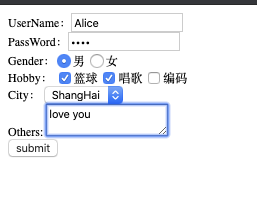
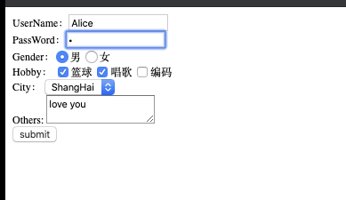
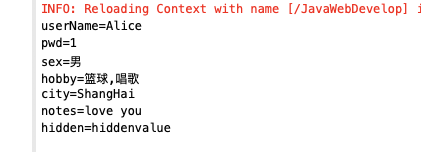
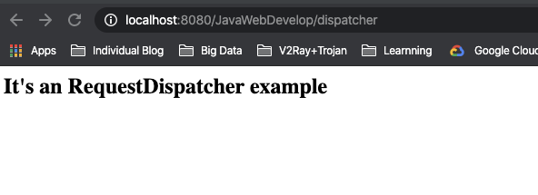
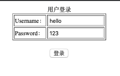
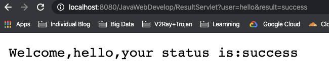

# HttpServletRequest对象和HttpServeltResponse对象详解

## 1. HttpServletRequest简介

HttpServletRequest代表客户端请求，顾名思义，客户端通过HTTP协议访问服务器时，HTTP相关信息都封装在这个对象中，开发者可以通过这个对象的方法获取客户端请求的所有信息。

## 2. Request对象常用方法

### 2.1 获取请求行信息「客户机信息」

| 方法名         | 作用                        |
| -------------- | --------------------------- |
| getMethod      | 获得请求方式                |
| getRequestURL  | 获得客户端发出请求时完整URL |
| getRequestURI  | 获得请求行中资源名部分      |
| getServletPath | 获得Servlet路径             |
| getProtocol    | 获得协议和版本              |
| getQueryString | 获得返回行中的参数部分      |
| getLocalAddr   | 获得Web服务器的IP地址       |
| getLocalName   | 获得Web服务器来的主机名     |

### 2.2 获取请求头信息

| 方法名         | 作用                               |
| -------------- | ---------------------------------- |
| getHeader      | 以字符串形式返回指定请求头的值     |
| getHeaderNames | 返回请求包含所有的请求头名称的枚举 |
代码实例：

```java
package servlet;

import java.io.IOException;
import java.io.PrintWriter;
import java.util.Enumeration;

import javax.servlet.ServletException;
import javax.servlet.annotation.WebServlet;
import javax.servlet.http.HttpServlet;
import javax.servlet.http.HttpServletRequest;
import javax.servlet.http.HttpServletResponse;

/**
 * Servlet implementation class request
 */
@WebServlet("/request")
public class request extends HttpServlet {
	private static final long serialVersionUID = 1L;
       
    /**
     * @see HttpServlet#HttpServlet()
     */
    public request() {
        super();
        // TODO Auto-generated constructor stub
    }

	/**
	 * @see HttpServlet#doGet(HttpServletRequest request, HttpServletResponse response)
	 */
	protected void doGet(HttpServletRequest request, HttpServletResponse response) throws ServletException, IOException {
		// TODO Auto-generated method stub
		//请求行、请求头内容获取
		response.setContentType("text/html");
		   PrintWriter out = response.getWriter();
		   String title = "Servlet Example: Showing Request Headers";
		   out.println(
		        "<html><head><title>" + title + "</title></head><body>\n"     
		     + "<h1>" + title+ "</h1>\n"
		     + "<h2>Request Method: "+request.getMethod()+"</h2>"
		     + "<h2>Request URL: "+request.getRequestURL()+"</h2>"
		     + "<h2>Request URI: "+request.getRequestURI()+"</h2>"
		     + "<h2>ServletPath: "+request.getServletPath()+"</h2>"
		     + "<h2>Request Protocol: "+request.getProtocol()+"</h2>"
		     + "<h2>Request String: "+request.getQueryString()+"</h2>"
		     + "<h2>Web Server IP Address: "+request.getLocalAddr()+"</h2>"
		     + "<h2>WebServerLocalName: "+request.getLocalName()+"</h2>"
		     + "<table border=\"1\">\n"
		     + "<tr><th>Header Name</th><th>Header Value</th></tr>");
		   Enumeration headerNames = request.getHeaderNames();
		   while (headerNames.hasMoreElements()) {
		       String headerName = (String) headerNames.nextElement();
		       out.println("<tr><td>" + headerName + "</td>" 
		         +"<td>"+request.getHeader(headerName)+"</td></tr>");
		    }
		    out.println("</table>\n</body></html>");
	}
	
	/**
	 * @see HttpServlet#doPost(HttpServletRequest request, HttpServletResponse response)
	 */
	protected void doPost(HttpServletRequest request, HttpServletResponse response) throws ServletException, IOException {
		// TODO Auto-generated method stub
		doGet(request, response);
	}

}

```

执行结果：


### 2.3 获取请求体

### 2.3.1 表单获取
| 方法名                                      | 作用                              |
| ------------------------------------------- | --------------------------------- |
| String getParameter(name)                   | 根据表单中的属性名，获取value的值 |
| String[]　getParameterValues（String name） | 为复选框提供的方法                |
| getParameterNames                           | 获取表单提交的所有name方法        |
| Map<String , String[]>　getParameterMap()   | 得到表单提交的所有值的方法        |
| getInputStream                              | 以字节流的方式得到所有表单数据    |

#### 2.3.1.1 使用getParameter和getParameterValues获取表单数据

代码举例：

```html
//创建表单文件，提交到requset
<!DOCTYPE html>
<html>
<head>
<meta charset="UTF-8">
<title>Insert title here</title>
</head>
<body>
<form action="request" method="get">
        UserName：<input type="text" name="userName"/><br/>
        PassWord：<input type="password" name="pwd"/><br/>
        Gender：<input type="radio" name="sex" value="男" checked="checked"/>男  
            <input type="radio" name="sex" value="女"/>女  <br/>
        Hobby：
            <input type="checkbox" name="hobby" value="篮球"/>篮球
            <input type="checkbox" name="hobby" value="唱歌"/>唱歌
            <input type="checkbox" name="hobby" value="编码"/>编码
            <br/>
        City：
        <select name="city">
            <option value="NewYork">NewYork</option>
            <option value="ShangHai">ShangHai</option>
            <option value="Sydney">Sydney</option>
        </select>
        <br/>
        Others:
        <textarea name = "notes"></textarea>
        <br/>
        <input type = "hidden" name = "hidden" value = "hiddenvalue"/>
        <input type="submit" value="submit"/>
    </form>
</body>
</html>
```

```java
//request.java
package servlet;

import java.io.IOException;
import java.io.PrintWriter;
import java.util.Enumeration;

import javax.servlet.ServletException;
import javax.servlet.annotation.WebServlet;
import javax.servlet.http.HttpServlet;
import javax.servlet.http.HttpServletRequest;
import javax.servlet.http.HttpServletResponse;

/**
 * Servlet implementation class request
 */
@WebServlet("/request")
public class request extends HttpServlet {
	private static final long serialVersionUID = 1L;
       
    /**
     * @see HttpServlet#HttpServlet()
     */
    public request() {
        super();
        // TODO Auto-generated constructor stub
    }

	/**
	 * @see HttpServlet#doGet(HttpServletRequest request, HttpServletResponse response)
	 */
	protected void doGet(HttpServletRequest request, HttpServletResponse response) throws ServletException, IOException {
		// TODO Auto-generated method stub
    	 	String userName = request.getParameter("userName");
	        String pwd = request.getParameter("pwd");
	        String sex = request.getParameter("sex");
	        String[] hobbys = request.getParameterValues("hobby");
	        String city = request.getParameter("city");
	        String others = request.getParameter("notes");
	        String hidden = request.getParameter("hidden");
	        
	        userName = new String(userName.getBytes("iso-8859-1"),"UTF-8");
	        System.out.println(userName);
	        System.out.println(pwd);
	        System.out.println(sex);
	        for (int i = 0; hobbys!=null && i < hobbys.length; i++) {
	            System.out.print(hobbys[i]+"\t");
	        }
	        System.out.println();
	        System.out.println(city);
	        System.out.println(others);
	        System.out.println(hidden);
	}
  
	/**
	 * @see HttpServlet#doPost(HttpServletRequest request, HttpServletResponse response)
	 */
	protected void doPost(HttpServletRequest request, HttpServletResponse response) throws ServletException, IOException {
		// TODO Auto-generated method stub
		doGet(request, response);
	}

}

```

执行结果如下：




####  2.3.1.2 使用getParameterNames()和 getParameterValues（String name）获取

```java
Enumeration names = request.getParameterNames();
        while(names.hasMoreElements()){
            String name = (String) names.nextElement();//得到每一个name名
            String[] values = request.getParameterValues(name);//根据name名，得到value值
            for (int i = 0;values!=null && i < values.length; i++) {
                System.out.println(name+"\t"+values[i]);
            }
```

#### 2.3.1.3 使用getParameterMap获取提交的所有值,需要导入对应包

```java
 Map<String, String[]> paramMap = request.getParameterMap();
        for(Map.Entry<String, String[]> entry :paramMap.entrySet()){
            String paramName = entry.getKey();
            String paramValue = "";
            String[] paramValueArr = entry.getValue();
            for (int i = 0; paramValueArr!=null && i < paramValueArr.length; i++) {
                if (i == paramValueArr.length-1) {
                    paramValue+=paramValueArr[i];
                }else {
                    paramValue+=paramValueArr[i]+",";
                }
            }
            System.out.println(MessageFormat.format("{0}={1}", paramName,paramValue));
        }
```

执行如下：






### 2.3.2 Request对象进行请求转发

主要使用以下方法

| 方法                                          | zuoyng                                                       |
| --------------------------------------------- | ------------------------------------------------------------ |
| void setAttribute(String name, Object value); | 将数据作为request对象的一个属性存放到request对象中           |
| Object getAttribute(String name);             | 获取属性                                                     |
| Void removeAttribute(String name);            | 移除request对象的name属性                                    |
| getAttributeNames                             | 获取request对象所有的属性名，例如：Enumeration<String> attrNames = request.getAttributeNames(); |

代码实例，将`dispatcher.java`请求转发到`anotherServelt.java`上：

```java
// dispatcher.java
package servlet;

import java.io.IOException;
import javax.servlet.ServletException;
import javax.servlet.annotation.WebServlet;
import javax.servlet.http.HttpServlet;
import javax.servlet.http.HttpServletRequest;
import javax.servlet.http.HttpServletResponse;

/**
 * Servlet implementation class dispatcher
 */
@WebServlet("/dispatcher")
public class dispatcher extends HttpServlet {
	private static final long serialVersionUID = 1L;
       
    /**
     * @see HttpServlet#HttpServlet()
     */
    public dispatcher() {
        super();
        // TODO Auto-generated constructor stub
    }

	/**
	 * @see HttpServlet#doGet(HttpServletRequest request, HttpServletResponse response)
	 */
	protected void doGet(HttpServletRequest request, HttpServletResponse response) throws ServletException, IOException {
		// TODO Auto-generated method stub
		//response.getWriter().append("Served at: ").append(request.getContextPath());
		request.setAttribute("param", "It's an RequestDispatcher example");//设置参数
		request.getRequestDispatcher("anotherServlet").forward(request,response);
	}

	/**
	 * @see HttpServlet#doPost(HttpServletRequest request, HttpServletResponse response)
	 */
	protected void doPost(HttpServletRequest request, HttpServletResponse response) throws ServletException, IOException {
		// TODO Auto-generated method stub
		doGet(request, response);
	}
}

```

```java
package servlet;

import java.io.IOException;
import java.io.PrintWriter;

import javax.servlet.ServletException;
import javax.servlet.annotation.WebServlet;
import javax.servlet.http.HttpServlet;
import javax.servlet.http.HttpServletRequest;
import javax.servlet.http.HttpServletResponse;

/**
 * Servlet implementation class anotherServelt
 */
@WebServlet("/anotherServelt")
public class anotherServelt extends HttpServlet {
	private static final long serialVersionUID = 1L;
       
    /**
     * @see HttpServlet#HttpServlet()
     */
    public anotherServelt() {
        super();
        // TODO Auto-generated constructor stub
    }

	/**
	 * @see HttpServlet#doGet(HttpServletRequest request, HttpServletResponse response)
	 */
	protected void doGet(HttpServletRequest request, HttpServletResponse response) throws ServletException, IOException {
		// TODO Auto-generated method stub
		//response.getWriter().append("Served at: ").append(request.getContextPath());
		//String param = (String)request.getAttribute("param");//getAttribute返回object类型，需要强制转换
		String param = (String)request.getAttribute("param");
		PrintWriter out = response.getWriter();
		out.print("<h1>"+param+"</h1>");
		System.out.print("hello");
		System.out.print(param);
		
	}

	/**
	 * @see HttpServlet#doPost(HttpServletRequest request, HttpServletResponse response)
	 */
	protected void doPost(HttpServletRequest request, HttpServletResponse response) throws ServletException, IOException {
		// TODO Auto-generated method stub
		doGet(request, response);
	}

}

```

结果如下：



总结：**请求转发并不改变浏览器的URL，服务器处理转发资源，屏蔽了浏览器，request对象的值不改变，可继续从中获取数据。同时请求转发局限于某一个Web项目下，不可跳转至其他项目。**


## 3. HttpServletResponse简介

Web服务器收到客户端HTTP请求，对每一次请求创建一个请求对象request和响应对象response对象。我们需要像容器输出数据，使用response对象即可。

HttpServletResponse对象代表服务器的响应。这个对象中封装了向客户端发送数据、发送响应头，发送响应状态码的方法。


其中getOutputStream和getWriter方法分别用于得到输出二进制数据、输出文本数据的ServletOuputStream、Printwriter对象。这两个方法互相排斥，调用了其中的任何一个方法后，就不能再调用另一方法。 会抛异常。

Servlet程序向ServletOutputStream或PrintWriter对象中写入的数据将被Servlet引擎从response里面获取，Servlet引擎将这些数据当作响应消息的正文，然后再与响应状态行和各响应头组合后输出到客户端。

Serlvet的service方法结束后，Servlet引擎将检查getWriter或getOutputStream方法返回的输出流对象是否已经调用过close方法，如果没有，Servlet引擎将调用close方法关闭该输出流对象。

### 3.1 响应行

| 常见的响应状态码          | 含义                                                         |
| ------------------------- | ------------------------------------------------------------ |
| 200 OK                    | 一切正常，对GET和POST请求的应答文档跟在后面                  |
| 3XX                       | 用于已经移动的文件并且充被包含在定位头信息中指定新的地址消息 |
| 302 Found                 | 类似于301，但新的URL应该被视为临时性的替代，而不是永久性的。 |
| 4XX  用于指出客户端的错误 | 404 Not Found 无法找到指定位置的资源                         |
| 5XX  用于支持服务器错误   | 500 Internal Server Error  服务器遇到了意料不到的情况，不能完成客户的请求 |

可以使用`setStatus(int sc)`来设置响应状态码

### 3.2 响应头

常见响应头：

```
				Accept-Charset:告知客户可以接收的字符集
        Accept-Encoding:所有响应的字符编码集
        Content-Type:响应体的MIME类型
        Content-Language:响应体的语言类型
        Content-Length:响应体的长度和字节数
        Expires：通知客户端过期时间，防止客户浏览器使用本地缓存副本
        Cookie：包含保存到客户端的Cookie集
        Redirect：提供指定重定向，可以不向浏览器输出响应内容，而是直接重新请求到另一个URL地址，实现重定向响应，即是一种自动定向。
```

可以使用`setHeader(String name, String value) `设置响应头信息

举例如下：

```java
response.setContentType("text/html;charset=UTF-8"); //告诉客户端使用什么编码

response.setStatus(302);//设置状态码为302，代表重定向
response.setHeader("location", "http://www.baidu.com");//设置location为baidu,实现重定向

response.setHeader("refresh","2");//定时刷新页面
```

### 3.3 响应正文方法

| 方法                                 | 作用                   |
| ------------------------------------ | ---------------------- |
| getWrite                             | 字符输出流             |
| getOutputStream                      | 字符输出流             |
| setCharacterEncoding(String charset) | 告诉服务器使用什么编码 |
| setContentType(String type)          | 设置服务器编码         |


### 3.4 重定向

什么是重定向：**一个web资源收到客户端请求后，通知客户端去访问另外一个web资源，这称之为请求重定向。**

应用场景：用户登陆成功，从注册页面跳转到某个页面。

实现方式：response.sendRedirect(String location)，调用response对象的sendRedirect方法实现请求重定向
sendRedirect内部的实现原理：使用response设置302状态码和设置location响应头实现重定向

举例：

```java
protected void doGet(HttpServletRequest request, HttpServletResponse response) throws ServletException, IOException {
			response.setContentType("text/html;charset=UTF-8");
		  response.sendRedirect("http://www.baidu.com");//重定向到baidu
  		//sendRedirect（"http://www.baidu.com"）等同于以下两行代码
  		//response.setStatus(302);
		  //response.setHeader("location", "http://baidu.com");
  
}
```

总结：

重定向由response发起，是服务器告诉浏览器要跳转的页面，所以URL地址会变，即浏览器重新发起一个请求到另一页面，request是重新发起的请求，而请求转发是服务器内部完成的请求，是不一样的。

对于重定向的跳转路径，有两种方法：

`response.sendRedirect("/test01/MyServlet01");`：此处使用/作为开始，说明是从web的根开始，可以定位到根下面的任何资源。

`response.sendRedirect("MyServlet01");`：这种写法是从当前web项目的根开始，即使用相对路径表示，能够访问到当前web项目下的任何资源。

#### 3.5 如何使用重定向传参

重定向发起的是二次请求，浏览器中请求的新页面无法获取服务器中原来页面参数，那么参数该如何获取呢？

解决：使用URL后的？传参，并使用getParameter取得参数。

举例：使用重定向传参数，模拟用户登陆页面。

说明：login.html为登陆的页面，表单提交后发送至loginServlet.java，在loginServlet.java中处理得到结果，将结果发送至resultServlet.java，并在页面中输出。

```html
//login.html
<!DOCTYPE html>
<html>
<head>
<meta charset="UTF-8">
<title>Insert title here</title>
</head>
<body>
	<div align="center">
		<form action="loginServlet" method="post" >
			<p style="margin-top: 0px;margin-bottom: 0px;margin-top: 0px">用户登录</p>
			<table align="center" border="1">
                <tr>
                    <td>Username：</td>
                    <td><input type="text" name="name" required></td>
                </tr>
                <tr>
                    <td>Password：</td>
                    <td><input type="text" name="password" required></td>
                </tr>
            </table><br>
            <table align="center">
	            <tr>
	            	<td><input type="submit" value="登录"></td>
	            </tr>
            </table>
        </form>
	</div>
</body>
</html>
```

```java
// loginServlet.java中的doGet方法，其余不变
protected void doGet(HttpServletRequest request, HttpServletResponse response) throws ServletException, IOException {
		// TODO Auto-generated method stub
		//获取表单参数
		String user = request.getParameter("name");
		String pw = request.getParameter("password");
		String result = "";
		//登陆验证
		if(user.equals("hello")&&pw.equals("123"))
			result = "success";
		else 
			result = "fail";
		//使用请求转发，通过设置参数进行获取
		//request.setAttribute("user", user);
		//request.setAttribute("result", result);
		//请求转发，跳回视图层
		//RequestDispatcher rd  = request.getRequestDispatcher("ResultServlet");
		//rd.forward(request, response);
		
		//使用重定向，则需要通过？传参
		response.sendRedirect("ResultServlet?user="+user+"&result="+result);
	}
```

```java
// resultServlet中的doGet方法，其余不变
protected void doGet(HttpServletRequest request, HttpServletResponse response) throws ServletException, IOException {
		// TODO Auto-generated method stub
		//请求转发使用getAttribute获取。
		//String user = (String)request.getAttribute("user");
		//String result =(String)request.getAttribute("result");
		//重定向参数获取，使用getParameter获取
		String user = (String)request.getParameter("user");
		String result =(String)request.getParameter("result");
		
		PrintWriter out = response.getWriter();
		out.print("Welcome,"+user+",your status is:"+result);
	}
```





> 以上登陆提供了请求转发和重定向两种方式，便于进一步体现两者区别。　　　


## 乱码问题解决

> 待补充...


## 参考

[Oracle HttpServletRequest官方文档](https://docs.oracle.com/javaee/6/api/javax/servlet/http/HttpServletRequest.html)

[Oracle HttpServletResponse官方文档](https://docs.oracle.com/javaee/7/api/javax/servlet/http/HttpServletResponse.html)

[孤傲苍狼博客园对Java Web的总结](https://www.cnblogs.com/xdp-gacl/p/3798347.html)

[LanceToBigData](https://www.cnblogs.com/zhangyinhua/p/7629221.html#_label0)