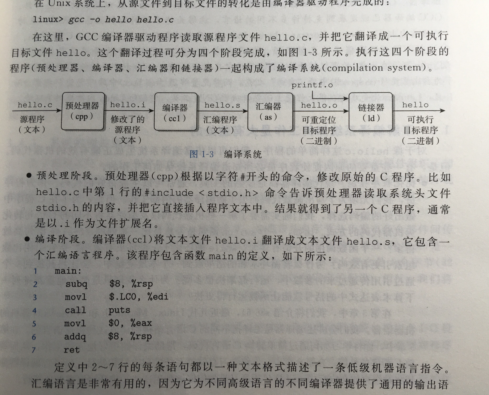
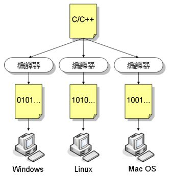
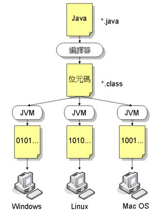
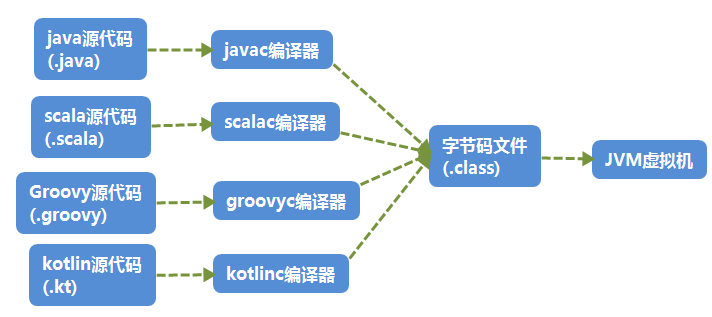

# 关于编程语言跨平台特性的挖掘与思考

“一次编写，到处运行”（Write once, run anywhere. ），是SUN公司用来展示Java程序设计语言所具有的跨平台特性的广告。字面理解为Java可以在任何设备上进行开发，且仅需要写一次代码即可。

而C++创始人说：“JVM创造了一个新的平台，让所有Java程序只能在这个平台上运行，而C和C++的代码却可以在几十个不同的平台上运行，从这个角度看，C和C++是跨平台的。“

”跨平台“概念一出，很多人都会思考，我现在所使用的语言是否具有跨平台性呢？细分下去又将语言分为了解释性语言和编译性语言，由此又可以带来很多探索。

**借机会写篇文章总结一下相关知识以及自己对跨平台的理解。**

## 程序的编译系统是如何工作的？

计算机系统是由硬件和系统软件组合，他们共同工作来运行应用程序。虽然系统具体实现方式随时间不断变化，但系统内在的概念却没有变化。以下通过对hello程序生命周期来了解程序编译系统工作。

~~~java
#include <stdio.h>
  
int main ()
{
	printf("hello, world\n");
  return 0;
}
~~~

当我们在文本编辑器写下这段文本，文件名保存`hello.c`。这段程序即源程序「程序生命周期的开始」，那么为了在系统上运行hello.c程序，C语言必须被转化为一系列**低级的机器语言指令**，并将指令按照可执行目标程序的格式打好包，并以二进制磁盘文件的形式存储起来，后载入内存执行。

而从源文件到目标文件之间的转化由**编译器驱动程序**完成，后简称编译器（Compiler）。

假设在Unix系统上，需要执行`gcc -o hello hello.c`可以完成程序的执行。

整个阶段如下：

图中展示了**预处理阶段**以及**编译阶段**。

**汇编阶段**：汇编器（as）将hello.s翻译成机器语言指令，把这些指令打包成一种可重新定位目标程序的格式，并将结果保存在目标文件hello.o中，hello.o为一个二进制文件。

**链接阶段**：hello程序调用了一个printf函数，是每个C编译器都提供的标准库函数中的一个函数。printf函数存在于一个名为printf.o的单独预编译好了的文件中，这个文件需要通过链接器合并到我们的hello.o程序中。然后目标文件就可以加载到内存中，由系统执行。

什么是汇编语言，在文章不做详细展开：[Wiki 汇编语言](https://zh.wikipedia.org/wiki/汇编语言)

>**汇编语言**( assembly language)是任何一种用于计算机、微处理器、微控制器或其他可编程器件的低级语言。不同设备中，汇编语言对应不同的机器语言指令集。一种汇编语言专用于某种计算机系统结构，而不想许多高级语言，可以在不同平台之间移植。
>
>使用汇编语言编写的源代码，然后通过相应的汇编程序将他们转换成可执行的机器代码，该过程为汇编过程。

再次回看C语言的整个执行过程，相较于汇编语言而言，多了预处理器和编译器层，其余部分原理基本和汇编一致。可以理解为人为封装了一层使得程序员更方便编程。高级语言就因运而生，并随着时间和技术的进步逐渐取代汇编语言成为主流，因为开发更为方便。**但不管语言怎么变化，计算机能够执行的和识别的并没有变，也就是不管我们使用什么语言如何编写，最后都会被解释为计算机能够执行的二进制机器码，只是中间的很多繁琐复杂的脏活累活，别人帮你干了。**

以上解释**了高级语言的编译器是如何运行的。**，通过以上模式开发的语言也被称为编译型语言，主要以C/C++、Pascal等为代表。由此引出一个问题：这些编译型语言如何在各不同平台运行呢？复杂度如何等？

## 编译型语言是否具有“跨平台”特性？

C语言如何在各平台之间使用呢？以下为《C Primer Plus》对C语言可移植性的介绍：

> C是可移植的语言。这意味着，在一种系统的编写的C程序稍作修改或不修改就可能在其他系统上运行。如需修改，也只需简单更改主程序头文件中的少数项即可。但需要注意的是，程序中针对特殊硬件设备或操作系统特殊功能编写部分，通常是不可移植的。

可见C语言是具有可移植性的。但是不同CPU所使用指令集等不同，就比如以Intel为代笔的复杂指令集和ARM代表的精简指令集，他们所使用的标准是不同的，CPU能看懂的二进制文件也是不同的；即C语言在一个平台上编译出的**可执行目标程序（二进制）**，只能保证该类型的操作系统和CPU架构可以识别并运行。所以C语言想要在不同的平台上运行，需要使用针对不同平台而设计的编译器进行编译，可以开玩笑的说“一次编写，到处编译”。但编译过程，还是挺费力的。

从C语言的角度看，C语言通过适配不同平台的编译器来实现语言的可移植性的，一定程度上可以理解为跨平台。

## 解释器是如何工作的？

随着技术进步，逐渐出现了以解释器为主的高级语言。与汇编器和编译器只是输出机器码且机器码单独执行不同的是，**解释器在翻译语句后便立即执行这个语句**，不需要编译。但由于软件的解释器很复杂，一般运行效率较低。

以特殊的Java举例，Java为了达到最佳的可移植性，设计了一种名为JVM（Java虚拟机）的软件解释器接受字节码程序，然后执行它。即JVM只能看懂字节码程序，只要是字节码，JVM就执行，至于如何执行，各个平台之间差异如何处理，这些是JVM开发者做的事情。

> 字节码：编译Java源代码所使用的标准机器语言 （.class文件）。

JVM的出现，真正意义上实现了语言的”跨平台“特性。比如你在Windows上将Java程序编译成字节码文件，这个文件便可以在任何运行JVM的机器上运行。所以Java也被理解为**中间件技术语言**。

JVM的出现，衍生出了很多基于JVM的编程语言，这些语言只需要根据各自编译器将语言编译成字节码文件即可。

JVM的出现衍生出了两种特性：平台无关性以及语言无关性。

**平台无关性**：对于程序员而言，不需要再考虑不同系统平台和CPU之间的差异了，JVM开发者帮你做了。

代码编译的结果，从本地机器码（NativeCode）向字节码(ByteCode)的转变，是存储格式的一小步，却是编程语言发展的一大步。「确实」

> 虽然说名字是 ByteCode,但是我觉的，其实和 NaticeCode 都差不多，反正都是定义了一套指令集，只是前者能被虚拟机执行引擎去执行，而 后者能被物理机的CPU去执行罢了。

**语言无关性**：简单的说，JVM是一个Class文件虚拟机，语言无关。

> Sun的开发设计团队在最初设计的时候就把Java的规范拆分成了Java语言规范《The Java Language Specification》及Java虚拟机规范《The Java Virtual Machine Specification》。并且在1997年发布的第一版Java虚拟机规范中就曾经承诺过：“In the future,we will consider bounded extensions to the Java virtual machine to provide better support for other languages”（在未来，我们会对Java虚拟机进行适当的扩展，以便更好地支持其他语言运行于JVM之上）。

总结：标准化高级语言实现的可移植性与Java程序翻译成字节码然后再JVM上解释它所实现的可移植性是不同的。高级语言编写的程序能够在任何具有适合编译器的机器上编译运行，程序将被翻译成计算机能够直接理解的机器码。而Java程序则是被编译成字节码，编译过的字节码程序可以在任何具有JVM解释器的机器上运行。即Java语言先被编译再被执行。

跨平台总结：**我个人认为跨平台性是可移植性的更高阶实现，C语言也可以跨平台，但实现的方式更为繁琐，对开发者的知识要求更高，需要对考虑物理机的差异等细节。而Java之所以跨平台，是因为原本C语言移植需要的繁琐流程被JVM虚拟机开发者封装起来了，他们帮你把物理机差异的问题给你解决了，但同时制定了一个更高级更统一的指令集，也就是字节码文件，通过这个中间件，直接开创了一个平台，既屏蔽了语言差异，又解决了底层物理机差异，看似简单但又异常巧妙的设计。**

## 各有所需

**Java这么多优势，为什么C语言依旧活跃。**

当然其中的原因有很多，但人无完人，语言也是，大家各有所长。Java很多优势C语言无法企及，但C语言一些优势Java也很难通过优化达到。所以两者各有应用场景，而非替代。**根据需求去选择工具，而非一个工具打遍天下**

**速度？**

Java多了一层封装，即ByteCode运行在虚拟机上，相较于直接编译成NativeCode在物理机运行，速度较慢。但随着技术发展，以及硬件技术的发展，一定程度上能够弥补两者的区别，而且对于多数程序员或产品而言，牺牲一定的性能换取效率，是完全可以接受的。

对于程序语言设计的哲学，引用《C++程序设计语言》中一段文字，我觉得说的非常棒，并作为结束。

>一个程序设计语言要服务于两个相互关联的目的：**它要为程序员提供一种描述执行的动作的载体；还要为程序员提供一组概念，是他们能够利用这些概念去思考什么东西是能够做的。**
>
>在理想情况下：第一个用途要求一种“尽可能接近机器的“语言，以使机器的所有重要方面，都能以一种对程序员相当明显的方式简单而有效的进行处理。C语言基本设计就是基于这一观点。而第二个用途所要求的理想语言是“尽可能接近需要解决的问题“，这样才能使解决方案中的概念能够被直接而紧凑地表达出来。

## 结尾

文章讨论以相关理念与思考为主，并为深究，故在严谨度上会有很大漏洞，有错误不足之处，欢迎指正。

---

涉及知识点：

中间件/虚拟机思想

计算机系统

参考文章：

[C为什么不能跨平台](https://www.cnblogs.com/jmsjh/p/7808764.html)

[轻松看懂Java字节码](https://juejin.im/post/5aca2c366fb9a028c97a5609)

[编译性语言和解释性语言](https://blog.csdn.net/Dream_angel_Z/article/details/47168159)