# Hadoop 配置【一】：macOS 10.15.3 + Hadoop 3.2.1

## 云计算平台

服务层次：基础设施即服务（IaaS）/ 平台即服务（PaaS）/ 软件即服务（SaaS）


## 资料选择

[《大数据技术原理与应用》](http://dblab.xmu.edu.cn/post/5663/)：作为入门教材使用

[《大数据基础编程、实验和案例教程》](https://dblab.xmu.edu.cn/post/bigdatapractice/)：配套实验指导书

[《Hadoop》](https://book.douban.com/subject/10464777/)


## 概述

大数据计算的几种模式

| 大数据计算模式 | 解决问题 | 代表产品  |
| :-------------- | :-------- | :---- |
|  批处理计算       | 大规模数据的**批**处理 | MapReduce、Spark等 |
|	流计算	|	针对流数据的**实时**计算	| Storm、S4、Flume、Streams等	|
|	图计算	|	针对大规模**图结构**数据的处理	| Pregel、GraphX、Giraph、PowerGraph等	|
|	查询分析计算	|	大规模数据的**存储管理和查询**	| Dremel、Hive、Cassandra等	|

扩展：大数据与云计算、物联网的关系

云计算概述：

> 解决两个核心问题：
>
> 解决海量数据的**分布式存储和分布式处理问题** / 虚拟化和多租户
>
> 三个核心缩写：
>
> SaaS： Software as a Service	「从集中的系统部署软件，使之在一台本地计算机上运行的一个模型，SaaS允许出租一个应用程序」
>
> PaaS：Platform as a Service	「类似IaaS，包括操作系统和围绕特定应用必须的服务」
>
> IaaS：Infrastructure as a Service	「将基础设施（计算资源和存储）作为服务出租」

物联网：

> 感知层	-> 网络层	->	处理层	->	应用层

云计算为大数据提供技术基础、大数据为云计算提供用武之地。

物联网是大数据重要来源，大数据为物联网数据分析提供支撑。

云计算为互联网提供海量数据存储能力，物联网为云计算技术提供广阔的应用空间。


## 处理架构Hadoop[需拓展]


开源的分布式计算平台，极大的降低了用户的复杂性。可以使用多种语言在Hadoop上运行。

两大核心：HDFS + MapReduce，**这两个核心解决了分布式的存储和分布式处理问题两大核心问题。**

特点：高可靠性，高效性「分布式并行处理」，高可扩展性，成本低「可用低端机」。

**Hadoop版本区分**：Hadoop1.x / Hadoop 2.x  / Hadoop 3.x

1.0 版本 MapReduce框架的功能过于复杂，效率低下。

2.0 版本 将MapReduce下的资源调度提取出来，新建一个**YARN框架**进行资源调度。HDFS也发生变化，对可扩展性进行改进。

> 衍生版本：**Cloudera**、MapR、Hortonwork、星环


**Hadoop项目结构**「需深入」

Spark基于内存计算，MapReduce基于内存，Spark性能高。Hive，Hadoop上的数据仓库。Pig进行轻量级的数据处理「可以嵌套Sql，基于Haaoop的大规模数据分析平台」，Oozie工作流管理，ZooKeeper，提供分布式协调一致性服务，Hbase非关系型的数据库。Flume进行数据收集，Sqoop进行数据导入导出「关系数据库的数据导出的Hadoop中」，Ambari，快速部署工具，支持Apache Hadoop集群的供应。


**Hadoop部署与使用**

HDFS：NameNode[名称节点]] + DataNode[数据节点] 一起构成分布式文件节点系统。NameNode很多数据都保存在内存中。

MapReduce：JobTracker[作业管家，进行协调] + TaskTracker[部署在不同机器中，负责跟踪和执行分配给自己的作业]

一个MapReduce做作业时由一个总管家JobTracker来协调很多个位于不同机器上的若干个TaskTracker完成一个大的作业。

冷备份，SecondaryNameNode：NameNode故障后需要恢复过程顶上去。


---

# MacOS Hadoop 配置及入坑指南

> 学习大数据的记录文章，有很多不足或错误尽请谅解或与我联系。
>
> [邮箱](supermingzero@gmail.com)      [Telegram](https://t.me/SuperMing)

> 系统版本：macOS Catalina 10.15.3
>
> Hadoop 版本：3.2.1

学习分布式计算( Distributed Computing )，Hadoop 是一个很好的开始。

Hadoop是一个开源的分布式计算平台，由于良好的开发环境极大的降低了用户的使用复杂性。基于Java开发，具有很好的扩展性，可以使用多种语言运行。

Hadoop的框架最核心的设计就是：HDFS和MapReduce。HDFS为海量的数据提供了存储，则MapReduce为海量的数据提供了计算.

由于Mac OS本身基于类Unix系统开发，Hadoop平台亦可以在Mac OS上使用。相关配置可能有所不同。


## WHY

mac作为我平时开发的主力机，当然希望各种开发环境都能在一台机子上完成，Hadoop也不例外。Apache Hadoop 3.2.1于2019年9月22日释出，mac系统可参考和借鉴的文章不是很多，所以希望在macOS下完美的配置Hadoop，并解决相关问题。「Not Yet」。


## 环境准备

* Java 8 [ 注意是Java 8 ]
* [Homebrew](https://brew.sh/) [Mac OS的包管理系统]
* ssh
* Hadoop

### 安装Homebrew

```shell
/usr/bin/ruby -e "$(curl -fsSL https://raw.githubusercontent.com/Homebrew/install/master/install)"
```

> Homebrew安装的软件都集中在/usr/local/Cellar中

```shell
# 查看brew的帮助
brew -help
# 安装软件
brew install hadoop
# 卸载软件
brew uninstall hadoop
# 搜索软件
brew search hadoop
# 查看已经安装的软件
brew list
# 更新软件
brew update
# 更新某具体软件
brew upgrade hadoop
```

### 安装Java8 

对于Java版本使用问题，参见[官网](https://cwiki.apache.org/confluence/display/HADOOP/Hadoop+Java+Versions)。

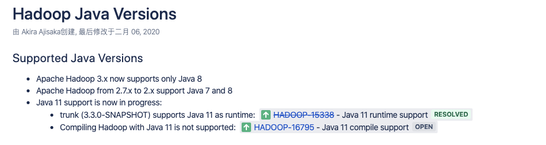

检查自己的Java 版本`Java -version`

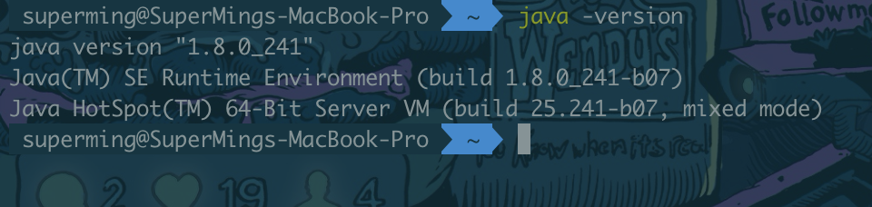

如果不是Java8，参考常规下载包安装或命令安装「若原本有更高级或别的java版本在进行其余开发，不用卸载修改路径即可，请自寻Google」

```shell
brew cask install java8
```

### 配置ssh key

使用下面命令查看ssh是否可用

```shell
ssh localhost
```

若显示

`ssh：connect to host localhost port 22: COnnection refused `

使用下面命令，授权SSH登陆。

```shell
  $ ssh-keygen -t rsa -P '' -f ~/.ssh/id_rsa
  $ cat ~/.ssh/id_rsa.pub >> ~/.ssh/authorized_keys
  $ chmod 0600 ~/.ssh/authorized_keys
```

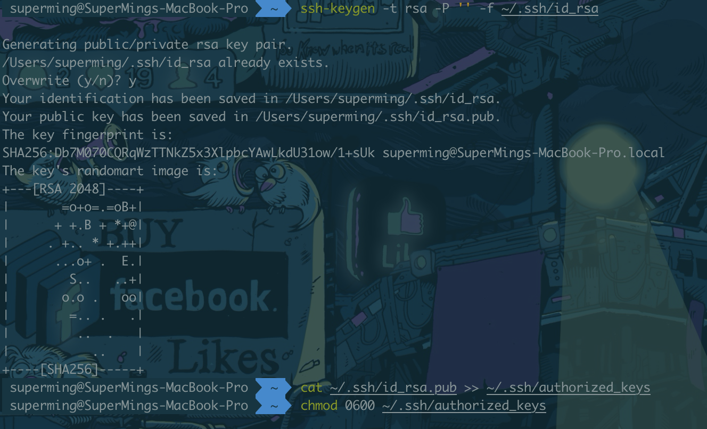

然后在系统System Preferences -> Sharing下的Remote Login中国中选择All users允许接入。

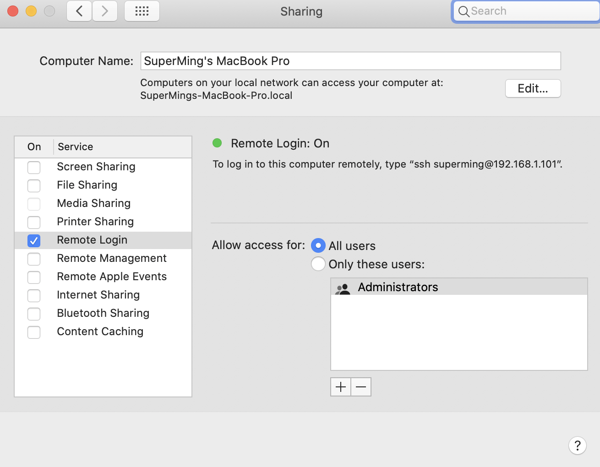

再次执行`ssh localhost`看是否成功。若依旧失败请Google解决。

### 安装Hadoop

```shell
Brew install hadoop
```

Brew会安装最新的稳定版本，截止2020年2月23日，版本为`hadoop-3.2.1` 

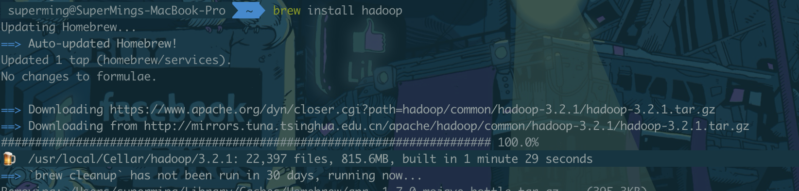

Mac下的安装目录：`/usr/local/Cellar/hadoop `

> In normal circumstances, brew would have automatically created a symlink from `/usr/local/opt/hadoop` to `/usr/local/Celler/hadoop/`


## 相关配置参考：

>Hadoop 三种运行模式
>
>* Standalone Operation  
>
>  单机配置，非分布式模式。设置单节点的时候，Hadoop默认运行在**非分布式的单机配置**下，方便进行调试。也就是说安装完成后无需进行配置即可运行。
>
>* Pseudo-Distributed Operation
>
>Hadoop可以在单节点上以伪分布的方式运行，Hadoop进程以分离的Java进行来运行，，即下面的配置。节点即作为NameNode也作为DataNode，同时提取的是HDFS中的文件。
>
>* Fully-Distributed Operation 
>
>分布式模式。需要多台分布式设备，在此不做展开。

macOS下Hadoop配置文件目录为：/usr/local/Cellar/hadoop/3.2.1/libexec/etc/hadoop/ 下，进入该目录对以下文件修改

> **core-site.xml**  「MapReduce job」
>
> **hdfs-site.xml** 「MapReduce job」
>
> **mapred-site.xml** 「YARN」
>
> **hadoop-env.sh** 「Total」

Hadoop运行由配置文件决定，也就是从伪分步模式切换回非分布式模式都需要对配置文件进行调整。

在官方文档下，伪分布模式只需要配置`fs.defaultFS`与`dfs.replication`就可。但我们需要配置`hadoop.tmp.dir、dfs.namenode.name.dir、dfs.datenode.data.dir`指定使用的目录，默认目录重启时会被清理，所以需要进行配置。

### hadoop-env.sh

在此文件对hadoop进行配置。使用命令找到mac下的Java_Home路径`/usr/libexec/java_home -V`

在`/usr/local/Cellar/hadoop/3.2.1/libexec/etc/hadoop/hadoop-env.sh`下寻找export JAVA_HOME，修改配置如下：

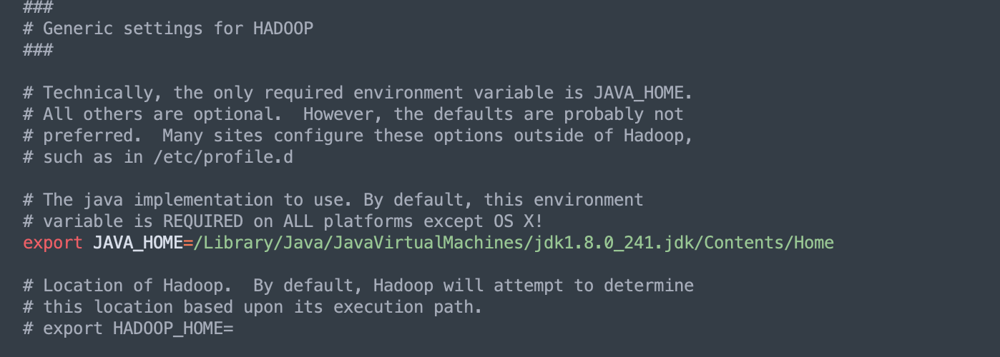

### core-site.xml

在core-site.xml下配置HDFS 地址和端口号，写入下面配置「注意所有端口号不要与你正在使用的**端口号**冲突，冲突请更换空闲端口」

```xml
<!-- Put site-specific property overrides in this file. -->
<configuration>
  <property>
    <name>hadoop.tmp.dir</name>
    <value>/usr/local/Cellar/hadoop/hdfs/tmp</value>
    <description>A base for other temporary directories</description>             
  </property>
  <property>
    <name>fs.default.name</name>
    <value>hdfs://localhost:9000</value>
  </property>
</configuration>
```

- `hadoop.tmp.dir` : 用于存放本地Hadoop临时文件，比如datanode、namenode、hdfs等，记得给相应权限
- `fs.defaultFS` : is the new name for the previously-deprecated key `fs.default.name`.

### hdfs-site.xml

在目录 `/usr/local/Cellar/hadoop/3.2.1/libexec/etc/hadoop/hdfs-site.xml` 下配置以下

```xml
<configuration>
  <property>
  	 <name>dfs.replication</name>
   	 <value>1</value>
  </property>
  <property>
   	 <name>dfs.namenode.name.dir</name>
     <value>/usr/local/Cellar/hadoop/hdfs/tmp/dfs/name</value>
  </property>
  <property>
    <name>dfs.datanode.name.dir</name>
    <value>/usr/local/Cellar/hadoop/hdfs/tmp/dfs/data</value>
  </property>
</configuration>
```

为什么是1？因为在单机环境下，不论是分布式还是伪分布，都只有一个数据点（Datanode）。

### mapred-site.xml

此节点为运行YARN配置。

```xml
<configuration>
  <property>
    <name>mapred.job.tracker</name>
    <value>localhost:8021</value>
  </property>
</configuration>
```


## 初始化HDFS

下面命令初始化分布式文件，收到"successfully formatted"即配置ok。

```bash
cd /usr/local/opt/hadoop
hdfs namenode -format
```


### 启动命令介绍

进入以下目录`/usr/local/opt/hadoop/sbin`

```shell
./start-dfs.sh # 开启HDFS服务命令
./stop-dfs.sh  # 停止HDFS服务命令
./start-all.sh # 开启所有命令
./stop-all.sh # 停止所有命令
```

开启完毕后使用`jps`命令查看服务状态

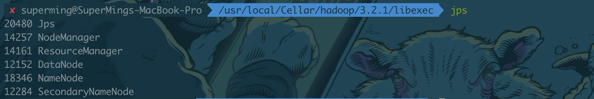

按照上述配置，且没有更换端口，通过下面网址接入Hadoop的网页

**Resource Manager： http://localhost:9780**

> **2.x版本默认为http://localhost:50070**

NameNode Info：

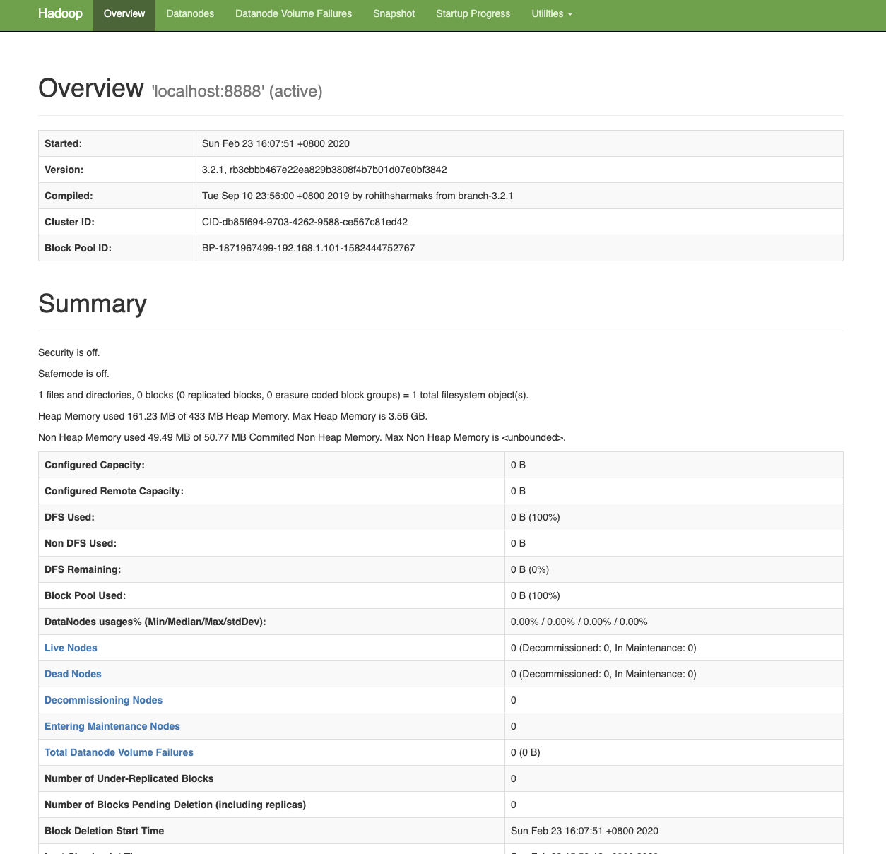

**JobTracker：http://localhost:8088/**

MapReduce Info：

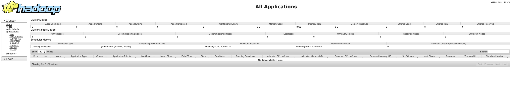

**Node Specific Info: http://localhost:8042/**

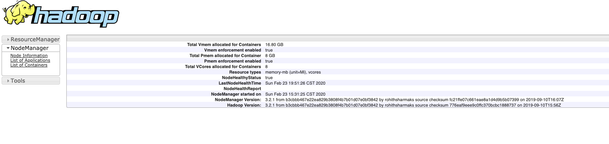


##  Shell 配置（optional）

相较于每次都进入目录`/usr/local/Cellar/hadoop/3.2.1/sbin`，在shell中配置全局`PATH`会方面很多，这样我们就可以在shell或terminal任意地方使用hadoop相关命令。

不同的shell配置目录不同，``/etc/profile`, `~/.bashrc`, `~/.bash_profile`, `~/.profile`, `~/.zshrc`… `

我使用zsh，所以打开`~/.zshrc`下添加

```bash
export PATH=$PATH:/usr/local/Cellar/hadoop/3.2.1/sbin 
alias gohadoop="cd /usr/local/Cellar/hadoop" #方便进入hadoop目录
```

保存退出

使用命令`source ~/.zshrc`使zsh配置生效

这样在`/usr/local/Cellar/hadoop/3.2.1/sbin`目录下的文件可以不再进入该目录直接执行即可。

Hadoop默认配置使用本地框架进行开发调试，如果要在本机上使用YARN，如果shell配置后，可直接使用`start-yarn.sh`。


## Troble shooting

碰到问题最好先检查日志来找原因。

1. 开启所有服务后，发现有些服务没有开启

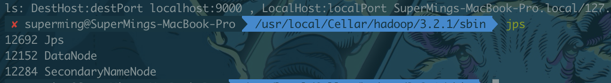

Answer：未能开启其余模块，主要是Java版本不兼容，我使用的是Java11进行安装，出现如上错误，下载Java 8 后问题Fix。

2. 进行单机伪分布测试时，出现如下问题「unFixed」不影响正常使用

```shell
WARN util.NativeCodeLoader: Unable to load native-hadoop library for your platform... using builtin-java classes where applicable
```

3. Hadoop启动错误是出现“ssh: Could not resolve hostname xxx” 「参考」

通过设置Hadoop的环境变量解决。


## Hadoop伪分布式运行MapReduce实例

> 此处参考的也是官方文档的例子，但有很多地方会与之有冲突。

单机模式中读取的是本地的数据，而伪分布则读取的是HDFS模式。

Shell命令的四种方式

> ./bin/hadoop dfs  #只适合HDFS文件系统
> hadoop fs  #适用不同的文件系统
> hadoop dfs #只适合HDFS文件系统
> hdfs dfs #只适合HDFS文件系统

1. 需要使用HDFS，则需要创建用户目录。mac默认为你原本用户的名字，可以直接用也可以创建用户。

```shell
./bin/hdfs dfs -mkdir -p /user/hadoop  #创建hadoop用户
```

> Report：我在mac的hadoop目录下运行以上命令没有任何反应，查看用户也不存在。

2. 在分布式文件中创建input文件，然后将文/usr/local/Cellar/hadoop/3.2.1/libexec/etc/hadoop/下的文件复制到分布式文件系统下的input文件中。

因为我使用的是此电脑的用户即superming，且已有相应用户目录/user/superming，因此在命令中可以使用相对路径如input，绝对路径为/user/superming/input,我在hadoop/3.2.1目录下执行的以下操作。

```shell
./bin/hdfs dfs -mkdir input
./bin/hdfs dfs -put .libxexc/etc/hadoop/*.xml input
```

复制完成后通过下面命令查看文件列表

```shell
./bin/hdfs dfs -ls input
```

接下来运行MapReduce作业。

```shell
./bin/hadoop jar ./libexec/share/hadoop/mapreduce/hadoop-mapreduce-examples-*.jar grep input output 'dfs[a-z.]+'
```

运行结果截图如下：


查看命令运行结果：

```shell
./bin/hdfs dfs -cat output/*
```

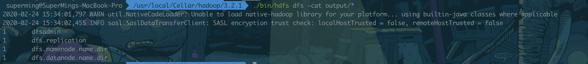

或把文件存入本地再查看

```shell
rm -r ./output    # 先删除本地的 output 文件夹（如果存在）
./bin/hdfs dfs -get output ./output     # 将 HDFS 上的 output 文件夹拷贝到本机
cat ./output/*
```

提示：Hadoop运行文件时，输出的目录Hadoop会给你创建，否则会导致冲突。若原本存在或要重新执行以上测试，先删除目标文件

```shell
./bin/hdfs dfs -rm -r output 「output指代目标文件」
```

【**参考**】：鉴于此在每次开发中，可以在程序中添加如下代码，能在每次运行时自动删除输出目录。

```java
Configuration conf = new Configuration();
Job job = new Job(conf);
 
/* 删除输出目录 */
Path outputPath = new Path(args[1]);
outputPath.getFileSystem(conf).delete(outputPath, true);
```

关闭Hadoop执行

```shell
./sbin/stop-dfs.sh  # 停止HDFS服务命令
./sbin/stop-all.sh  # 停止所有hadoop服务
```

---

**目录整理：**

环境配置目录：`/usr/local/Cellar/hadoop/3.2.1/libexec/etc/hadoop/capacity-scheduler.xml`


## 参考文献

[林子雨老师的Hadoop3.1.3 安装教程](http://dblab.xmu.edu.cn/blog/2441-2/#more-2441)

[Hadoop: Setting up a Single Node Cluster.](https://hadoop.apache.org/docs/stable/hadoop-project-dist/hadoop-common/SingleCluster.html#Required_Software)

[Complete Guide to Install and Configure Apache Hadoop 3 on MacOS](https://blog.petehouston.com/complete-guide-to-install-and-configure-apache-hadoop-3-on-macos/)