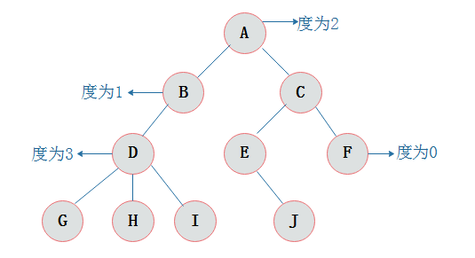
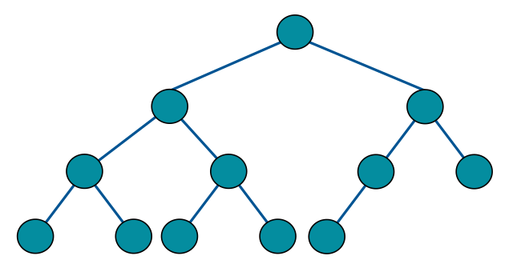
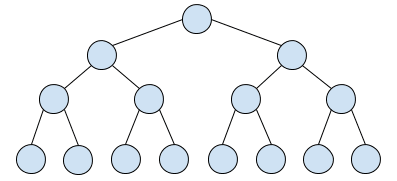
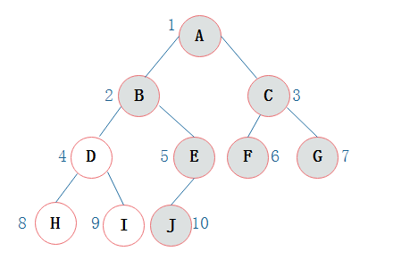
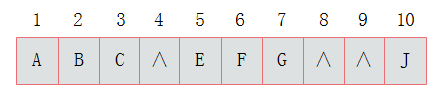
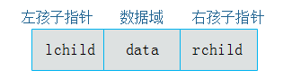
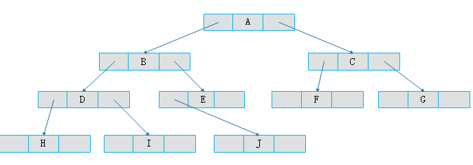

# 二叉树

> 挖坑：二叉排序树、哈夫曼编「编码和解码」，二叉树的经典操作「增删改查」


## 树

树是一种抽象数据类型(ADT)，用来模拟具有树状结构性的数据集合。

为什么要使用树，数组在扩容上受到限制，而链表在查找数据上受到相应限制，当我们希望有一种数据结构同时具备数组查找快的优点和链表插入删除快的有点，树便应运而生。

树是一种重要的非线性数据结构，以树和二叉树最为常用，在数据结构中非常重要。

## 基本概念

定义：树（Tree）是n(n >= 0)个结点的有限集。在任意一棵树中，（1）：有且仅有一个特定的根（Root）结点。（2）：当n > 1时，其余结点可分为m个互不相交的有限集，其中咩哥集合本身又是一棵树，并称为根的子树（SubTree）。

**度**：结点拥有的子树数目为结点的度。度为0的结点为叶子结点（Leaf）或终端结点。度不为0的结点称为非终端结点或分支结点。树的度是树内各结点的度的最大值。

结点的子树称为该节点的孩子（Child）。该结点为孩子的双亲（Parent）。同一个双亲的孩子相互为兄弟（Sibling）。

结点的祖先是从根到该结点所经分支上所有结点。反之为子孙。

双亲在同一层称为堂兄弟。

结点的层次：从根开始定义，根为第一层，根的孩子就在第二层。树中结点的最大层次称为树的深度（Depth）。




## 二叉树结构

**二叉树**：**每个结点最多只有两颗子树**（不存在度大于2的结点），二叉树的子树有左右之分，次序不能任意颠倒。

**二叉树性质**：

1）在二叉树的第i层上最多有2<sup>i-1 </sup>个节点 。（i>=1）
 2）二叉树中如果深度为k,那么最多有2k-1个节点。(k>=1）
 3）n0=n2+1  n0表示度数为0的节点数，n2表示度数为2的节点数。
 4）在完全二叉树中，具有n个节点的完全二叉树的深度为[log2n]+1，其中[log2n]是向下取整。
 5）若对含 n 个结点的完全二叉树从上到下且从左至右进行 1 至 n 的编号，则对完全二叉树中任意一个编号为 i 的结点有如下特性：

>(1) 若 i=1，则该结点是二叉树的根，无双亲, 否则，编号为 [i/2] 的结点为其双亲结点; 
>
>(2) 若 2i>n，则该结点无左孩子，  否则，编号为 2i 的结点为其左孩子结点；
>
>(3) 若 2i+1>n，则该结点无右孩子结点，  否则，编号为2i+1 的结点为其右孩子结点

**完全二叉树**（Complete Binary Tree）

二叉树深度为h，除h层外，其余各层的节点都达到最大的个数，第h层所有结点都连续集中在最左边，就是完全二叉树。

> 一棵深度为k的有n个结点的二叉树，对树中的结点按从上到下，从左到右的顺序进行编号，如果编号为i (1≤i≤n）的结点与满二叉树中编号为i的结点在二叉树中位置相同，那么这棵二叉树为完全二叉树。



**满二叉树**（Perfect Binary Tree）

一棵二叉树中，所有的分支结点都存在左子树和右子树，并且所有叶子都在同一层上，这样的二叉树称为满二叉树。

> 满二叉树的结点要么是叶子结点，要么是度为2的结点，不存在度为1的结点。



**二叉查找树（Binary Serach Tree）**

也称二叉搜索树，如果二叉树的左子树不空，则左子树上所有结点的值小于它的根节点的值；右子树不为空，则右子树上所有结点的值大于根节点的值。【可以理解为排序的二叉树】

二叉搜索树重点在于插入节点和查找节点。二叉查找树一般使用中序遍历，遍历后结果即为排序结果。

查找节点：

从根节点开始，如果比当前节点大，搜索右子树；等于当前值，停止搜索；小于当前值，搜索左子树。

```java
public Nodefind(int key){
  	Node current = root; //从根节点开始,保存当前节点。
  	while(current != null){
      	if(current > key){
          	current = current.leftChild;
        }
      	else if(current.data < key){
          	current = current.rightChild;
        }
      	else{
          	return current;
        }
    }
  	return null;
}
```

时间复杂度为O(logn)。

插入节点：

总体和查找类似，找到插入位置。

```java
public boolean insertNode (int data){
  	Node newNode = new Node(data);//create new node of data
  	if(root == null){
      	root = newNode;
  			return true;
    }
  	
  	Node current = root;//find from root
  	Node ParentNode = null;
  	while(current != null){
      	parentNode = current;
      	if(current.data > data){//bigger than current data, search the left node
        		current = current.leftChild;
          	if(current == null){//it's time to insert
								parentNode.leftChild = newNode; 
              	return true;
            }
        }
      	else{
          	current = current.rightChild;
          	if(current == null){
              	parentNode.rightChild = newNode;
              	return true;
            }
        }
    }
  	return false;
}
```

删除节点：

删除节点为二叉树中难点。分为以下三种情况：

1. 该节点为叶节点
2. 该节点有一个子节点
3. 该节点有两个子节点

删除没有子节点的节点。

```java
@override
public boolean delete(int key){
  	Node current = root;
  	Node Parent = root;
  	boolean isLeftChild = false;
  	//find the key.
  	while（current.data != key){
      	parent = curent;
      	if(current.data > key){
          	isLeftChild = true;
          	current = current.leftChild;
        }
      	else{
          	ifLeftChild = false;
          	current = current.rightChild;
        }
      	if(current == null){
          	return false;
        }
    }
  	//Node is leaf
  	if(current.leftChild == null && current.rightChild == null){
      	if(current == root)
          	root = null;
      	else if(ifLeftChild)
          	parent.leftChild = null;
      	else 
          	parent.rightChild = null;
      	return true;
    }
  	return false;
}
```

删除一个子节点的节点

将原本指向该节点的引用，改为指向该子节点。

~~~java
// 当前节点有一个子节点
if (current.leftChild == null && current.rightChild != null) {
	if (current == root) {
		root = current.rightChild;
	} else if (isLeftChild) {
		parent.leftChild = current.rightChild;
	} else {
		parent.rightChild = current.rightChild;
	}
	return true;
} else {
	// current.leftChild != null && current.rightChild == null
	if (current == root) {
		root = current.leftChild;
	} else if (isLeftChild) {
		parent.leftChild = current.leftChild;
	} else {
		parent.rightChild = current.leftChild;
	}
	return true;
}
return false; 
~~~

删除两个子节点的节点

找出后继节点并替代，后继节点为比删除节点大的最小节点。

先找删除节点的右节点，因为右节点都比删除节点大，再找该以该右节点为根的最深左节点，若该左节点为叶子结点，那么替代删除节点即可。如果该左节点存在右子树，需要另分讨论，是删除中最复杂的一种情况。

后继节点为删除节点的右子节点

后继节点是删除节点的右子节点的左子节点。

```java
public NodegetSuccessor(Node delNode){
  	Node successorParent = delNode;
  	Node successor = delNode;
  	Node current = delNode.rightChild;
  	//find the left Node which is not void
  	while(current != null){
    		successorParent = successor;
      	successor = current;
      	current = current.leftChild;
    }
  	//replace the delNode
  	if(successor != delNode.rightChild){
      	successorParent.leftChild = successor.rightChild;
      	successor.rightChild = delNode.rightChild;
    }
  	return successor;
}
```

标示字段的方式进行删除

删除其实是挺复杂的，其实我们可以不用真正的删除该节点，只需要在Node类中增加一个标识字段isDelete，当该字段为true时，表示该节点已经删除，反正没有删除。那么我们在做比如find()等操作的时候，要先判断isDelete字段是否为true。这样删除的节点并不会改变树的结构。

```text
public class Node {
 int data;   //节点数据
 Node leftChild; //左子节点的引用
 Node rightChild; //右子节点的引用
 boolean isDelete;//表示节点是否被删除
} 
```


二叉树效率


## 二叉树存储结构

顺序存储

二叉树的顺序存储结构就是使用一堆一维数组存储二叉树中的结点，并且结点的存储位置就是数组的下标索引。



上图树中浅色部分不存在，则二叉树顺序存储结构如下图，可见，顺序存储存在空间浪费的情况，因此顺序存储一般适用于完全二叉树。



链式存储

为了解决顺序存储中出现的大量空间浪费，使用链式存储相对较好。

链式存储中，每个节点的结构如下，data为数据域，lchild和rchild为指针域，分别指向左孩子和右孩子。





## 二叉树的遍历

二叉树结构的定义

```c
typedef struct BinaryTree{
  	int data;
  	struct BinaryTreeNode *left;
  	struct BinaryTreeNode *right;
}BinaryTreeNode;
```


### 前序遍历

根节点 -> 左孩子节点 -> 右孩子节点

```c
void pre_order(BinaryTreeNode *p){
  	if(p != NULL){
      	printf("%d\t", p -> data);
      	pre_order(p -> left);
      	pre_order(p -> right);
    }
}
```


### 中序遍历

左子树 -> 父节点 -> 右子树

```c
void in_order(BinaryTreeNode *p){
  	if(p != NULL){
      	in_order(p -> left)
        printf("%d \t", p->data);
      	in_order(p -> right);
    }
}
```


### 后序遍历

左子树 -> 右子树 -> 父节点

```c
void post_order(BinaryTreeNode *p){
  	if(p != NULL){
      	post_order(p -> left);
      	post_order(p -> right);
      	printf("%d \t", p -> data);
    }
}
```


### 层序遍历

用链表存储每一层节点

```c
void lever_order(BinaryTreeNode *p){
  	//使用队列
  	list<BinaryTreeNode *> t;
  	if(p != NULL){
      	t.push_back(p); //把p放到数组末尾
    }
  	
  	while(t.size() > 0){
      	printf("%d\t", (t.front()) -> data);
      	if(t.front() -> left != NULL){
          	t.push_back((t.front()) -> left);
        }
      	
      	if(t.front() -> right != NULL){
          	t.push_back((t.front() -> right);
        }
        t.pop_front();
    }
}
```


---

参考：

[二叉树](https://zhuanlan.zhihu.com/p/37470148)

[Binary Search Tree](https://www.geeksforgeeks.org/binary-search-tree-set-1-search-and-insertion/)

