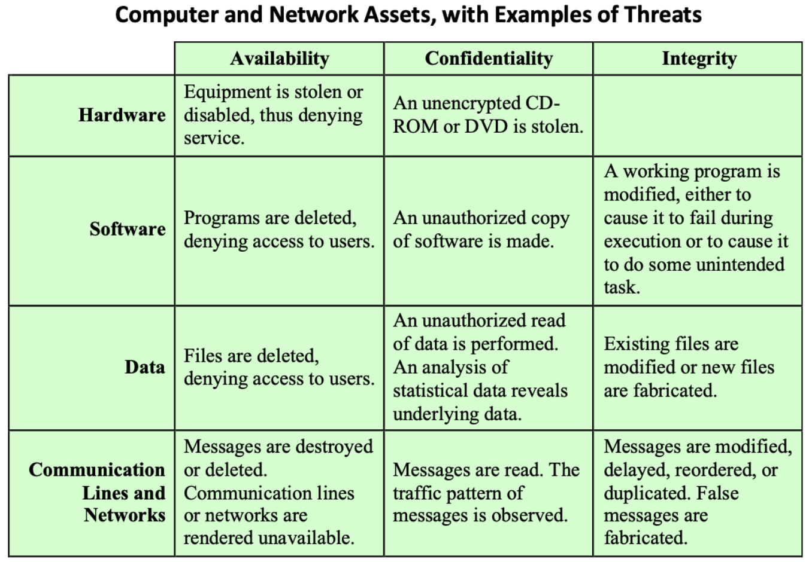

# Overview

## Computer Security Concepts.

**The definition of Computer Security.**

Computer Security: The Protection afforded to an automated information system in order to attain the applicable objectives of preserving the integrity, availabiltiy, and confidentiality of information system resources (including hardware, software, firmware, information/data, and telecomunications.)

**Confidentiality.（保密性）** This term covers two related concepts:

- **Data confidentiality**: Assure that private or confidential information is not made available or disclosed to unauthorized individuals.
- **Privacy**: Assures that individuals control or influence what information related to them may be collected and stored and by whom and to whom that information may be disclosed.

A loss of confidentiality is the unauthorized disclosure of information.

**Integrity: （完整性） This term covers two related concepts:**

- **Data integrity:** Assures that information and programs are changed only in a specified and authorized manner.
- **System integrity:** Assures that a system performs its intended function in an unimpaired manner, free from deliberate or inadvertent unauthorized manipulation of the system.
- **User integrity**: match the identity to the correct entity, including ensuring information nonrepudiation and authenticity  c.f., NIST FIPS 199

A loss of integrity is the unauthorized modification or destruction of information/service

**Availability：（可用性）**

**Availability**: Assures that systems work promptly and service is not denied to authorized users. A loss of availability is the disruption of access to or use of information or an information system.

---

**Authenticity: （真实性）**

The property of being **genuine** and being able to be **verified** and trusted; confidence in the validity of a transmission, a message, or message originator.

**Accountability**: **（责任性）**The security goal that generates the requirement for actions of an entity to be traced uniquely to that entity.

- Nonrepudiation, fault isolation, ...

**Exp. Levels of impact from security breach.**

**Low.**

- E.g., minor degradation of service, minor damage to assets, minor financial loss, minor harm individuals.

**Moderate.**

- E.g., significant degradation of service, significant ...

**High.**

- E.g., severe degradation of service, severe...

**Examples of Security requirements.**

**Confidentiality**

- passwords (high), student grades (moderate), directory information (low)

**Integrity**

- patient allergy information (high), Web forum for registered users (moderate), anonymous online poll (low)

**Availability**

- authentication service (high), public Web site for a university (moderate), online telephone directory lookup application (low)

### Fundamental Security Design Principles.

**Economy of mechanisms**: Simple and small design.

**Fail-safe default**: E.g., most file access system have the access decisions based on permissions rather than exclusion.

**Complete mediation**: Every access must be checked against access control; resource-intensive.

**Open design**: E.g., encryption algorithms should be open to public scrutiny.

**Separation of privilege**: Multiple privilege attributes are required to achieve access to a restricted resource.

**Least privilege**: Use the least set of privileges necessary to perform the task.

**Least common mechanism:** Minimize the functions shared by users **Psychological acceptability**: Security should not interfere with the **Isolation**: Logical (and physical) isolation for file or subsystem access **Encapsulation**: Encapsulation of procedures or data objects **Modularity**: Modular security design, e.g., plug-and-play **Layering**: Multiple, overlapping protection approaches, e.g., defense in depth **Least astonishment**: Reduce the astonishment of the user

**Steganography: Find the Hidden Message.**

**Security Terms**

- vulnerability. - a weakness / opening allowing attacker threat.
- threat. - a potential for violation of security
- risk. - where a threat intersects with a vulnerability, risk is present.
- attack. - an assault on system security, a deliberate attempt to evade security services.

### Security Attack

**Passive Attacks.** A passive attack attempts to learn or make use of information from the system but does not affect system resources.

- Release of message contents.
- Traffic analysis.
  - monitor traffic flow to determine location and identity of communicating hosts and could observe the frequency and length of message being exchanged.
- Passive attacks are difficult to detect because they do not involve any alteration of data.
- Our main goal is to prevent their success.

**Active Attacks.** An active attack attempts to alter system resources or affect their operation.

- Four types of active attacks are:
  - Masquerade
  - Replay
  - Modification of messages
  - Denial of service
- Active attacks are difficult to prevent because of the wide variety of potential physical, software, and network vulnerabilities.
- Our main goal is to detect them and to recover from any disruption or delays caused by them.

**Inside attack:** Initiatedbyanentityinsidethesecurityperimeter(an“insider”). The insider is authorized to access system resources but uses them in a way not approved by those who granted the authorization.

**Outside attack:** Initiated from outside the perimeter, by an unauthorized or illegitimate user of the system (an “outsider”). On the Internet, potential outside attackers range from amateur pranksters to organized criminals, inter- national terrorists, and hostile governments.

### Cryptography Terminology

**Cryptography** - the study of encryption and decryption techniques.

**Cryptology** - the filed of cryptography and cryptology

**Cryptanalaysis** - codebreaking and deciphering ciphertext without key.

