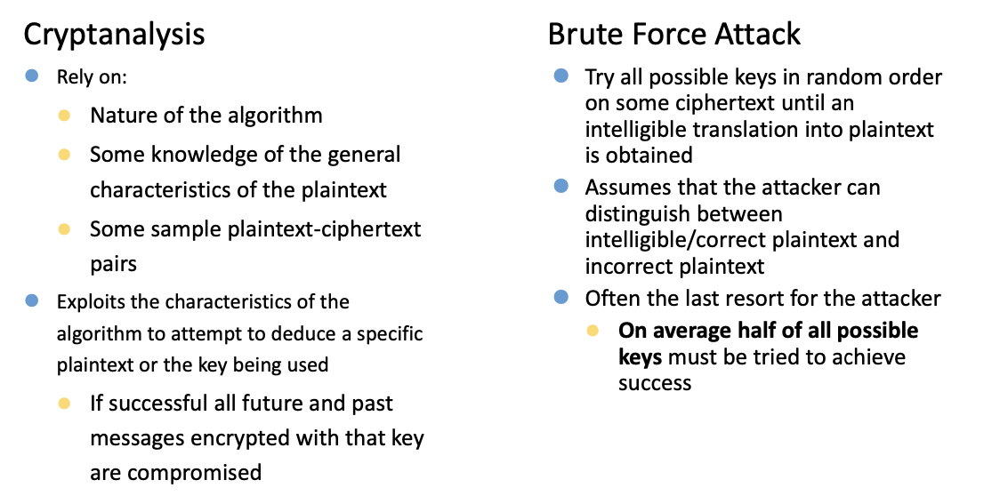
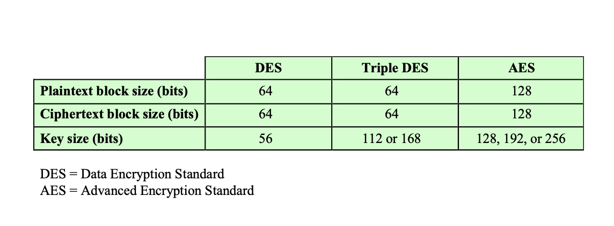
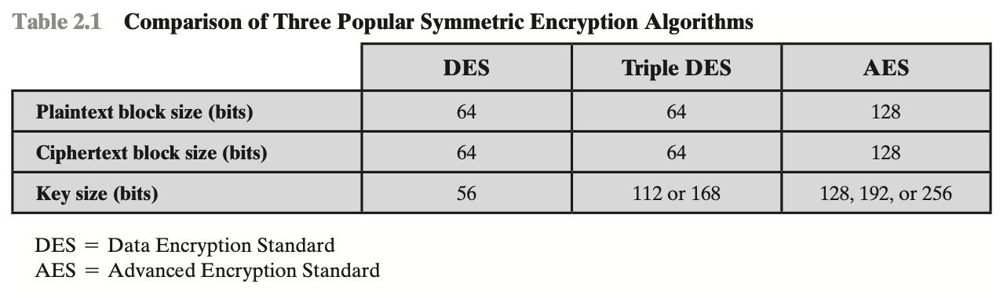
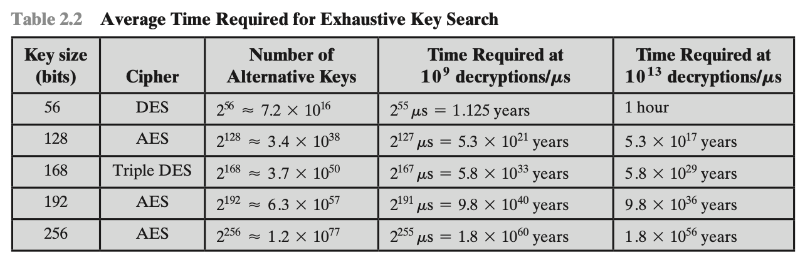
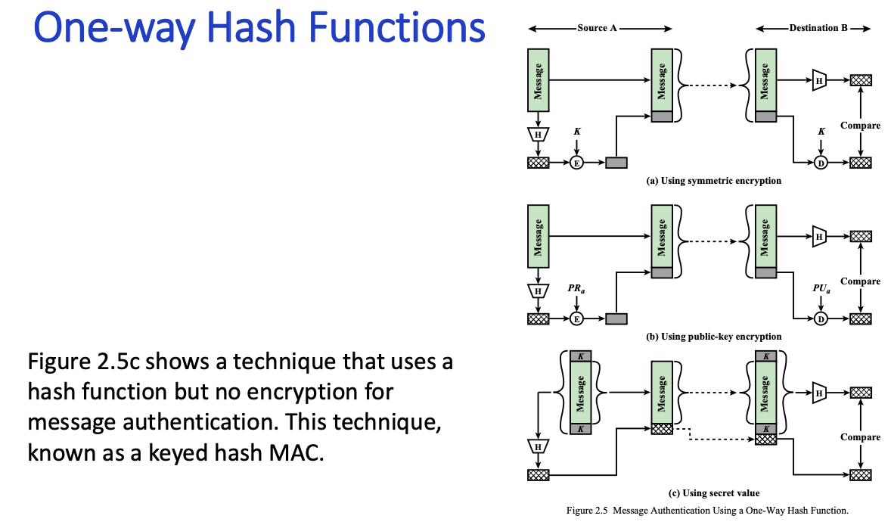
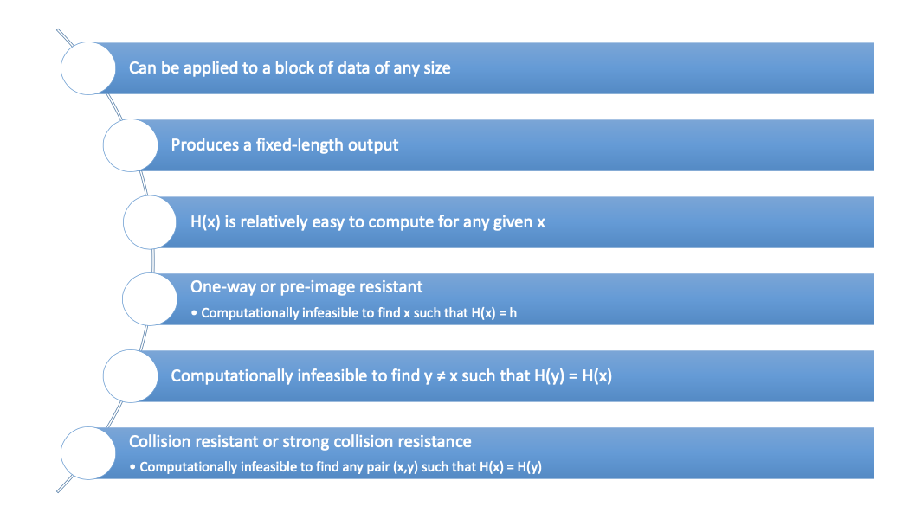
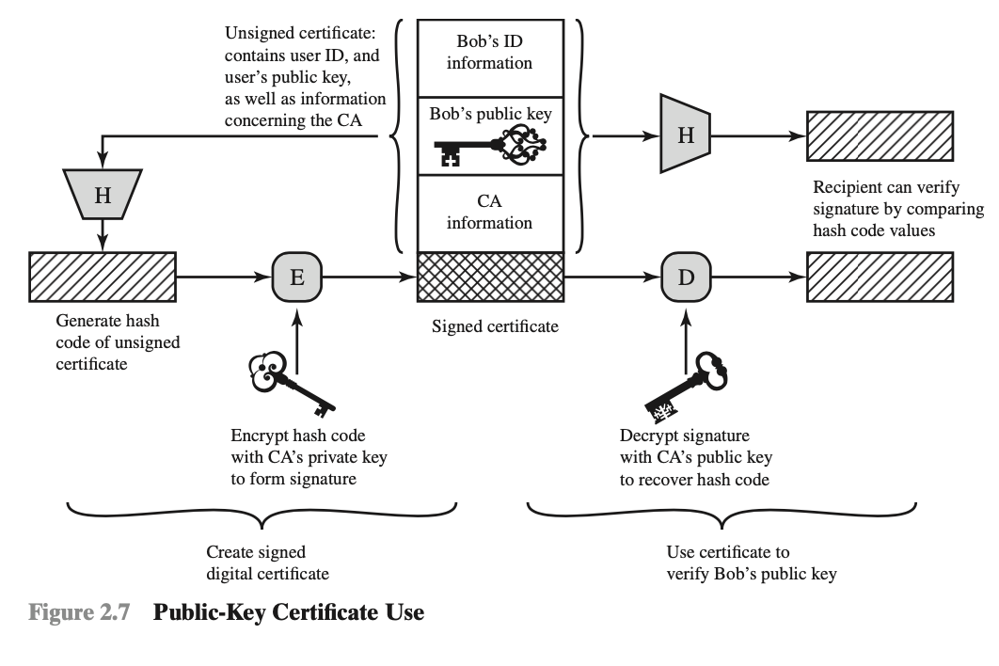
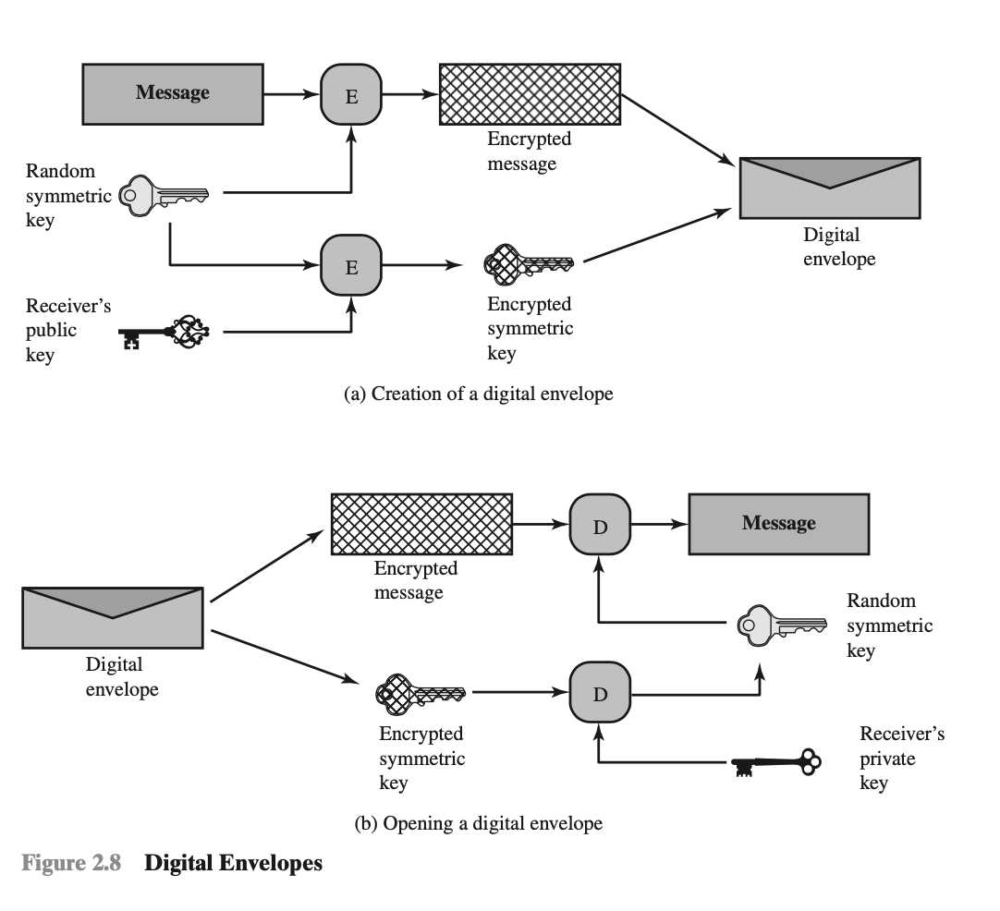

# Cryptographic Tools

## Confidentiality with Symmetric encryption

The universal technique for providing confidentiality for transmitted or stored data is symmetric encryption. This is followed by an overview of two most important symmetric encryption algorithms: the **Data Encryption Standard(DES)** and the **Advanced Encryption Standard (AES)**, which are block encryption algorithms.

### Symmetric Encryption

Symmetric encryption five ingredients.

**Plaintext.**  This is the original message or data that is fed into the algorithm as input.

**Encryption algorithm.** The encryption algorithm performs various substitutions and transformations on the plaintext.

**Secret key.** The secret key is also input to the encryption algorithm. The exact substitutions and transformations performed by the algorithm depend on the key.

**Ciphertext.** This is the scrambled message produced as output. It depends on the plaintext and the secret key. For a given message, two different keys will produce two different ciphertexts.

**Decryption algorithm.** This is essentially the encryption algorithm run in reverse. It takes the ciphertext and the secret key and produces the original plaintext.

<u>There are two requirements for secure use of symmetric encryption:</u>

1. We need a strong encryption algorithm. At a minimum, we would like the algorithm to be such that an opponent who knows the algorithm and has access to one or more ciphertexts would be unable to decipher the ciphertext or figure out the key. This requirement is usually stated in a stronger form: The opponent should be unable to decrypt ciphertext or discover the key even if he or she is in possession of a number of ciphertexts together with the plain- text that produced each ciphertext.
2. Sender and receiver must have obtained copies of the secret key in a secure fashion and must keep the key secure. If someone can discover the key and knows the algorithm, all communication using this key is readable.

There are two <u>general approaches</u> to attacking a symmetric encryption scheme. 

1. **Cryptanalysis**. Cryptanalytic attacks rely on the nature of the algorithm plus perhaps some knowledge of the general character- istics of the plaintext or even some sample plaintext-ciphertext pairs. 
2. **Brute-force attack**.  is to try every possible key on a piece of ciphertext until an intelligible translation into plaintext is obtained.

**Symmetric Encryption Examples.**

**Systemetric Block Encryption Algorithms.**

The most commonly used symmetric encryption algorithms are block ciphers. A block cipher processes the plaintext input in fixed-size blocks and produces a block of ciphertext of equal size for each plaintext block. The most important symmetric algorithms are the Data Encryption Standard(DES), triple DES and the Advanced Encryption Standared(AES).

**Data Encryption Standard**

DES takes a plaintext block of 64 bits and a key of 56 bits, to produce a ciphertext block of 64 bits. 

Concerns about the strength of DES fall into two categories:  concerns about the algorithm itself and concerns about the use of 56-bit key. The first concern refers to the possibility that cryptanalysis is possible by exploiting the characteristics of the DES algorithm. Over the years, there have been numerous attempts to find and exploit weaknesses in the algorithm, making DES the most-studied encryption algorithm in existence. 

With these results in mind, *Table 2.2* shows how much time is required for a brute-force attack for various key sizes. 

Triple DES.

Repeats basic DES algorithm three times using either two or three unqiue keys.

Attractions.

* 168-bit key length overcomes the vulnerability to brute-force attack of DES.
* Underlying encryption algorithm is the same as in DES.

Drawbacks.

* Algorithm is sluggish in software.

**Advanced Encryption Standard(AES)**

Because of its drawbacks, 3DES is not a reasonable candidate for long-term use.

Advanced Encryption Standard (AES), which should have a security strength equal to or better than 3DES and significantly improved efficiency.

## Messager Authentication and Hash Functions

Encryption protects against passive attack (eavesdropping). A different requirement is to protect against active attack (falsification of data and transactions).

Message authentication is to protect message integrity, and sender authentication.

Also prevent threats, including masquerading / spoofing, content modification, sequence modification and timing modification.

And approaches: Encryption, message authentication code(MAC) and Hash Function.

**Message Authentication Code.**

* Create a small fixed-sized block.
* MAC depends on message and key.[Different with Hash]
* Need not be reversible.[Difference with encryption / decryption]
* Sender appends the MAC to message .
* The authorized parties share same key.
* Receiver computes based on message and checks the match with the MAC.

**Hash Functions**

Functions transforming large input (variable size) to small fixed output.

Determinsitic and efficient computation given the input.

Output is uniformly distributed.

Input is also called message and output can be called digest, fingerpring, hash.

**Crytographic Hash(h) Requirements.**

The output of h is <u>pesudo-random</u>.

<u>One-wayness</u> Difficult to find a input that maps to a given hash output.

<u>Collision resistance</u> Difficult to find two input mapping to same hash output.

**Cryptographic Hash Function Requirements.**

### Public-Key Encryption 

A public-key encryption scheme has six ingredients.

* **Plaintext**: This is teh readable message or data that is fed into the algorithm as input.

- **Encryptionalgorithm:**The encryption algorithm performs various transformations on the plaintext.
- **Public and private key:** This is a pair of keys that have been selected so that if one is used for encryption, the other is used for decryption. The exact transformations performed by the encryption algorithm depend on the public or private key that is provided as input.
- **Ciphertext:** This is the scrambled message produced as output. It depends on the plaintext and the key. For a given message, two different keys will produce two different ciphertexts.
- **Decryption algorithm:** This algorithm accepts the ciphertext and the matching key and produces the original plaintext.

A general-purpose public-key cryptographic algorithm relies on one key for encryption and a different but related key for decryption.The essential steps are the following:

1. Eachusergeneratesapairofkeystobeusedfortheencryptionanddecryption of messages.
2. Each user places one of the two keys in a public register or other accessible file. This is the public key. The companion key is kept private. As Figure 2.6a suggests, each user maintains a collection of public keys obtained from others.
3. If Bob wishes to send a private message to Alice, Bob encrypts the message using Alice’s public key.
4. WhenAlicereceivesthemessage,shedecryptsitusingherprivatekey.Noother recipient can decrypt the message because only Alice knows Alice’s private key.

### Digital Signatures and Key Management.

With respect to key management and distribution, there are at least three dis- tinct aspects to the use of public-key encryption in this regard:

* The secure distribution of public keys
* The use of public-key encryption to distribute secret keys
* The use of public-key encryption to create temporary keys for message encryption

**Digital Signatures.**

* Used for authenticating both source and data integrity
* Created by encrypting hash code with private key 
* Does not provide confidentiality

**Certificate Authority(CA).**

* To prevent anybody from claiming a public key 
* CA certifies the ownership of public keys
* Matches the public key with the identity
* CA is a trusted third party

The key steps can be summarized as follows:

1. User software (client) creates a pair of keys: one public and one private.

2. Client prepares an unsigned certificate that includes the user ID and user’s public key.

3. User provides the unsigned certificate to a CA in some secure manner. This might require a face-to-face meeting, the use of registered e-mail, or happen via a web form with e-mail verification.

4. CA creates a signature as follows:

   1. CA uses a hash function to calculate the hash code of the unsigned certifi- cate. A hash function is one that maps a variable-length data block or mes- sage into a fixed-length value called a hash code, such as SHA family that we discuss in Section 21.1.
   2. CA encrypts the hash code with the CA’s private key.

5. CAattachesthesignaturetotheunsignedcertificatetocreateasignedcertificate.

6. CA returns the signed certificate to client.

7. Client may provide the signed certificate to any other user.

8. Any user may verify that the certificate is valid as follows:

   **a.** User calculates the hash code of certificate (not including signature).

   **b.** User decrypts the signature using CA’s known public key.
   **c.** User compares the results of (a) and (b). If there is a match, the certificate

   is valid.

 **Digital Envelop.**

* Protects a message without needing to first arragne for sender and reveiver to have the same secret key.

* Equates to the same thing as a sealed envelop containing an unsigned letter.

