# Ubuntu18.04 Tensorflow 1.x 安装（一）：Nvidia软件安装

文章包含以下几个内容：

- Nvidia驱动安装
- CUDA版本选择及安装
- cuDNN选择及安装

我的配置[参考]：

- GTX965M
- Ubuntu18.04 LTS

## Nvidia驱动安装

需考虑：GPU硬件型号，GPU驱动，CUDA，TensorFlow，PyTorch以及CuDNN等适配信息。

1. **检查GPU是否支持CUDA。这决定了你能否安装TensorFlow的GPU版本。**

通过下面链接检查GPU是否支持CUDA，如果GPU能在列表中找到，即支持CUDA。

[CUDA GPUs](https://developer.nvidia.com/cuda-gpus)

例如：我使用的GPU为GTX965M，相关信息能在Nvidia官网找到：

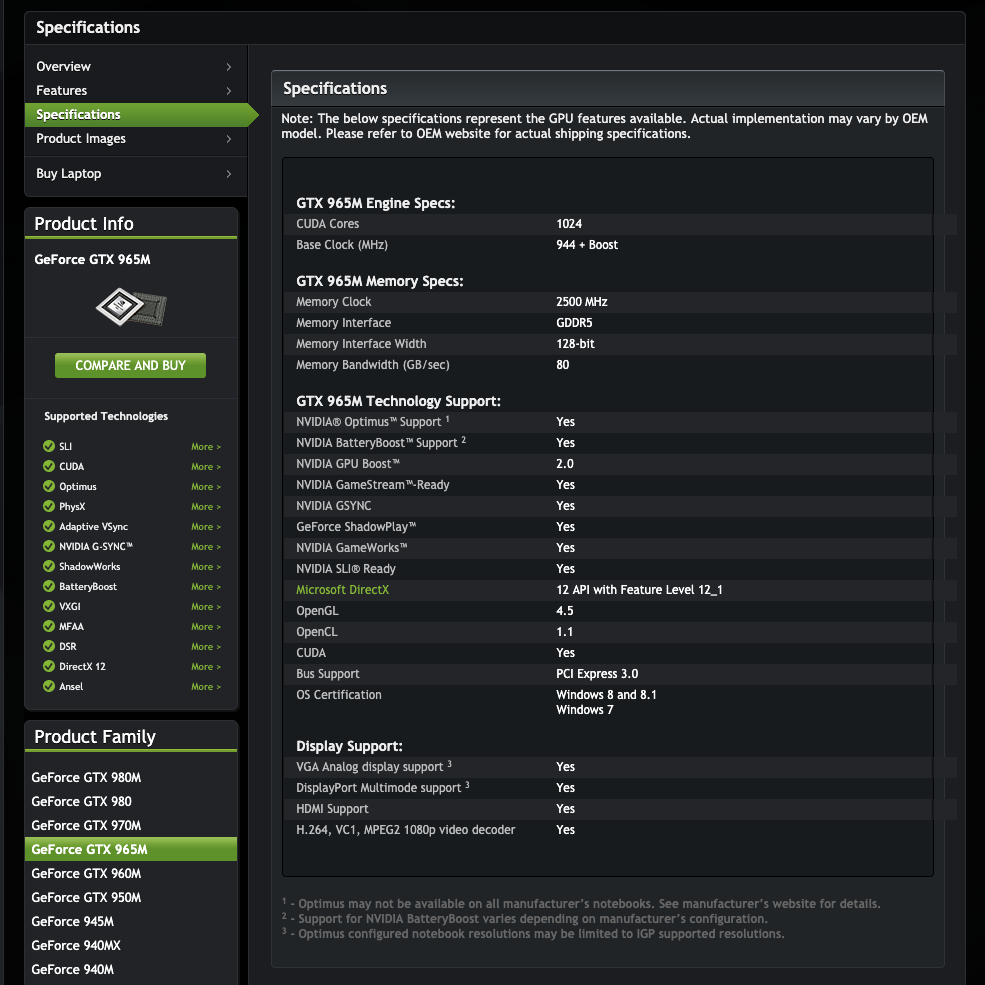

计算能力5.2


2. **确定安装驱动的版本**

下面链接可以查到GPU所对应操作系统可安装最新的驱动版本：

[Download Drivers](https://www.nvidia.com/Download/index.aspx)

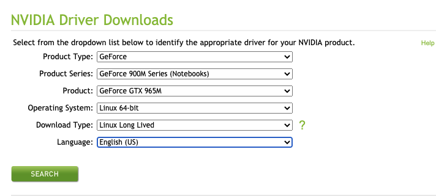

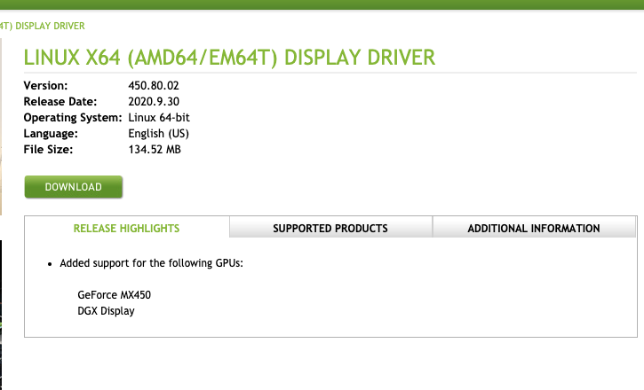

接下来执行如下代码：

```bash
sudo add-apt-repository ppa:graphics-drivers #添加NVIDIA显卡的驱动库
sudo apt-get update
ubuntu-drivers devices #显示可安装的驱动版本
```

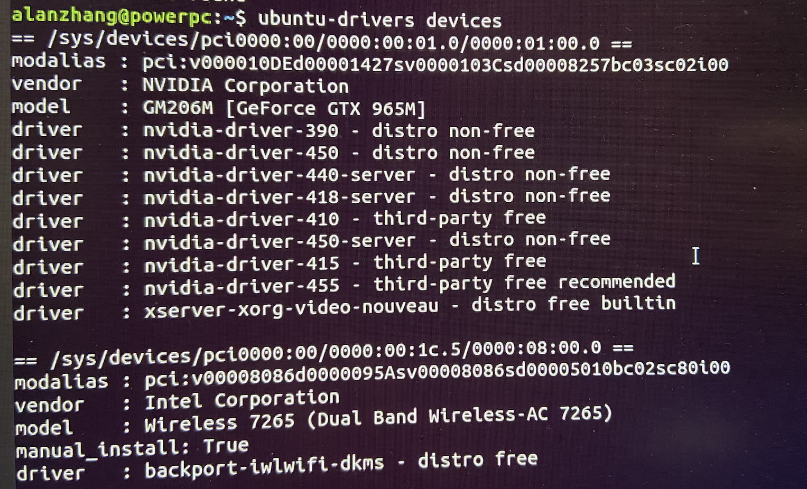

显示有390-455的版本，其中推荐安装455版本。

需要注意的是，在下一步安装CUDA时，<u>不同版本的CUDA对驱动版本有要求</u>，详细要求在[Nvidia CUDA Compatibility]()页面中进行查看。

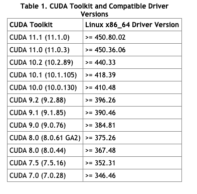

**如何确定安装的CUDA版本？**

CUDA的版本根据Tensorflow版本确定。如下图所示，假设要安装tensorflow_gpu-1.14.0版本，那么我需要安装的CUDA版本为10.0[10.1或9都不行，版本间一一对应]。[检查Tensorflow对应版本]()。

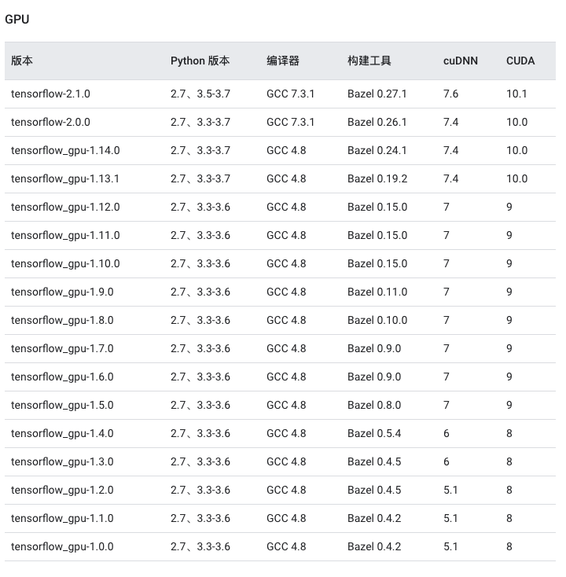

综上，根据我要安装的tensorflow版本，需要安装CUDA10.0以及cuDNN7.4。

回到CUDA对驱动要求查看对应GPU驱动版本的要求：`> = 410.48` 。

执行如下命令安装驱动：

```bash
sudo apt list nvidia-drivers* #列出可安装的驱动版本
sudo apt install nvidia-driver-450 #安装450的驱动
```

检验驱动是否安装完成：

```bash
sudo reboot
nvidia-smi
```

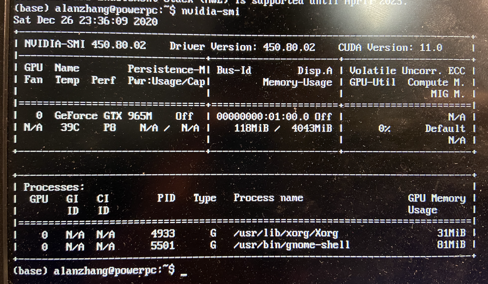

执行nvidia-smi显示如图表示驱动安装完成

训练时检测GPU使用情况：

```shell
watch -n 0.5 nvidia-smi  #即每隔0.5秒执行一次nvidia-smi；
```


## CUDA安装：

在[官方页面](https://developer.nvidia.com/Cuda-Toolkit-Archive)中找到对应的CUDA版本

[CUDA Toolkit 10.0 Archive](https://developer.nvidia.com/cuda-10.0-download-archive)

可以采用多种教程进行安装，根据给出的参考进行安装：

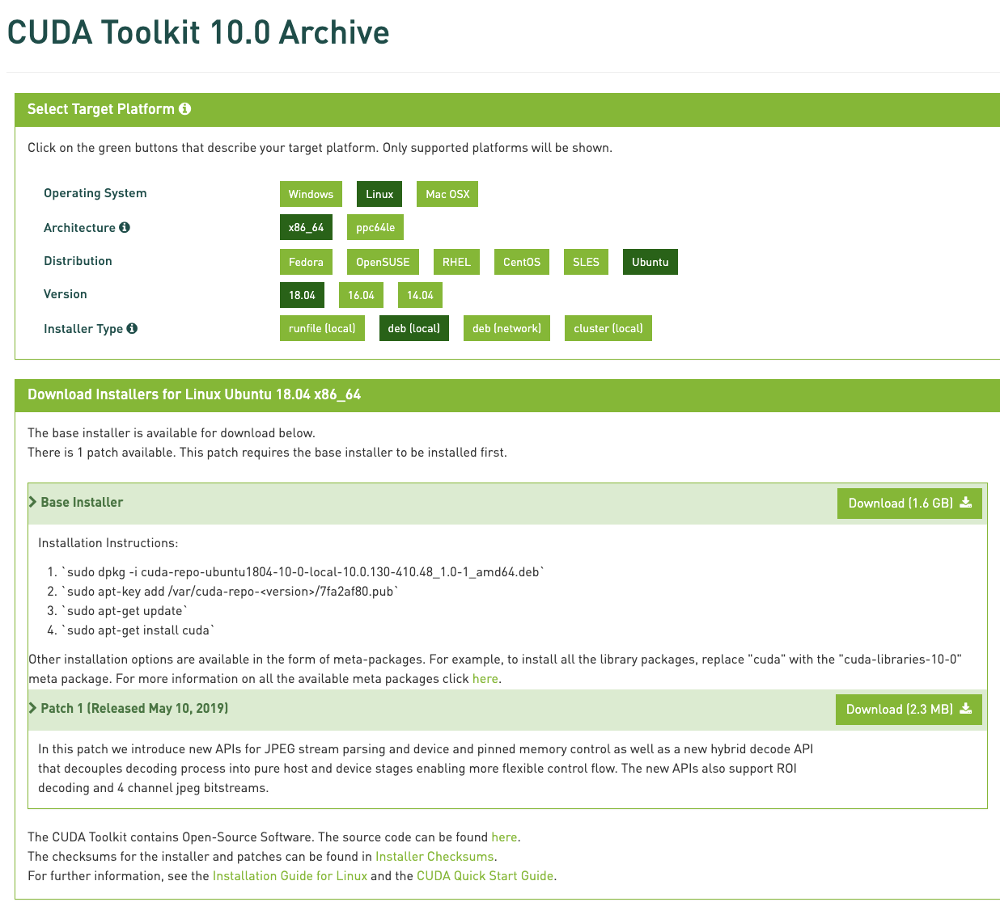

选择deb(local)进行安装

```bash
sudo dpkg -i cuda-repo-ubuntu1804-10-0-local-10.0.130-410.48_1.0-1_amd64.deb
sudo apt-key add /var/cuda-repo-<version>/7fa2af80.pub
sudo apt-get update
sudo apt-get install cuda
```

安装完成：


**CUDA配置**：

执行`vim ~/.bashrc`在bash配置文件下添加：

```bash
# added by cuda 10.0 installer
export PATH="/usr/local/cuda-10.0/bin:$PATH"
export LD_LIBRARY_PATH="/usr/local/cuda-10.0/lib64:$LD_LIBRARY_PATH"
```

`source ~/.bashrc`
`nvcc -V` 检查CUDA版本

```bash
nvcc: NVIDIA (R) Cuda compiler driver
Copyright (c) 2005-2018 NVIDIA Corporation
Built on Sat_Aug_25_21:08:01_CDT_2018
Cuda compilation tools, release 10.0, V10.0.130
```

**检查CUDA是否正常工作：**

```bash
cuda-install-samples-10.x.sh ~  #安装cuda 10.x的样本到~目录下，替换x为你的版本号
cd ~/NVIDIA_CUDA-10.x_Samples  #进入Sample目录
make  #有点耗时，如果系统版本不匹配，gcc版本可能会导致报错。
./1_Utilities/deviceQuery/deviceQuery  #执行检查程序
```

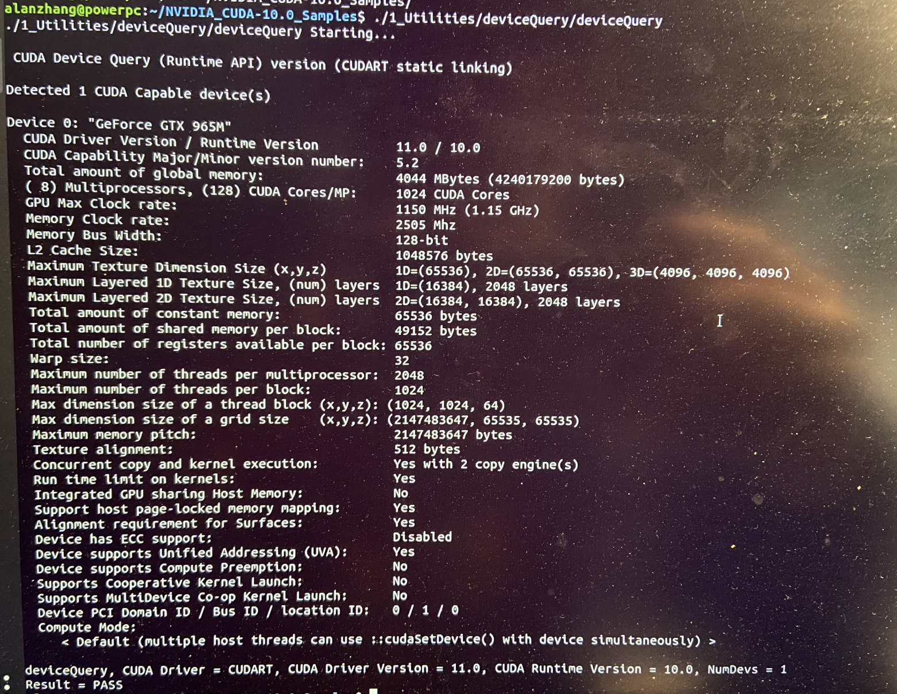

结果出现Result==Pass表示通过，CUDA安装完成。

## 安装cuDNN：

CUDA10.0 对应cuDNN 7.4

在官方页面下载cuDNN【需注册Nvidia账号】，

下载[cuDNN v7.4.2 for CUDA 10.0](https://developer.nvidia.com/rdp/cudnn-archive)

找到Ubuntu18.04 对应的deb包，并下载。

```bash
cd ~/Downloads  #进入下载目录
sudo dpkg -i libcudnn*  #同时安装三个文件
#逐个安装执行如下三个命令
#sudo dpkg -i libcudnn7_7.6.5.32-1+cuda10.2_amd64.deb 
#sudo dpkg -i libcudnn7-dev_7.6.5.32-1+cuda10.2_amd64.deb
#sudo dpkg -i libcudnn7-doc_7.6.5.32-1+cuda10.2_amd64.deb

cp -r /usr/src/cudnn_samples_v7/ $HOME  #复制样本文件到$HOME文件夹下
cd  $HOME/cudnn_samples_v7/mnistCUDNN  #进入样本目录
make clean && make  #编译
./mnistCUDNN  #执行cuDNN测试

#输出 Test Passed表示cuDNN安装成功。
```


# Ubuntu18.04 Tensorflow 1.x 安装（二）：TensorFlow及相关软件包安装

## 使用原生pip安装

**libcupti包下载：**

```bash
$ sudo apt-get install libcupti-dev
$ echo 'export LD_LIBRARY_PATH=/usr/local/cuda/extras/CUPTI/lib64:$LD_LIBRARY_PATH' >> ~/.bashrc
```

**相关软件包下载**：

注：我的Ubuntu系统使用python3.6版本，通过`python -V`查看。

```bash
$ sudo apt-get install python3-pip python3-dev python3-numpy python3-wheel ****# for Python 3.n
```

**下载指定版本的TensorFlow：**

```bash
# Python 3.x
$ pip3 install tensorflow==1.14.0 # cpu version 
$ pip3 install tensorflow-gpu==1.14.0 #gpu version
# Python 2.x
$ pip install tensorflow==1.14.0 # cpu version 
$ pip install tensorflow-gpu==1.14.0 #gpu version
```

备用方法：如果以上安装失败或者有报错，可以选择指定`tfBinaryURL`的形式进行安装。

- [CPU Version](https://pypi.org/project/tensorflow/)
- [GPU Version](https://pypi.org/project/tensorflow-gpu/)

根据TensorFlow版本、操作系统以及Python版本确定.whl文件。使用如下命令进行安装：

- 可以直接安装，也可以在Virtualenv环境中安装。

```bash
# Python 2.x
$ sudo pip  install --upgrade tfBinaryURL   
# Python 3.x
$ sudo pip3 install --upgrade tfBinaryURL  
```

**卸载：**

使用pip安装的TensorFlow可以使用如下命令卸载：

```bash
# Python 2.x
$ sudo pip uninstall tensorflow 
# Python 3.x
$ sudo pip3 uninstall tensorflow
```

## 使用Anaconda安装TensorFlow

### Anaconda安装

在[官网](https://www.anaconda.com/products/individual#Downloads)下载64位Linux版本的**Anaconda**。

执行如下命令进行安装。

```bash
$ bash Anaconda3-2020.11-Linux-x86_64.sh
$ source ~/.bashrc
```

验证：运行python时，显示的内容如下：

```bash
$ python
Python 3.6.0 |Anaconda 4.3.0 (64-bit)| (default, Dec 23 2016, 12:22:00) 
[GCC 4.4.7 20120313 (Red Hat 4.4.7-1)] on linux
Type "help", "copyright", "credits" or "license" for more information.
>>>
```

查看下面图表，确定TensorFlow版本对Python版本的要求。【我使用Python 3.6】

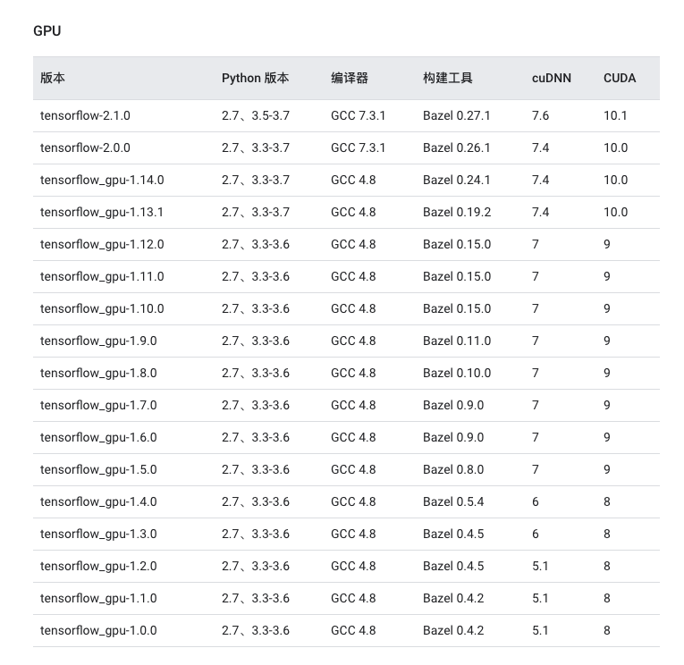

### TensorFlow安装

**Anaconda安装**

在Anaconda中，我们使用conda创建一个虚拟环境，并在该环境中安装TensorFlow。

```bash
# 建立一个名为tensorflow的conda虚拟环境，同时指定运行的Python版本为3.6
$ conda create -n tensorflow pip python=3.6
# 安装完成后使用命令激活conda环境
$ conda acticate tensorflow
(tensorflow)$ # 表示进入了名为tensorflow的虚拟环境中
```

接下来可以选择在线安装或者本地安装：

1. 在线安装[简单]

```bash
pip install tensorflow==1.14.0  # CPU 版本
pip install tensorflow-gpu==1.14.0 # GPU版本
```

2. 本地安装

在[pypi-tensorflow](https://pypi.org/project/tensorflow-gpu/#files)网站找到对应的whl文件，下载后使用`pip install`执行即可。

附：conda的简单使用：[参考[conda-cheatsheet](https://docs.conda.io/projects/conda/en/latest/user-guide/cheatsheet.html)]

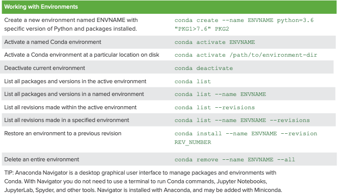

## 使用Virtualenv安装

Virtualenv顾名思义是Python的虚拟环境，独立于其他环境【类似于conda】，不与其他Python程序相互影响。在Virtualenv虚拟出的环境中安装TensorFlow及相关依赖，只要激活该环境便可在该环境中运行TensorFlow。

**安装pip和Virtualenv：**

```bash
# Python 2.x
$ sudo apt-get install python-pip python-dev python-virtualenv 
# Python 3.x
$ sudo apt-get install python3-pip python3-dev python-virtualenv 
```

选择其中一条命令创建[Virtualenv](https://virtualenv.pypa.io/en/latest/index.html)的虚拟环境

- `tragetDirectory`  : 自定义VIrtualenv根目录，我设置为`~/tensorflow`

```bash
# Python 2.x
$ virtualenv --system-site-packages targetDirectory 
# Python 3.x
$ virtualenv --system-site-packages -p python3 targetDirectory 
```

**激活环境并安装TensorFlow**

```bash
$ source ~/tensorflow/bin/activate
# Make sure pip 8.1+ installed.
(tensorflow)$ easy_install -U pip
# Download TensorFlow
	# CPU with pip or pip3
(tensorflow)$ pip install --upgrade tensorflow     
(tensorflow)$ pip3 install --upgrade tensorflow    
	# GPU with pip or pip3
(tensorflow)$ pip install --upgrade tensorflow-gpu  
(tensorflow)$ pip3 install --upgrade tensorflow-gpu
```

**Others**

```bash
# 激活环境
$ source ~/tensorflow/bin/activate
# 休眠环境
(tensorflow)$ deactivate
# 卸载TensorFlow, 移除目录树即可
rm -r targetDirectory
```


## 源代码构建

待补充...


## 验证TensorFlow是否可用：

```bash
pip show tensorflow-gpu
pip show tensorflow
```

执行简单的Python程序：

在shell中输入`python`开启python

输入如下命令：

```bash
# Python
import tensorflow as tf
hello = tf.constant('Hello, TensorFlow!')
sess = tf.Session()
print(sess.run(hello))
```

系统输出：`Hello, Tensorflow` ，表示TensorFlow可正常使用。

---


## 参考&帮助

[우분투 16.04에 텐서플로 1.0 설치하기 (1) Nvidia 소프트웨어 설치 (ft. GTX 970)](http://ejklike.github.io/2017/03/06/install-tensorflow1.0-on-ubuntu16.04-1.html)

[GPU support | TensorFlow](https://www.tensorflow.org/install/gpu)

[Install Tensorflow 1.13 on Ubuntu 18.04 with GPU support](https://medium.com/better-programming/install-tensorflow-1-13-on-ubuntu-18-04-with-gpu-support-239b36d29070)

[简易记录：安装GPU驱动，CUDA和cuDNN](https://zhuanlan.zhihu.com/p/143429249)

[在 Ubuntu 上安装 TensorFlow](https://tensorflow.juejin.im/install/install_linux.html#toc-16)

[anaconda | 镜像站使用帮助 | 清华大学开源软件镜像站 | Tsinghua Open Source Mirror](https://mirrors.tuna.tsinghua.edu.cn/help/anaconda/)


## Q&A

How to change the default Anaconda python environment?

如何指定python的pip下载【电脑中有多个版本的python和pip】[Dealing with multiple Python versions and PIP?](https://stackoverflow.com/questions/2812520/dealing-with-multiple-python-versions-and-pip)

```bash
# The system default python:
$ python -m pip install fish

# A virtualenv's python:
$ .env/bin/python -m pip install fish

# A specific version of python:
$ python-3.6 -m pip install fish
```


[GitHub记录](https://github.com/AlenZhang-Dev/Learning-Records/blob/master/Machine%20Learning/Notes/Ubuntu18.04%20%2B%20Tensorflow%201.x%20.md)

